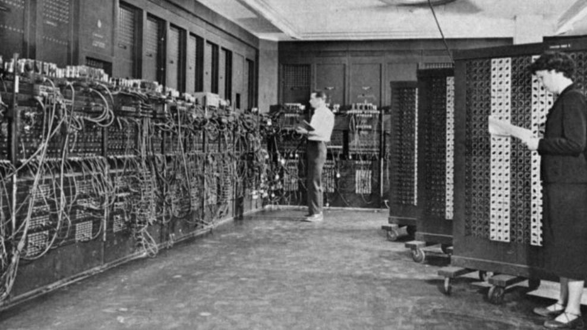
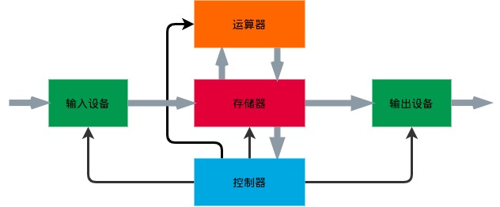
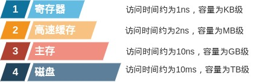
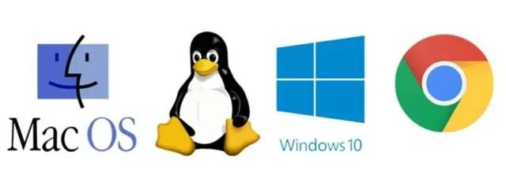
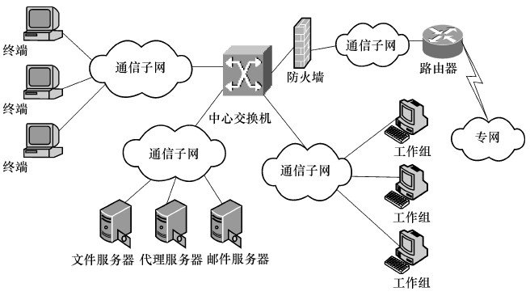
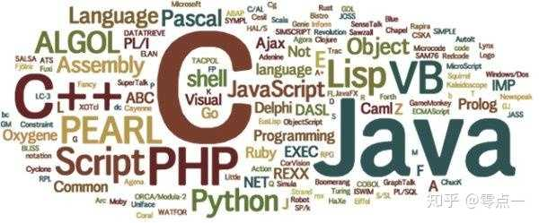

# 第 0 章 计算机基础概述

计算机编程是人与计算机之间的交互，我们通过程序语言这个载体和计算机软硬件这个平台构建解决问题的思路、实现解决问题的方法，所谓“九层之台，起于垒土；百仞之高，始于足下”，扎实的计算机基础知识是软件编程的基本功，对学习程序设计语言大有裨益，这一节我们就来简单学习一下计算机基础知识。

## 0.1 计算机发展

从计算机诞生之日起，计算机的每一次发展都是人类科技进步的重要成果，也伴随着社会生活的巨大改变和生产力的革命性进步。那么计算机到底有哪些经历呢？

### 0.1.1 计算机发展简史

1. 第一代电子管计算机（1946 ～ 1958）

    1946 年 2 月 14 日，第一台电子计算机诞生于美国宾夕法尼亚大学，命名为 ENIAC，真正开启了计算机的时代。

    

    第一代电子管计算机在硬件方面，使用真空电子管作为逻辑元件，主存储器使用汞延迟线、阴极射线示波管静电存储器、磁鼓、磁芯，外存储器采用磁带；软件方面，使用机器语言、汇编语言；应用领域较为单一地集中在军事和科学计算方面。

    主要特点：体积庞大，耗电量高，运行速度慢，存储空间有限，可靠性、稳定性较差。

2. 第二代晶体管计算机（1958 ～ 1963）

    晶体管的发明和应用极大地促进了计算机的发展，计算机体积变小、速度加快、功耗降低、性能稳定；操作系统、高级语言应用领域逐步从科学计算和事务处理向工业控制领域发展。

3. 第三代集成电子计算机（1964 ～ 1971）

    以美国 于 1964 年 IBM 公司成功研制第一个采用集成电路的通用电子计算机系列 IBM360 系统为标志。

    集成电路的发明应用使得更多电子元件集成在单一半导体芯片上，以中小规模集成电路构成计算机功能部件，计算机体积更小、速度更快、功耗更低；软件方面发展出了分时操作系统及结构化、模块化程序设计，软件生态逐步完善，计算机软硬件逐步走向系列化、标准化道路，并进军文字、图形、图像处理等领域。

4. 第四代大规模集成电子计算机（1971 ～）

    使用大规模、超大规模集成电路逻辑单元，计算机体积进一步减小，运算速度加快，稳定性、可靠性进一步提升；软件生态空前发展，数据库系统、计算机网络等技术应用于社会各领域。

5. 第五代智能计算机

    智能计算机具备人工智能，运算速度极快，硬件系统支持高度并行和推理，软件系统能够处理知识信息，目前仍在探索、研制及发展阶段。

### 0.1.2 计算机体系结构

计算机体系结构是指计算机的逻辑结构和功能特征，包括各个硬件和软件之间的相互关系，应用最广泛的是冯・诺依曼结构，主要由输入设备、运算器、控制器、存储器及输出设备组成。

### 0.1.3 IT 行业三大定律

1. 摩尔定律

    每 18 个月 IT 产品的性能会翻一翻，或者说相同性能的 IT 产品，每 18 个月价钱会降一半。

2. 安迪-比尔定律

    **Andy gives, Bill takes away.** 计算机工业是由软件更新带动硬件更新的，也可以理解为硬件提高的性能，很快被软件消耗掉。

3. 反摩尔定律

    IT 公司如果今天和 18 个月前销售等量、同样的产品，营业额就要降一半。

从计算机及 IT 行业的发展历程我们可以清晰地看到电子元器件的更新换代，从二级管到逻辑门电路，再到大规模、超大规模集成电路；也能够看到软件产业的不断完善，从纸带到汇编语言，再到高级语言，从操作系统的出现，到人工智能的空前发展，人类物质文化需要、社会生产力发展不断呼唤更先进完备的计算机工业体系，计算机的发展进步也不断推动着人类社会的发展进步。

# 0.2 计算机硬件

### 0.2.1 CPU

CPU 是计算机的大脑，扮演冯・诺依曼体系结构中控制器、运算器的角色，主要和内存时行交互，提取指令并执行。

CPU 有一级可以执行的特定指令集，为了提高执行效率，CPU 内部都包含一些寄存器保存关键变量和临时结果，也包括特殊的寄存器，主要有程序计数器、堆栈指针及程序状态寄存器（PSW）。

多数 CPU 有两种模式——内存态和用户态。用户态下，CPU 只能执行指令集中的一部分并访问硬件的部分功能；用户程序执行系统调用后，CPU 转入内核态，任务完成后交出控制权。

### 0.2.2 存储器

计算机存储器的层次结构中越往顶层存储器速度越快，但容量较小、成本较高，越往下层访问速度越慢，但容量越大、造价越便宜。

1. 寄存器

    寄存器位于 CPU 内，用和 CPU 一样的材料制成，速度和 CPU 速度一样快，程序必须在软件中自行管理寄存器。

2. 高速缓存

    存在于主存与 CPU 之间的一级缓存器，高速缓存多数由硬件控制，容量比较小，但速度接近于 CPU 的速度。

3. 主存

    主存即 RAM(Random Access Memory)，是 CPU 能直接寻址的存储空间，用于暂时存放 CPU 中的运算数据，与外部存储器交换数据。

4. 磁盘

    计算机的主要存储介质，容量大、造价低。

### 0.2.3 输入输出设备

输入输出设备是人与设备间联系交互的纽带。输入设备包括常用的键盘、鼠标、扫描仪、摄像头等，是计算机与用户或其他设备通信的桥梁，主要用于把原始数据和数据处理程序输入到计算机。输出设备包括常用的显示器、打印机等，是把计算机的数据处理结果以各种形式输出。

## 0.3 计算机软件

如果说硬件是计算机的骨骼，那么操作系统就是计算机的血肉，应用软件是计算机的文化和知识。没有操作系统的计算机不过是一堆电子器件，没有应用软件的计算机也无法充分发挥其功能。

### 0.3.1 操作系统

操作系统即 Operating System(OS)，是一组控制和管理计算机硬件、软件资源，组织计算机工作流程，为用户和其他软件提供接口与环境的程序集合。

虽然抽象，但也说明计算机操作系统具备处理器管理、存储器管理、文件管理、设备管理及提供用户接口等功能，也表达出操作系统方便性、有效性、可扩充性及开放性的目标。

简单来来，操作系统是管理计算机硬件与软件资源的程序。一般可分为服务器操作系统、多处理器操作系统、个人桌面操作系统、嵌入式操作系统等。

日常大家最熟悉的操作系统当属 Windows、MacOS 及 Linux 了，其中，Windows 系统在 PC 端的桌面环境占有绝大多数市场份额，Linux 以独特的优势霸占了服务器领域的绝大部分市场，因各路大神的不懈努力，拥有各种发行版，可满足各专业方向的需求，建议程序员从基础开始学习。

操作系统是一门完整的基础学科，这里我们不过多强调，但仍然要理解操作系统的基本概念，推荐大家认真学习《计算机操作系统》课程，或阅读[Operating Systems: Three Easy Pieces](https://pages.cs.wisc.edu/~remzi/OSTEP/)《深入理解计算机系统》《现代操作系统》等经典教材。

### 0.3.2 应用软件

应用软件是为满足用户不同领域、不同需求而提供的计算机软件，可以极大地拓宽计算机的应用，放大硬件的功能。如我们平时使用的办公软件、浏览器、图像处理软件、数据分析软件等等，不同的软件具有不同的专业功能，较好地满足用户的需求。

## 0.4 计算机网络

网络绝对是二十世纪最伟大的发明之一，它将地理位置不同的具有独立功能的多台计算机及其外部设备，通过通信线路连接起来，在网络操作系统、网络管理软件及网络通信协议的管理和协调下，实现资源共享和信息传递。通过局域网、城域网、广域网及互联网的划分，高效实现数据通信、资源共享、集中管理等功能，极大地促进了计算机、通信、大数据、云计算等技术的发展，使得网上购物、移动支付、线上教学等极大地改变了人们的生活。

在当下新冠肺炎疫情时有反复、难以根除的背景下，如果没有计算机网络，社会生活的大部分工作都难以进行。

## 0.5 计算机编程语言

计算机编程语言主要完成人与计算机间的信息传递，人使用编程语言指挥计算机进行某个任务，计算机通过“读懂”编程语言来具体执行某个动作。

### 0.5.1 机器语言

机器语言就是最简单直接的 0 和 1 的二进制代码，人通过 0 和 1 的指令序列使计算机完成进行操作，效率最高。但不同计算机的机器语言并不一样，0 和 1 的指令序列一旦指定后也很难更改，编程效率很低，可读性很差。

### 0.5.2 汇编语言

人们使用与指令实际含义相近的字符取代指令代码（如用 ADD 取代加法操作的机器代码），形成汇编语言。执行时，将写好的源程序翻译成目标程序，再存入指定位置就可被 CPU 处理执行。

汇编语言是对机器语言的抽象，在一定程度上简化了编程，而且程序战胜内存少、运行速度快，应用于嵌入式领域。

### 0.5.3 高级语言

对汇编语言再进行抽象，放下硬件的具体操作，使语言的语义确定、规则明确、自然直观，就形成了各类高级语言。

高级语言面向用户，需要通过编译、解释形成机器语言形式的目标程序，供计算机执行。

常用的高级语言有 C、C++、Java、C#、Python、JavaScript 等等。
