# 第 1 章 Java 语言概述

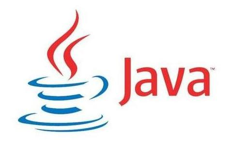

## 1.1 Java 简介

### 1.1.1 Java 简史

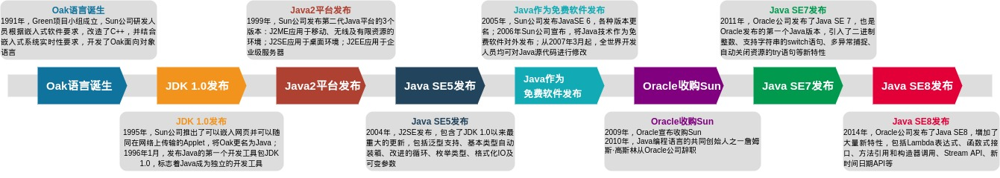

1. Oak 语言诞生

    在 1991 年成立了 Green 的项目小组，帕特里克、詹姆斯·高斯林、麦克·舍林丹为首的工作小组研究开发新技术，专攻计算机在家电产品上的嵌入式应用。他们根据嵌入式软件的要求，对 C++进行了改造，并结合嵌入式系统的实时性要求，开发了 Oak 面向对象语言。

2. JDK 1.0 发布

    1995 年，互联网蓬勃发展，Sun 公司首先推出了可以嵌入网页并且可以随同网页在网络上传输的 Applet，并将 Oak 更名为 Java。

    1996 年 1 月，Sun 公司发布了 Java 的第一个开发工具包（JDK 1.0），标志着 Java 成为一种独立的开发工具，是一个重要的里程碑。

3. Java2 平台发布

    1999 年 6 月，Sun 公司发布了第二代 Java 平台（Java2）的 3 个版本：J2ME（Java2 Micro Edition，微型版），应用于移动、无线及有限资源的环境；J2SE（Java 2 Standard Edition，标准版），应用于桌面环境；J2EE（Java 2Enterprise Edition，企业版），应用于基于 Java 的应用服务器。

    Java 2 平台发布，标志着 Java 应用的普及。

4. Java SE 5 发布

    2004 年 9 月 ，J2SE1.5 发布，并更名为 Java SE 5.0，包含了从 1996 年以来的最重大的更新，其中包括泛型支持、基本类型的自动装箱、改进的循环、枚举类型、格式化 I/O 及可变参数等新特性。

5. Java 作为免费软件发布

    2005 年 6 月，Sun 公司发布了 Java SE 6，Java 的各种版本已经更名，J2EE 更名为 JavaEE，J2SE 更名为 JavaSE，J2ME 更名为 JavaME。

    2006 年 11 月，Sun 公司宣布，将 Java 技术作为免费软件对外发布。从 2007 年 3 月起，全世界所有的开发人员均可对 Java 源代码进行修改。

6. Oracle 收购 Sun

    2009 年，Oracle 公司宣布收购 Sun 公司。

    

    2010 年，Java 编程语言的共同创始人之一詹姆斯·高斯林从 Oracle 公司辞职。

7. Java SE 7 发布

    2011 年 7 月，Oracle 公司发布了 Java SE 7。这是 Oracle 发布的第一个 Java 版本，引入了二进制整数、支持字符串的 switch 语句、多异常捕捉、自动关闭资源的 try 语句等新特性。

8. Java SE 8 发布

    2014 年 3 月，Oracle 公司发布了 Java SE 8，增加了大量新特性，包括 Lambda 表达式、函数式接口、方法引用和构造器调用、Stream API、接口中的默认方法和静态方法、新时间日期 API 等新特性。

### 1.1.2 Java 技术体系

1. Java ME

    主要应用于嵌入式领域，只保留部分 Java API 组件及适应设备的特有组件。

2. Java SE

    主要应用于桌面领域，包含 Java API 标准组件。

3. Java EE

    活跃在企业级领域，包含 Java API 组件和扩充的 Web 组件、事务组件、分布式组件、EJB 组件及消息组件。

## 1.2 Java 语言特点

1.  简单性

    Java 剔除了 C++中操作符操作符重载、多重继承、指针操作、虚基类等很少使用、难以理解和容易混淆的特性，自动处理对象的引用和间接引用，实现垃圾自动回收，使用户不必纠结在指针、内存等复杂问题，能够集中精力做好开发。

2.  面向对象

    Java 中一切皆是对象。面向对象程序设计技术里，类是数据和方法的集合，数据和方法一起描述对象的状态和行为。

3.  分布式

    Java 有丰富的例程库，用于处理如 HTTP 和 FTP 等 TCP/IP 协议，既支持各种层次的网络连接，又以 Socket 类支持可靠的流（stream）网络连接，用户可以产生分布式的客户机和服务器，通过 URL 打开和访问网络上的对象，像访问本地文件一样。

4.  健壮性

    Java 能够有效进行早期的问题检测、后期动态（运行时）检测，并消除了容易出错的情况。

    Java 不支持指针，消除了重写存储和讹误数据的可能性。类似地，Java 自动的“无用单元收集”预防存储漏泄和其它有关动态存储分配和解除分配的有害错误。

    异常处理是 Java 中使得程序更稳健的另一个特征，使用 try/catch/finally 语句，可以找到出错的处理代码，简化了错误处理和恢复。

5.  安全性

    Java 的存储分配模型是防御恶意代码的主要方法之一。Java 编译程序不处理存储安排决策，不能通过查看声明去猜测类的实际存储安排；编译的 Java 代码中的存储引用在运行时由 Java 解释程序决定实际存储地址。

    Java 运行系统使用字节码验证过程来保证装载到网络上的代码不违背任何 Java 语言限制。这个安全机制部分包括类如何从网上装载。例如，装载的类是放在分开的名字空间而不是局部类，预防恶意的小应用程序用它自己的版本来代替标准 Java 类。

6.  体系结构中立

    Java 编译器生成一个体系结构中立的目标文件格式，只要有 Java 运行时系统，编译后的代码可以在许多处理器上运行，实现了 write once, run anywhere。

7.  可移植性

    Java 中没有信赖具体实现的地方，环境本身对新的硬件平台和操作系统是可移植的。

8.  解释性

    Java 编译程序生成字节码（byte-code），可以在任何实现了 Java 解释程序和运行系统（run-time system）的系统上运行。

9.  高性能

    Java 采用了“及时”编译程序，能够在运行时把 Java 字节码翻译成特定 CPU（中央处理器）的机器代码，实现全编译，生成机器代码的过程相当简单。

10. 多线程

    多线程能够带来更好的交互响应和实时行为。

    Java 是多线程语言，支持多线程的执行，以便处理不同任务，使多线程程序设计很容易。

11. 动态性

    Java 语言能够适应变化的环境，是一个动态的语言。Java 所需的类能够动态地被载入到运行环境，也可以通过网络载入。

## 1.3 Java 开发环境

### 1.4.1 开发工具包

1. JVM

    JVM 即 Java Virtual Machine，是运行Java字节码的虚拟机，Java 虚拟机拥有完善的硬件架构，且屏蔽了与具体平台相关的信息，使得 Java 代码在不同平台上运行时不需要重新编译。

    JVM是实现“一次编写，随处运行”的关键。

    JVM 主要由类装载器子系统、运行时数据区、执行引擎、本地方法接口和垃圾收集模块组成。JVM并不只有一种，只要 满足JVM规范，都可以开发JVM。

2. JDK

    [JDK](https://www.oracle.com/java/technologies/downloads/) 即 Java Development Kit，是 Java 开发的核心，主要包括：

    - JavaSE，即 Java Standard Edition，标准版，是常用版本；
    - JavaEE，即 Java Enterprise Edition，企业版，主要用于开发 JavaEE 应用程序;
    - JavaME，即 Java Micro Edition，主要用于移动设备、嵌入式设备上的 java 应用程序。

3. Java API

    [Java API](https://docs.oracle.com/)是学习 Java 语言最重要的工具，绝大多数问题都可以在文档里找到正确的解决方案，我们一定要养成阅读文档的习惯。

### 1.4.2 OpenJDK与OracleJDK

- OpenJDK是一个参考模型，完全开源，OracleJDK是OpenJDK的一个实现，并不完全开源。

- 相较于OpenJDK，OracleJDK经过了更严格和彻底的测试，更稳定、性能更好。

### 1.4.3 安装配置 JDK

根据个人常用开发平台安装配置所选版本的 JDK。

1. Windows 系统安装配置

    1. 在官网下载相应版本的 JDK 至本地；

        [JDK Download](https://www.oracle.com/java/technologies/downloads/#jdk17-windows)

    2. 双击下载文件 jdk-version_windows-x64_bin.exe 安装(version 代表对应版本)；

    3. 可以选择默认配置进行安装；

        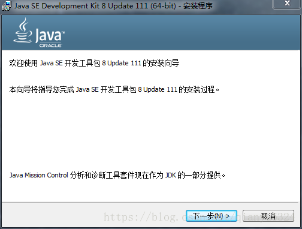

    4. 完成安装后配置系统环境变量；

        PATH 环境变量是 Windows 执行系统命令时搜寻的路径，为使 java 命令在任意目录下均可执行，必须进行配置。

    5. 在终端输入 java -version 测试是否成功，如果安装成功，会显示当前 JDK 的相应版本号。

2. Linux 系统安装配置

    1. 在官网下载相应版本的 JDK 到本地；

        [JDK Download](https://www.oracle.com/java/technologies/downloads/#jdk17-linux)

    2. 解压到自定义目录，使用命令为 `tar -zxvf` 文件名

    3. 进入当前用户的主目录，然后点击查看，选择“显示隐藏文件”，显示用户目录下的.bashrc 文件；

    4. 打开.bashrc 文件，输入如下配置信息：

        ```
        export JAVA_HOME=JDK解压后目录路径
        export JRE_HOME=${JAVA_HOME}/jre
        export CLASSPATH=.:JAVAHOME/lib:{JRE_HOME}/lib
        export PATH=JAVA_HOME/bin:PATH
        ```

    5. 在终端输入 java -version 测试是否成功，如果安装成功，会显示当前 JDK 的相应版本

        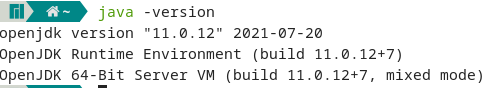

### 1.4.3 IDE

关于 IDE，个人认为，如果不清楚 IDE 在底层帮我们做了什么的，那么就不要用它。开始阶段完全可以使用一般的文本编辑器，手动完成代码从零到一、从编写到运行的全过程，掌握了开发的过程后再用 IDE，会发现效率六到飞起。

1. IDEA

    [IDEA](https://www.jetbrains.com/idea/)被公认为最好用的 Java 开发工具，整合了 Java 开发的诸多实用功能，可最大程度提高开发效率。社区免费版加上各种插件可以满足基本的开发。

2. VSCode

    [VSCode](https://code.visualstudio.com/)是一款免费的跨平台源代码编辑器，可通过插件配置具备丰富的功能。

    VSCode 常用插件推荐：

    - [Auto Close Tag](https://marketplace.visualstudio.com/items?itemName=formulahendry.auto-close-tag)

        

    - [Auto Rename Tag](https://marketplace.visualstudio.com/items?itemName=formulahendry.auto-rename-tag)

        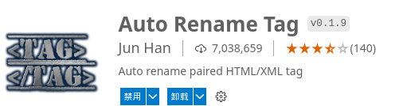

    - [Bracket Pair Colorizer](https://marketplace.visualstudio.com/items?itemName=CoenraadS.bracket-pair-colorizer)

        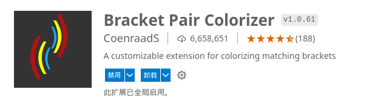

    - [Prettier-Code formatter](https://marketplace.visualstudio.com/items?itemName=esbenp.prettier-vscode)

        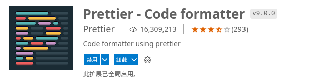

    - [Code Spell Checker](https://marketplace.visualstudio.com/items?itemName=streetsidesoftware.code-spell-checker)

        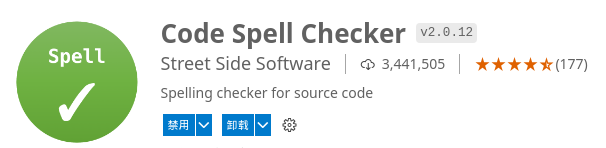

    - [Path Intellisense](https://marketplace.visualstudio.com/items?itemName=christian-kohler.path-intellisense)

        

    - [Chinese Language Pack for Visual Studio Code](https://marketplace.visualstudio.com/items?itemName=MS-CEINTL.vscode-language-pack-zh-hans)

        

    - [Code Runner](https://marketplace.visualstudio.com/items?itemName=formulahendry.code-runner)

        

    - [Git Graph](https://marketplace.visualstudio.com/items?itemName=mhutchie.git-graph)

        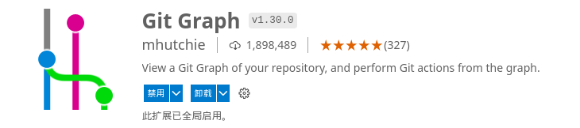

    - [GitLens-Git supercharged](https://marketplace.visualstudio.com/items?itemName=eamodio.gitlens)

        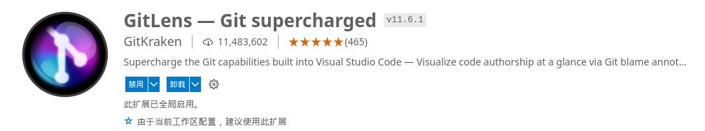

    - [Settings Sync](https://marketplace.visualstudio.com/items?itemName=Shan.code-settings-sync)

        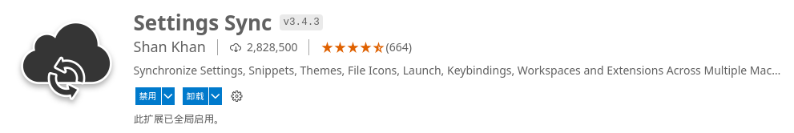