# 第 2 章 Java 基础语法

## 2.1 基本程序结构

### 2.1.1 HelloWorld

```java
public class HelloWorld {
    /**
     * main()
     *
     * @param args array of string arguments
     */
    public static void main(String[] args) {
        // output string "Hello World"
        System.out.println("Hello World");
    }
}
```

Java 程序开发过程：

-   编写

    按照问题解决思路和 Java 语法编写源文件，并保存为“.java”文件；

    每个源文件可以声明多个 class，但最多有一个声明为 public 类，且该类必须与源文件名相同。

-   编译

    使用 javac 命令编译源文件，生成“.class”字节码文件。

    ```java
    javac FileName.java
    ```

-   运行

    使用 java 命令运行字节码文件。

    ```java
    java FileName
    ```

    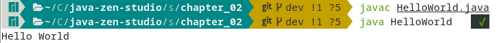

### 2.1.2 注释

1. 单行注释
    ```java
     // 单行注释：解释说明单行代码，增强可读性，调试部分代码
    ```
2. 多行注释

    ```java
    /**
     * 多行注释：
     * 1. 解释说明代码块功能，增强可读性
     * 2. 调试部分代码
     * 3. 多行注释不能嵌套使用
     */
    ```

3. 文档注释

    注释内容可以被 JDK 工具 javadoc 解析，生成网页文件以提供说明文档。

    ```java
    /**
     * 文档注释
     * @author
     * @version
     * @see
     */
    ```

### 2.1.3 代码风格

程序代码风格有多种形式，但开发时应尽量使用统一的代码风格，如合理的注释、正确的缩进和空白等，增强代码的可读性。

## 2.2 关键字和标识符

### 2.2.1 关键字

关键字是编译器定义的字符串，有特殊的含义或专门用途。

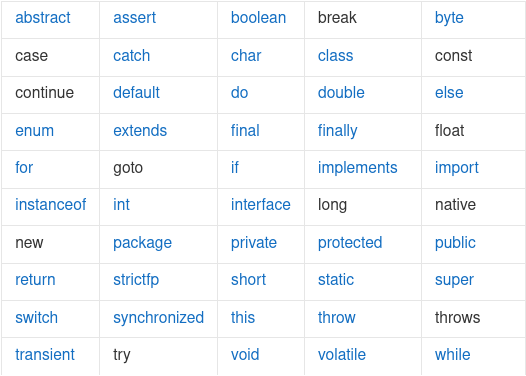

关键字没有必要刻意去记，在学习编程不断深入的过程中会自然而然地掌握它的含义、用法等。

### 2.2.2 标识符

程序中各种变量、方法、类和接口等要素命名时所使用的字符序列就是标识符，也可以简单地理解为所有需要命名的都叫标识符。

标识符命名必须遵守一定的规则，否则会引起编译错误。标识符命名规则：

-   由字母、数字、“\_”和“$”符等字符组成，长度无限制；
-   命名区分大小写；
-   首字符不能以数字开头；
-   不能使用系统保留的关键字；

```java
public class IdentifierTest {
    public static void main(String[] args) {
        int number = 1024;
        System.out.println(number);

        // 错误标识符
        // int 5int = 5;

        // 可通过编译，但不规范
        // int account￥ = 100;
        // short 小数 = 124;

    }
}
```

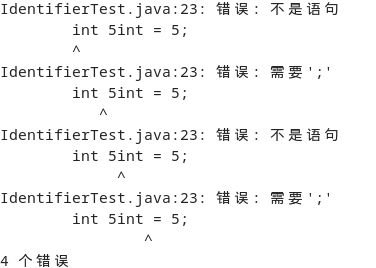

示例代码中`int 5int = 5;`会引起编译错误；后面两行代码虽然能够通过编译，但极不规范，不能出现类似代码。

为了使程序可读性更好，代码风格更统一，建议标识符命名遵守必要的规范，使变量、方法、类、接口等能够见名知意。

-   标识符不以下划线或`$`符号开始，不以下划线或$符结束；

    ```java
    // 反例
    String _name;
    String name_;

    Object $Object;
    Object Object$;
    ```

-   标识符不使用拼音与英文混合，不直接使用中文或拼音；

    诸如 huawei, meituan, 等可视同英文。

-   包名统一使用小写，点分隔符之间有且仅有一个自然主义的单词多单词；

    ```java
    com.java.util;
    ```

-   类、接口使用 UpperCamelCase 风格，遵从驼峰形式；
    ```java
    // 正例
    class MarcoPolo{}
    ```
-   变量、参数、方法使用 lowerCamelCase 风格，遵从驼峰形式；

    ```java
    // 正例
    int localValue;
    ```

-   常量全部大写，单词间用下划线隔开，意义表达完整清楚。

    ```java
    // 正例
    final int MAX_STOCK_COUNT;
    ```

## 2.3 变量

变量是程序中最基本的存储单元，包含变量类型、变量名和存储值。Java 变量可分为基本类型和引用类型两种，基本类型变量对应基本数据类型，引用类型变量对应引用数据类型。

### 2.3.1 变量的声明

声明变量就是让运行环境为其分配内存空间，用以存储数据。

逐一声明每一个变量可以提高程序的可读性，Java 中变量的声明应尽可能地靠近第一次使用的地方。

1. 声明方式为：

    > 数据类型 变量名 = 变量初始化值；

    或

    > 数据类型 变量名;

2. 变量的命名

    每个变量都有一个名称，变量命名必须遵守标识符命名规则、规范。

### 2.3.2 变量初始化

    变量声明后，要为其赋一个确定的初值再使用，可以在声明时初始化，也可以在第一次使用前初始化。

### 2.3.3 变量的访问

    可以对变量进行赋值、运算、存取等操作，但这些操作必须与变量声明时的类型匹配。

## 2.4 数据类型

Java 是强类型语言，必须为每个变量声明一种类型，Java 数据类型为：

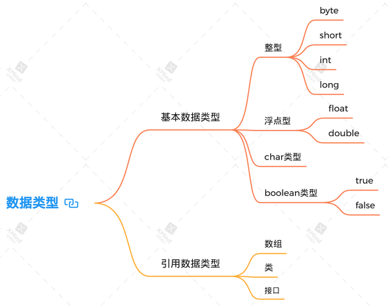

### 2.4.1 整型

| 类型  | 字节数 | 数值范围                             |
| ----- | ------ | ------------------------------------ |
| byte  | 1      | -128 ~ 127                           |
| short | 2      | -2<sup>16</sup> ~ 2<sup>16</sup>-1   |
| int   | 4      | - 2<sup>32</sup> ~ 2<sup>32</sup> -1 |
| long  | 8      | - 2<sup>64</sup> ~ 2 <sup>64</sup>-1 |

一般情况下，int 类型最常用；byte 和 short 主要用于特定的场合，特别要注意 byte 型的数值范围，避免越界；使用 long 类型时，数值必须以`l`或`L`结束，建议使用`L`，如 12345678L;

```java
public class NumberTest {
    public static void main(String[] args) {
        // byte的范围为-128~127
        byte b1 = -120;
        System.out.println("b1 = " + b1);

        // byte b2 = 128;
        // System.out.println("b2 = " + b2);

        long l1 = 123456789L;
        System.out.println(l1);
    }
}
```

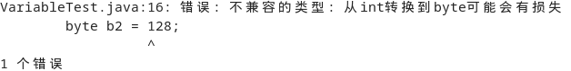

`byte b2 = 128;`越界引发编译错误。

### 2.4.2 浮点型

| 类型   | 字节数 | 数值范围               |
| ------ | ------ | ---------------------- |
| float  | 4      | -3.403E38 ~ 3.403E38   |
| double | 8      | -1.798E308 ~ 1.798E308 |

double 类型变量的数值精度是 float 类型的两位，所以 double 常称为双精度浮点数。

一般情况下，double 类型较常用，float 类型精度难以满足应用需求。

定义 float 类型的变量时，变量要以 `f` 或 `F` 作为数值后缀，没有时默认为 double 类型。double 类型的变量值也可以 `d` 或 `D` 作为数值后缀。

```java
public class NumberTest {
    public static void main(String[] args) {

        double d = 2.765;
        System.out.println(d);

        // float类型的值要以f或F作为数值后缀，否则默认为double类型
        // float f = 1.742;
        float f = 1.742F;
        System.out.println(f);
    }
}
```

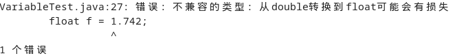

代码`float f = 1.742;`会引发编译时类型错误。

### 2.4.3 字符类型

char 类型的字面量要用单引号括起来，只能包含单个字符。

特殊转义字符序列：

| 转义序列 | 名称   | Unicode 值 |
| -------- | ------ | ---------- |
| \\b      | 退格   | \\u0080    |
| \\t      | 制表符 | \\u0090    |
| \\n      | 换行   | \\u000a    |
| \\r      | 回车   | \\u000d    |
| \\"      | 双引号 | \\u0022    |
| \\'      | 单引号 | \\u0027    |
| \\       | 反斜杠 | \\u005c    |

```java
public class CharTest {
    public static void main(String[] args) {
        // 声明单个字符
        char a = 'a';
        System.out.println(a);

        // 转义字符
        System.out.print("Welcome to " + "\t");
        System.out.print("Beijing" + "\n");

        // 使用Unicode编码输出字符

        char c = '\u0022';
        System.out.println(c);
    }
}
```

### 2.4.4 布尔类型

布尔类型只有两个值`true`和`false`，用来进行逻辑判断。

### 2.4.5 类型转换

在将一种数据类型转换为另一种时，会发生类型转换，数据类型转换包括自动类型转换（提升）和强制类型转换，遵循规则如图。

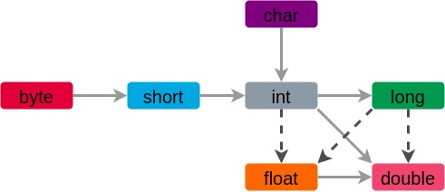

1.  自动类型转换

    把一个表数范围小的类型的数值或变量直接赋给一个表数范围大的数值或变量时，系统默认自动进行类型转换。

    ```java
    public class AutoConversionTest {
        public static void main(String[] args) {
            byte b = 124;
            int i = 129;
            // 编译错误
            // byte sum = b + i;
            int sum = b + i;
            System.out.println(sum);

            // 自动类型转换
            float f = b;
            System.out.println(f);

            double d = 3.1415;
            // 无法自动进行类型转换
            // int i = d;
            // System.out.println(i);

            double sub = f - d;
            System.out.println(sub);

            // 编写代码时忽略long类型的L后缀时可通过编译，
            // 默认以int类型处理
            long l = 1345668;
            System.out.println(l);

            // 编写代码时忽略float类型后的F后缀时无法通过编译
            // 默认为double型，无法自动转换
            // float f2 = 2.7682;
            // System.out.println(f2);
        }
    }
    ```

    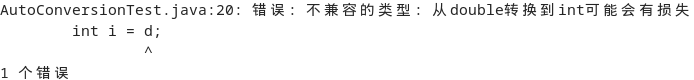

    `int i = d;`引发类型转换错误。

    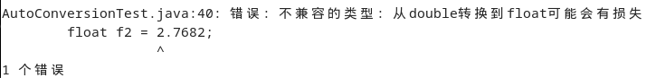
    `float f2 = 2.7682`引发类型转换错误。

2.  强制类型转换

    把一个表数范围大的类型的数值或变量赋给一个表数范围小的类型的数值或变量时，必须通过强制类型转换实现，并且有可能造成精度损失或数值溢出。

    ```java
    public class NarrowConversionTest {
        public static void main(String[] args) {

            double d = 3.14159265;
            // 强制类型转换，引起精度丢失
            float f = (float)d;
            System.out.println(f);

            // 强制类型转换，截断操作
            int i = (int)f;
            System.out.println(i);

            // 强制类型转换，引起数据溢出
            int i2 = 128;
            byte b = (byte)i2;
            System.out.println(b);
        }
    }
    ```

## 2.5 字符串

Java 类库预定义了 String 类，每个用双括号括起来的字符串都是一个 String 类的实例。

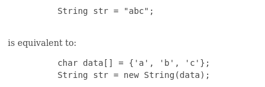

```java
public class StringTest {
    public static void main(String[] args) {
        String str = "Hello";
        System.out.println(str);

        char c = 'a';   // a->97, A->65
        int num = 10;
        // 107Hello
        System.out.println(c + num + str);
        // aHello10
        System.out.println(c + str + num);
    }
}
```

这是一个简单的例子，String 类有很多实用方法，建议从 API 文档开始，尝试结合文档进行学习。

查阅 API 文档是学习 Java 最主要的方法，因为无论是基础类库还是各种框架，所包含的类数量都是惊人的，我们不可能记住每一个类、每个方法的使用，必须学会通过查阅文档迅速掌握基本的使用方法，再通过阅读源码掌握底层原理方法，不断提高编程能力。

## 2.6 运算符

### 2.6.1 算术运算符

| 运算符 | 执行运算 | 示例   | 备注                                  |
| ------ | -------- | ------ | ------------------------------------- |
| +      | 加法     | 3+2=5  | 可表示正数或进行字符串连接操作        |
| -      | 减法     | 5-1=4  | 可表示负数                            |
| \*     | 乘法     | 2\*4=8 |                                       |
| /      | 除法     | 5/2=2  | 若要得到小数，只能进行 5.0/2 或 5/2.0 |
| %      | 取模     | 5%2=1  | 结果符号与被模数符号相同              |
| ++num  | 自增 1   |        | 先加 1 后赋值                         |
| num++  | 自增 1   |        | 先赋值后加 1                          |
| --num  | 自减 1   |        | 先减 1 后赋值                         |
| num--  | 自减 1   |        | 先赋值后减 1                          |

```java
public class ArithmeticTest {
    public static void main(String[] args) {
        // /除法运算符
        System.out.println("----------除法运算----------");
        int num1 = 22;
        int num2 = 3;

        int result1 = num1 / num2;
        System.out.println("22 / 3 = " + result1);

        int result2 = num1 / num2 * num2;
        System.out.println("22 / 3 * 3 = " + result2);

        double result3 = num1 / (num2 + 0.0);
        System.out.println("22 / (3 + 0.0) = " + result3);

        double result4 = (double)num1 / num2;
        System.out.println("(double)22 / 3 = " + result4);

        // %取模运算符
        // 取模结果与被模数符号一致
        System.out.println("----------取模运算----------");
        System.out.println("12 % 5 = " + 12 % 5);
        System.out.println("(-12) % 5 = " + (-22 % 3));
        System.out.println("(-12) % (-5) = " + (-12) % (-5));
        System.out.println("12 % (-5) = " + 12 % (-5));

        // ++num, 先加1后赋值
        // num++, 先赋值后加1
        System.out.println("----------自增运算----------");
        int a1 = 9;
        int a2 = 100;
        System.out.println("自增运算a前: a1 = " + 1 + ", a2 = " + a2);
        System.out.println("执行自增运算: a1++ = " + (a1++) + ", ++a2 = " + (++a2));
        System.out.println("自增运算后: a1 = " + a1 + ", a2 = " + a2);

        // 自增自减运算符不改变数据原始类型
        byte a = 127;
        a++;
        System.out.println("127++ = " + a);

        System.out.println("----------自减运算----------");
        int d1 = 9;
        int d2 = 100;
        System.out.println("自减运算前: d1 = " + d1 + ", d2 = " + d2);
        System.out.println("执行自减运算: d1-- = " + (d1--) + ", --d2 = " + (--d2));
        System.out.println("自减运算后: d1 = " + d1 + ", d2 = " + d2);

        byte d = -128;
        d--;
        System.out.println("-128-- = " + d);
    }
}
```

示例代码中

```java
byte a = 127;
a++;
```

的底层存储原理如图：

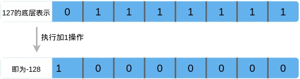

对于 byte 或 short 等数值范围较小的类型，这样的边界条件一定要注意。

### 2.6.2 赋值运算符

| 运算符 | 执行操作 | 备注       |
| ------ | -------- | ---------- |
| =      | 赋值     | i = 1      |
| +=     | i += j   | i = i + j  |
| -=     | i -= j   | i = i - j  |
| \*=    | i \*= j  | i = i \* j |
| /=     | i /= j   | i = i / j  |
| %=     | i %= j   | i = i % j  |

赋值运算符执行操作不会改变变量本身的类型。

### 2.6.3 关系运算符

关系运算符主要用于逻辑判断，返回值布尔类型，只有`true`或`false`。

| 运算符 | 执行操作     | 示例   |
| ------ | ------------ | ------ |
| ==     | 判断等于     | a == b |
| !=     | 判断不等于   | a != b |
| >      | 判断大于     | a > b  |
| <      | 判断小于     | a < b  |
| >=     | 判断大于等于 | a >= b |
| <=     | 判断小于等于 | a <= b |

### 2.6.4 逻辑运算符

| 运算符 | 执行操作 | 备注                                      |
| ------ | -------- | ----------------------------------------- |
| &&     | 短路与   | 必须前后两个操作数都是 true 结果才是 true |
| &      | 与       |
| \|\|   | 短路或   | 只要两个操作数中有一个 true 结果就是 true |
| \|     | 或       |
| ！     | 非       | 操作数为 true，返回 false                 |
| ^      | 异或     | 两个操作数不同时返回 true                 |

### 2.6.5 位运算符

| 运算符 | 执行操作   | 备注                         |
| ------ | ---------- | ---------------------------- |
| &      | 按位与     |
| \|     | 按位或     |
| ~      | 按位非     |
| ^      | 按位异或   |
| <<     | 左位移     | y << x 即 y \* 2<sup>x</sup> |
| >>     | 右位移     | y >> x 即 5 / 2<sup>x</sup>  |
| >>>    | 无符号右移 |

### 2.6.6 条件运算符

```java
(expression) ? if-true-statement : if-false-statement;
```

```java
public class MaxNumberTest {
    public static void main(String[] args) {
        int x = 19;
        int y = 30;
        int z = -2;

        // 获取两个数的最大值
        int temp = (x > y) ? x : y;
        int max = (temp > z) ? temp : z;
        System.out.println("The max number is " + max);
    }
}
```

### 2.6.7 运算符优先级

对于运算符优先级更良好的习惯是使用括号处理，避免代码晦涩难懂。

## 2.7 流程控制

### 2.7.1 顺序结构

顺序结构即代码从上至下依次执行。

### 2.7.2 分支结构

1. if 条件语句

    ```java
    if (logic expression) {
        statements...
    }
    ```

    if 语句的流程图：

    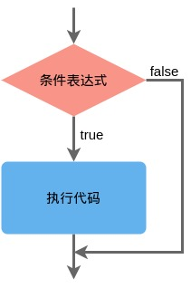

    ```java
    if (logic expression) {
        statements...
    } else {
        statements...
    }
    ```

    if-else 语句流程图：

    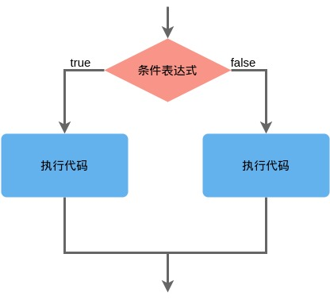

    ```java
    if (logic expression) {
        statements...
    } else if (logic expression) {
        statements...
    } else {
        statements...
    }
    ```

    if-else if 语句流程图：

    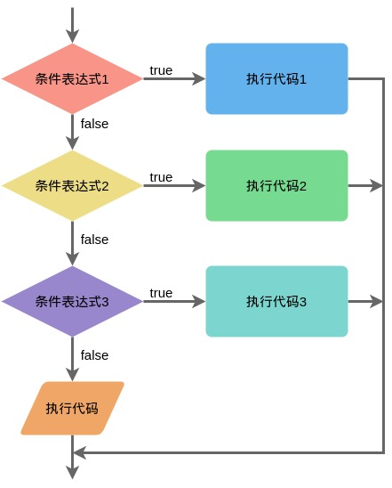

    示例代码：

    ```java
    import java.util.Scanner;

    public class IfTest {
        public static void main(String[] args) {
            // 获取键盘输入
            System.out.println("请输入年龄：（20）");
            Scanner in = new Scanner(System.in);
            int age = in.nextInt();

            // 进行条件判断
            if (age < 0) {
                System.out.println("输入数据错误");
            } else if (age < 18) {
                System.out.println("少年");
            } else if (age < 35) {
                System.out.println("青年");
            } else if (age < 60) {
                System.out.println("中年");
            } else {
                System.out.println("老年");
            }
        }
    }
    ```

    如果多个条件表达式之间是“互斥”关系，判断条件和执行语句的顺序不影响；如果条件表达式之间有“交集”，必须考虑判断条件和执行语句的顺序，通常将判断范围小的条件设置在前。

    - 练习: NumberCalculationTest.java
    - 练习: NumberSortTest.java

2. switch 分支语句

    ```java
    switch (expression) {
        case condition1:
            statement;
            break;
        case condition2:
            statment;
            break;
        default:
            statment;
    }
    ```

    switch 分支结构流程图：

    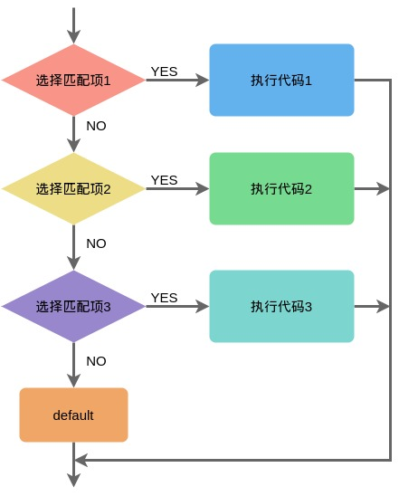

    switch 示例：

    ```java
    public class SwitchTest {
        public static void main(String[] args) {
            // 从键盘获取输入
            Scanner input = new Scanner(System.in);
            System.out.println("请输入单科目成绩: (0~100)");
            double score = input.nextDouble();

            int level = (int) score / 10;
            switch (level) {
                case 0:
                case 1:
                case 2:
                case 3:
                case 4:
                case 5:
                    System.out.println("科目等级评定：不及格");
                    break;
                case 6:
                case 7:
                    System.out.println("科目等级评定：及格");
                    break;
                case 8:
                    System.out.println("科目等级评定：良好");
                    break;
                case 9:
                case 10:
                    System.out.println("科目等级评定：优秀");
                    break;
                default:
                    System.out.println("成绩输入错误");
                    break;
            }
        }
    }
    ```

    switch 结构的表达式，只能是 byte, short, char, int, 枚举, String 类型的一种，依次匹配各个 case 的常量 ，匹配成功则进入执行，至 break 时结束；default 是可选的，且位置可变化。

    - 练习： MonthAndSeasonTest.java
    - 练习： WhichDayTest.java

### 2.7.3 循环结构

循环语句通常由初始化语句、循环条件、循环体和迭代语句四个部分组成。

1. while

    ```java
    [init_statments]
    while (test_expression) {
        statements;
        [iteration_statements]
    }
    ```

    while 循环流程图：

    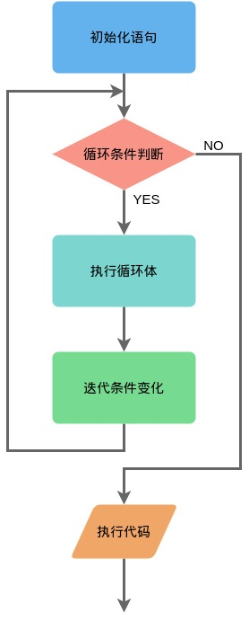

    一定要保证循环条件有变为 false 的时候，否则将成为一个死循环。

2. do-while

    ```java
    [init_statements]
    do {
        statements;
        [iteration_statements]
    } while (test_expression);
    ```

    do-while 循环结构流程图：

    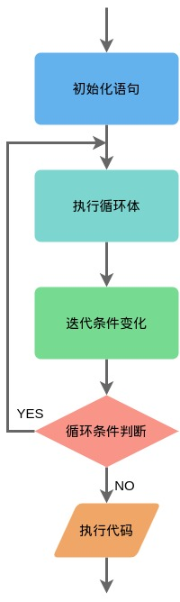

    即使 test_expression 循环条件的初始值为假，do-while 循环也会执行一次。

3. for

    ```java
    for ([init_statements]; [test_expression]; [iteration_statement]) {
        statements;
    }
    ```

    for 循环结构流程图：

    

    for 循环示例：

    ```java
    public class ForTest {
        public static void main(String[] args) {
            // 从键盘获取输入
            Scanner input = new Scanner(System.in);
            System.out.println("请输入任意整数: ");
            int num = input.nextInt();

            int sum = 0;
            for (int i = 0; i <= num; i++) {
                sum += i;
            }
            System.out.println("0 ~ " + num + "间所有整数的和为：" + sum);
        }
    }
    ```

    - 练习：MultiplicationTableTest.java

### 2.7.4 控制循环结构

1. 使用 break 结束循环

    break 用于完全结束一个循环，跳出循环体。

2. 使用 continue 结束本次循环

    continue 只是中止本次循环，接着开始下一次循环。

3. 使用 return 结束方法

    当一个方法执行到 return 语句时，方法将被结束。

示例：

```java
public class PositiveAndNegativeTest {
    public static void main(String[] args) {
        // 从键盘获取输入
        Scanner input = new Scanner(System.in);
        System.out.println("请输入任意个整数: ");

        // 记录正数个数
        int positiveNumbers = 0;
        // 记录负数个数
        int negativeNumbers = 0;

        while (true) {
            int number = input.nextInt();
            if (number > 0) {
                positiveNumbers++;
            } else if (number < 0) {
                negativeNumbers++;
            } else {
                break;
            }
        }
        System.out.println("输入正数个数为：" + positiveNumbers
            + "，负数个数为：" + negativeNumbers);
    }
}
```

-   练习：GreatestCommonDivisorTest.java
-   练习：LeastCommonMultipleTest.java
-   练习：PrimeNumberTest.java

## 2.8 数组

### 2.8.1 数组概述

数组是多个相同类型的数据按顺序排列的集合，可以通过一个整形下标访问数组的每一个元素。

1. 数组特点

    - 数组是有序排列的集合；
    - 创建数组在内存中占用一块连续的空间；
    - 一旦创建数组，就不能改变其大小；
    - 数组是引用类型变量，其元素可以是任意数据类型。

2. 数组分类

### 2.8.2 数组的声明与初始化

1.  数组声明

    声明数组变量时，必须确定数组类型和数组变量名。

    ```java
    int[] id;
    ```

2.  数组初始化

    -   静态初始化

        数组初始化的同时对数组元素进行赋值。

        ```java
        boolean[] flag = new boolean[] {true, false};
        // 数组创建与赋初始值的简写形式
        int[] nums = {1, 2, 3, 4, 5};
        ```

    -   动态初始化

            数组初始化和数组元素赋值分开进行。

            ```java
            String[] books = new String[5];
            books[0] = "Core Java";
            books[1] = "Thinking in Java";
            books[2] = "Effective Java";
            books[3] = "Professional JavaScript for Web Developers";
            books[4] = "Python Crash Course";
            ```

        数组初始化时内存如图：

    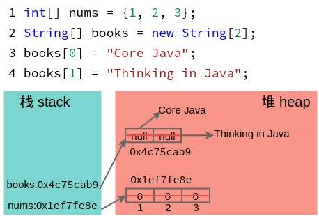

    如图所示，执行代码`int[] nums = {1, 2, 3};`时，栈内存开辟一个内存空间，存放 nums 地址，堆内存开辟一段连续内存并全部初始化为 0，再分别将 nums[0]、nums[1]、nums[2]赋值为 1、2、3；执行`String[] books = new String[2];`时，栈内存开辟一个存储空间，存放 books 引用地址，并将 books[0]和 books[1]赋值为 null，执行后两行赋值操作时，先在堆内存构建两个字符串，然后 books[0]内存储字符串"Core Java"的地址，books[1]存储字符串"Thinking in Java"的地址，至此两个数组初始化结束。

3.  数组元素默认初始化值

    byte, short, int, long 等的默认初始值为 0；float, double 的默认初始值为 0.0；char 的默认初始值为 0 或'\u0000'（不是'0'）；boolean 类型的默认初始值为 false；引用类型的默认值为 null。

### 2.8.3 数组遍历

1. for 循环遍历

    ```java
    for (int i = 0; i < id.length; i++) {
        System.out.println(id[i]);
    }
    ```

2. for-each 循环遍历

    ```java
    for (String book : books) {
        System.out.println(book);
    }
    ```

一维数组示例代码：

```java
public class ArrayTest {
    public static void main(String[] args) {
        // 数组声明与静态初始化
        int[] id = {1, 2, 3, 4, 5};

        // 数组声明与动态初始化
        String[] books = new String[5];
        books[0] = "Core Java";
        books[1] = "Thinking in Java";
        books[2] = "Effective Java";
        books[3] = "Professional JavaScript for Web Developers";
        books[4] = "Python Crash Course";

        System.out.println("id.length = " + id.length);
        // for循环遍历数组元素
        for (int i = 0; i < id.length; i++) {
            System.out.print(id[i] + "\t");
        }
        System.out.println();

        // for-each遍历数组元素
        for (String book : books) {
            System.out.println(book);
        }
    }
}
```

-   练习：ArrayNumbersTest.java

### 2.8.4 多维数组

1. 二维数组声明

    ```java
    int[][] arr;
    String[][] booksInfo;
    ```

2. 二维数组初始化

    ```java
    int[][] arr = new int[][] {{1, 2, 3}, {4, 5}, {6, 7, 8}};
    // String[3][2]表示3行2列的二维数组
    String[][] booksInfo = new String[3][2];
    booksInfo[0][0] = "Core Java";
    booksInfo[0][1] = "Cay S. Horstmann";
    booksInfo[1][0] = "Thinking in Java";
    booksInfo[1][1] = "Bruce Eckel";
    booksInfo[2][0] = "Effective Java";
    booksInfo[2][1] = "Joshua Bloch";
    ```

    二维数组初始化内存分析：

    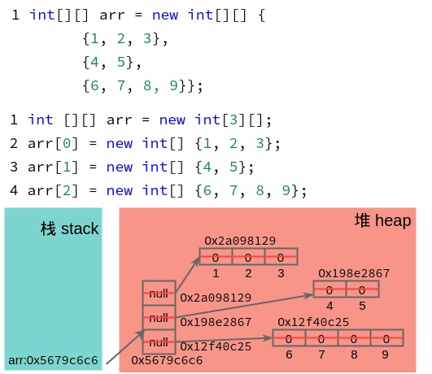

    如图所示，执行代码：

    ```java
    int[][] arr = new int[][] {{1, 2, 3}, {4, 5}, {6, 7, 8, 9}};
    ```

    等同于

    ```java
    int [][] arr = new int[3][];
    arr[0] = new int[] {1, 2, 3};
    arr[1] = new int[] {4, 5};
    arr[2] = new int[] {6, 7, 8, 9};
    ```

    声明二维数组 arr 后，栈空间分配内存空间存储 arr 的地址（示例为 0x5679c6c6）；在堆内存中，先开辟一段连续的地址空间并初始化为 null，再分别存储 arr[0]、arr[1]和 arr[2]的地址；然后在堆内存中分别开辟 arr[0]、arr[1]和 arr[2]的存储空间，将其初始化为默认值（int 型数组即为 0），每个存储单元经赋值操作最终存储初始值，如`arr[0][0]=1`。由此可以看出，Java 多维数组的本质是：多维数组是数组的数组。

3. 二维数组遍历

    ```java
    for (int i = 0; i < arr.length; i++) {
        for (int j = 0; j < arr[i].length; j++) {
            System.out.print(arr[i][j] + "\t");
        }
        System.out.println();
    }
    ```

二维数组示例代码：

```java
public class TwoDimensionalArrayTest {
    public static void main(String[] args) {
        // 数组声明与静态初始化
        int[][] arr = new int[][] {{1, 2, 3}, {4, 5}, {6, 7, 8, 9}};
        // int [][] arr = new int[3][];
        // arr[0] = new int[] {1, 2, 3};
        // arr[1] = new int[] {4, 5};
        // arr[2] = new int[] {6, 7, 8, 9};

        // 数组声明与动态初始化
        String[][] booksInfo = new String[3][2];
        booksInfo[0][0] = "Core Java";
        booksInfo[0][1] = "Cay S. Horstmann";
        booksInfo[1][0] = "Thinking in Java";
        booksInfo[1][1] = "Bruce Eckel";
        booksInfo[2][0] = "Effective Java";
        booksInfo[2][1] = "Joshua Bloch";

        System.out.println("arr = " + arr);
        System.out.println("arr.length = " + arr.length);
        System.out.println("arr[0] = " + arr[0]);
        System.out.println("arr[1] = " + arr[1]);
        System.out.println("arr[2] = " + arr[2]);
        // for循环遍历数组元素
        for (int i = 0; i < arr.length; i++) {
            for (int j = 0; j < arr[i].length; j++) {
                System.out.print("a[" + i + "][" + j +"]=" + arr[i][j] + "\t");
            }
            System.out.println();
        }

        // for-each遍历数组元素
        System.out.println("booksInfo = " + booksInfo);
        System.out.println("booksInfo[0] = " + booksInfo[0]);
        System.out.println("booksInfo[1] = " + booksInfo[1]);
        System.out.println("booksInfo[2] = " + booksInfo[2]);
        for (String[] book : booksInfo) {
            for (String strings : book) {
                System.out.print(strings + ", ");
            }
            System.out.println();
        }
    }
}
```

### 2.8.5 数组常用方法

1.  数组复制

    ```java
    int[] nums = {1, 2, 3, 4, 5};
    int[] arr;
    arr = nums;
    ```

    代码`arr = nums`只是将数组 nums 的内存地址赋给数组 arr，两个引用同时指向一块内存区域，类似于计算机中的创建文件快捷方式，改变其中一个，另一个也会改变。

    正确的复制是使用 Arrays 工具类提供的复制方法，即

    > Arrays.copy(source_rray, new_array_length);

    ```java
    arrCopy = Arrays.copyOf(nums, 10);
    ```

2.  数组反转

    ```java
    public class ArrayReverseTest {
        public static void main(String[] args) {

            String[] str = {"hello", "java", "world", ",", "I", "love", "you"};
            for (int i = 0; i < str.length; i++) {
                System.out.print(str[i] + " ");
            }
            System.out.println();

            // 方式一
            for (int i = 0; i < str.length / 2; i++) {
                String temp = str[i];
                str[i] = str[str.length-i-1];
                str[str.length-i-1] = temp;
            }
            for (int i = 0; i < str.length; i++) {
                System.out.print(str[i] + " ");
            }
            System.out.println();

            // 方式二
            for (int i = 0, j = str.length - 1; i < j; i++, j--) {
                String temp = str[i];
                str[i] = str[j];
                str[j] = temp;
            }
            for (int i = 0; i < str.length; i++) {
                System.out.print(str[i] + " ");
            }
            System.out.println();
        }

    }

    ```

3.  数组查找

    查找操作是数据结构和算法中常用的算法，已经成熟的线性查找、二分查找、Hash 查找等等，Java 中 Arrays 类提供了二分查找的多种实现，可以直接调用，基础阶段至少应当熟练查阅文档，学会方法的基本使用，后续必须阅读 JDK 中查找算法的实现源码。

    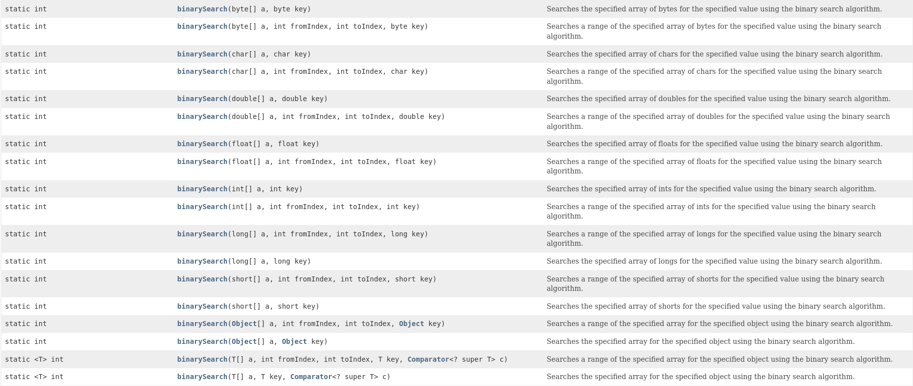

4.  数组排序

    排序操作是数据结构和算法中常用的算法，常用的如快速排序、冒泡排序、插入排序、选择排序等等，Java 中 Arrays 类提供了排序算法的实现，可以直接调用，基础阶段至少应当熟练查阅文档，学会方法的基本使用，后续必须阅读 JDK 中查找算法的实现源码。

    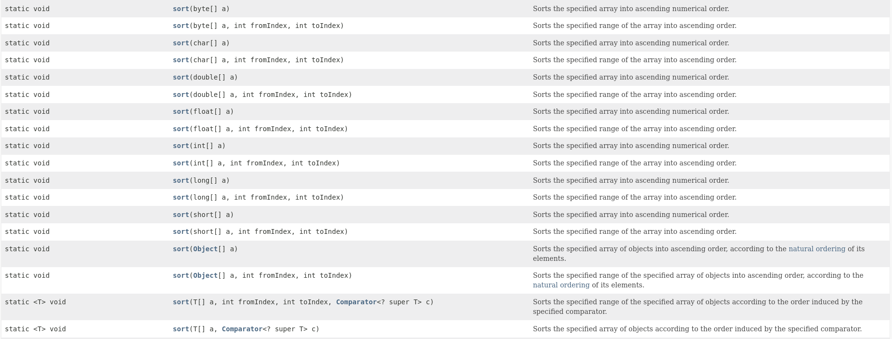
