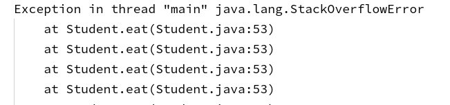

# 第 3 章 面向对象程序设计

## 3.1 面向对象概述

面向对象程序设计（OOP）是现在主流的程序设计模式。

面向对象与面向过程的程序设计模式主要区别在于解决问题的方式不同，面向过程把解决问题的过程拆分为一个一个方法，通过方法间的调用来解决；面向对象抽象出对象，通过对象间传递消息、调用方法解决问题。

参考面向对象编程思想的创始人之一（2003 年图灵奖获得者） Alan Kay 的描述，面向对象程序设计以传递消息为核心，对象间通过消息传递实现相互通信，继而完成一系列的操作。这是模拟现实世界不同实体间相互联系的一种方式。面向对象程序设计中，对象是程序的基本模块，重点是类的设计。

关于面向对象编程学习经验，可以参考 B 站 Up 主 SchelleyYuki 的一期视频，[分享 Java 学习经验和 Java 教程, 解密初学 Java 的常见误区](https://www.bilibili.com/video/BV1c54y1U7pp?spm_id_from=333.999.0.0)。

### 3.1.1 类

类(class)是构造对象的模板，是一类对象的抽象描述。每个类都由属性和行为构成，其中类属性由成员变量描述，行为则由类的方法表达。

比如，现实中每个人都有姓名、性别、身高、体重等基本信息，就可以把它们抽象为对应类的属性；每个人都有起床、吃饭、运动、睡觉等诸多行为，就可以用类的方法来表达。

### 3.1.2 对象

“万事万物皆对象”，对象是一个类的实例，是类的具体存在。

比如，张三、李四都是人类的特定实例，是客观存在的，他们具有人类描述的属性和行为，但张三和李四并不相同。

对象具备状态、行为和标识等主要特性：

-   状态

    每个对象都保存着描述当前特征的信息，对象状态的改变必须通过调用方法实现。

-   行为

    对象的行为即由可调用的方法定义。

-   标识

    每个对象都有唯一的身份，同一个类的不同对象，标识也不相同。

## 3.2 类

### 3.2.1 变量类型

一个类可以包含三种类型的变量，即局部变量、成员变量和类变量。

-   局部变量

    在方法、构造器或者语句块中定义的变量；变量声明和初始化都在方法中，随着方法的调用自动生成，方法结束后，变量自动销毁。


-   成员变量

    定义在类中，方法体之外的变量； 成员变量是对象的一部分，随着对象的创建而存在，在创建对象的时候实例化，可以被类中方法、构造方法和特定类的语句块访问。

-   类变量

    定义在类中，方法体之外，用 static 修饰。

### 3.2.2 类属性

类属性即类的成员变量。

声明类属性的语法为：

```java
// [修饰符] [变量类型] [变量名];
public String name;
private int age;
private double weight;
```

1. 修饰符

    权限修饰符描述成员变量作用范围， public,protected,private 或缺省控制符，只能出现其中之一，也可以与 static,final 组合起来。

2. 变量类型

    变量类型可以是基本类型，也可以是引用类型或者泛型。

3. 属性赋值

    属性赋值的顺序为先默认初始化值，再显式初始化值（或在代码块中赋值），再构造器初始化值，最后`对象.方法`或`对象.属性`赋值。

### 3.2.3 构造器

构造方法是是创建对象的特殊方法，主要作用是完成对象的初始化，每个类至少有一个构造器。

1. 无参构造器

    如果编写类代码时没有显式地定义构造器，系统就会默认提供一个无参构造器；创建对象时若调用默认无参构造器，会把类属性设置为各类型对应的默认值。

    ```java
    // 调用默认构造器
    Person p1 = new Person();
    ```

2. 自定义构造器

    构造器定义语法为：

    ```java
    // [修饰符] [类名] (参数列表) {}

    // 无参构造器
    public Person() {

    }
    // 有参构造器
    public Person(String name, int age, double weight) {
        this.name = name;
        this.age = age;
        this.weight = weight;
    }
    ```

    可以在类中定义多个参数列表不同的构造器，它们构成重载。类中一旦显式地定义了类构造器，系统就不会再提供无参构造器，一般情况下，建议保留无参构造器。

    String 类构造器示例：

    

### 3.2.4 类方法

类方法主要描述类所具备的功能。

类方法的声明语法为：

```java
// [修饰符] [返回值类型] [方法名] (参数列表) {}

public void setName(String name) {
    // statements
}

public String getName() {
    // statements
}

public void eat() {
    // statements
}

public void sleep() {
    // statements
}
```

1. 修饰符

    权限修饰符描述成员变量作用范围， public,protected,private 或缺省控制符，只能出现其中之一，也可以与 static,final 组合起来；

2. 返回值类型

    返回值类型可以是基本类型，也可以是引用类型，如果没有返回值，则使用`void`；

    对于有返回值的方法，必须在方法内使用`return`关键字结束方法并返回相应类型的值，否则会引起编译错误，同时`return`语句后不能再有执行语句。

3. 参数列表

    参数列表是传入方法的形参，可以是 0 个，1 个或多个，调用方法时向传入相应类型的参数。

4. 方法使用

    方法中即可以调用成员变量，也可以调用其他方法；方法调用自身时即为递归，递归必须满足递归结束的条件，否则会抛出异常。

### 3.2.5 初始化块

代码块主要用于初始化类、对象，被 static 关键字修饰的代码块随类的加载而执行，只执行一次；未被 static 修饰的代码块随对象的创建而执行，每创建一个对象执行一次，可以在这里对对象属性进行赋值。

### 3.2.6 自定义类

定义类的简单语法为：

```java
// [修饰符] class class-Name {
//     属性定义；
//     构造器定义；
//     方法定义；
// }

public class Person {
    private String name;
    private int age;
    private double weight;

    public Person() {}

    public Person(String name, int age, double weight) {
        this.name = name;
        this.age = age;
        this.weight = weight;
    }

    public void eat() {
        //
    }

    public void sleep() {
        //
    }
}
```

## 3.3 对象

### 3.3.1 创建对象

创建对象的根本途径是通过 new 关键字来创建。

```java
People p1 = new People();
```

### 3.3.2 使用引用操作对象

创建对象后可通过对象名来调用对象属性、方法，进行赋值、执行等一系列操作。

```java
// 调用属性并赋值，属性声明为private时无法赋值，不推荐使用
// p1.name = "Jack";
// p1.age = 29;
// p1.gender = "Male";
// 调用方法为属性赋值
p1.setName("Jack");
p1.setAge(29);
p1.setGender("Male");
// 调用方法执行
p1.eat();
p1.sleep();
```

### 3.3.3 对象创建内存分析

对象创建内存示意如图：


执行代码`Person p1 = new Person();`时，在栈内存中开辟空间存储变量 p1 的内存地址并指向对应的堆内存地址，在堆内存中初始化内存空间存储 Person 类成员变量，并将其初始化为默认值（示例中 String 型为 null，int 型为 0）；执行

```java
p1.name = "Jack";
p1.age = 29;
p1.gender = "Male";
```

赋值语句时，将对应成员变量设置为指定值。

执行代码`Person p2 = new Person();`时，在栈内存中开辟空间存储变量 p2 的内存地址并指向对应的堆内存地址，在堆内存中初始化内存空间存储 Person 类成员变量，并将其初始化为默认值.

执行代码`Person p3 = p1;`时，直接将堆内存对象地址赋给栈内存中变量 p3，此时 p1 和 p3 指向堆内同一块内存区域。

注：**引用类型的变量，只可能存储两类值：null 或地址值。**

类和对象创建代码示例

```java
public class Person {
    // 类属性
    private String name;
    private int age;
    private String gender;

    /**
     * @return the name
     */
    public String getName() {
        return name;
    }

    /**
     * @param name the name to set
     */
    public void setName(String name) {
        this.name = name;
    }

    /**
     * @return the age
     */
    public int getAge() {
        return age;
    }

    /**
     * @param age the age to set
     */
    public void setAge(int age) {
        this.age = age;
    }

    /**
     * @return the gender
     */
    public String getGender() {
        return gender;
    }

    /**
     * @param gender the gender to set
     */
    public void setGender(String gender) {
        this.gender = gender;
    }

    public void eat() {
        System.out.println(name + " is eating");
    }

    public void sleep() {
        System.out.println(name + " is sleeping");
    }

    public void talk(String language) {
        System.out.println(name + " is talking with " + language);
    }

    public static void main(String[] args) {
        // 类的实例化
        Person p1 = new Person();

        // 调用属性
        // p1.name = "Jack";
        // p1.age = 29;
        // p1.gender = "Male";
        // 应尽量使用类提供的方法操作属性
        p1.setName("Jack");
        p1.setAge(29);
        p1.setGender("Male");

        // 调用方法
        p1.eat();
        p1.sleep();
        p1.talk("Chinese");
    }
}
```

### 3.3.4 对象数组内存分析

创建对象数组过程如图：


代码块 1 声明的 Student 类中有 3 个成员变量，代码块 2 声明创建包含 3 个 Student 对象的数组。执行代码`Student[] students = new Student[3];`时，栈开辟内存空间存储数组 students 的内存地址（示例为 0x2a098129）并指向对应的堆内存，堆内存开辟一段连续的内存空间并初始化为 null，执行代码`students[0] = new Student("Tom", 6, 98.0);`时，在堆内存开辟内存空间存储对象地址（示例为 0x2a098a46），并将地址存储于数组 0 的位置，对象最先初始化为各类型对应的默认值，即 name 为 null，grade 为 0，score 为 0.0，执行构造函数并赋值后，各成员变量初始化为对应的值。代码`students[2] = new Student();`没有给各成员变量赋值，就为默认值。

对象数组代码示例：

```java
public class StudentTest {
    public static void main(String[] args) {
        Student[] students = new Student[5];
        students[0] = new Student("Tom", 6, 98.0);
        students[1] = new Student("Jack", 9, 85.5);
        students[2] = new Student("Tony", 6, 88.3);
        students[3] = new Student("Kay", 8, 95.5);
        students[4] = new Student("Denny", 7, 63);

        // 遍历输出
        for (int i = 0; i < students.length; i++) {
            System.out.println(students[i]);
        }
        System.out.println("---------------------");
        // 使用冒泡排序算法按成绩排序
        for (int i = 0; i < students.length - 1; i++) {
            for (int j = 0; j < students.length -1 - i; j++) {
                if (students[j].getScore() < students[j+1].getScore()) {
                    Student temp = students[j];
                    students[j] = students[j+1];
                    students[j+1] = temp;
                }
            }
        }
        for (Student student : students) {
            System.out.println(student);
        }
    }
}
class Student {
    // 类属性
    private String name;
    private int grade;
    private double score;

    public Student() {
    }

    /**
     * @param name 姓名
     * @param grade 年级
     * @param score 分数
     */
    public Student(String name, int grade, double score) {
        this.name = name;
        this.grade = grade;
        this.score = score;
    }

    /**
     * @return the name
     */
    public String getName() {
        return name;
    }

    /**
     * @param name the name to set
     */
    public void setName(String name) {
        this.name = name;
    }

    /**
     * @return the grade
     */
    public int getGrade() {
        return grade;
    }

    /**
     * @param grade the grade to set
     */
    public void setGrade(int grade) {
        this.grade = grade;
    }

    /**
     * @return the score
     */
    public double getScore() {
        return score;
    }

    /**
     * @param score the score to set
     */
    public void setScore(double score) {
        this.score = score;
    }

    @Override
    public String toString() {
        return "Student [name=" + name + ", grade=" + grade + ", score=" + score + "]";
    }
}
```

## 3.4 方法与重载

### 3.4.1 方法重载

方法重载是指在同一个类中，允许存在一个以上的同名方法，只要方法参数列表不同即可。

重载的方法与返回值类型无关，在调用方法时只通过参数列表（参数个数或参数类型）区分。


如图为`System.out.println()`方法的部分截图，针对不同的参数类型，println()方法提供了不同的实现。

方法重载代码示例：

```java
public class OverloadTest {

    public int max(int i, int j) {
        return (i > j) ? i : j;
    }

    public long max(long a, long b) {
        return (a > b) ? a : b;
    }

    public double max(double a, double b) {
        return (a > b) ? a : b;
    }

    public double max(double a, double b, double c) {
        double temp = max(a, b);
        return max(temp, c);
    }
}
```

### 3.4.2 可变形参方法

在 JavaSE 5.0 提供了 Varargs(Variable number of arguments)机制，允许直接定义形式参数个数可变的方法，调用方法时能和不定个数的实际参数相匹配，传递可变实际参数更为简洁。

可变形参必须声明在参数列表的最后。

可变形参方法示例：

```java
public class MethodArgsTest {
    public void print(int i) {
        System.out.println("i = " + i);
    }

    public void print(String str) {
        System.out.println("str: " + str);
    }

    public void print(String ...strings) {
        System.out.print("strings: ");
        for (int i = 0; i < strings.length; i++) {
            System.out.print(strings[i] + " ");
        }
        System.out.println();
    }

    public static void main(String[] args) {
        MethodArgsTest mat = new MethodArgsTest();
        mat.print(2021);
        mat.print();
        mat.print("hello");
        mat.print("hello", "java", "world");
    }
}
```

### 3.4.3 方法参数传递机制

方法参数的传递有按值传递和按引用传递两种机制。其中，按值传递表示方法接收的是调用者提供的值，按引用传递表示方法接收的是调用者提供的变量地址。

Java 总是使用按值调用，即方法在实际执行时得到的是所有参数值的一个拷贝。如果参数是基本数据类型，实参传递给形参的是真实存储的数据值；如果参数是引用类型，实参传递给形参的是实参存储数据的地址值，并且方法不能修改传递给它的任何参数变量的内容。

```java
public class PassObjectTest {

    public void printAreas(Circle c, int time) {
        for (int i = 1; i <= time; i++) {
            c.setRadius(i);
            System.out.println(i + "\t" + c.findArea());
        }

        c.setRadius(time + 1);
    }
    public static void main(String[] args) {
        PassObjectTest pot = new PassObjectTest();
        Circle c = new Circle();
        pot.printAreas(c, 5);

        System.out.println("now radius is " + c.getRadius());
    }
}

class Circle {
    private double radius;

    /**
     * @return the radius
     */
    public double getRadius() {
        return radius;
    }

    /**
     * @param radius the radius to set
     */
    public void setRadius(double radius) {
        this.radius = radius;
    }

    /**
     * Return area of the circle
     *
     * @return area of the circle
     */
    public double findArea() {
        return Math.PI * radius * radius;
    }
}
```


## 3.5 部分关键字的使用

### 3.5.1 package

Java 使用`package`关键字将类组织起来。借助于包可以分类组织和管理代码，并与其他代码库分开管理。

### 3.5.2 import

import 语句是导入指定包下的类、接口的简洁方式。

若使用的类或接口在 java.lang 下定义的，或者是在本包下，则省略 import 语句；其他情况都需要逐个导入；`import static`可导入指定类或接口中的静态结构，如属性或方法。

```java
// 导入包下的全部类和接口
import xxx.yyy.*;

// 导入包下单个类
imort xxx.yyy.Abc;

// 导入静态结构
import java.lang.Math;
```

### 3.5.3 this

在前面的代码中我们经常看到类似`this.name = name;`的代码，其中的 this 到底表示什么呢？其实可以简单理解为：this=当前对象。

this 关键字只能在构造器或方法内部使用，表示对当前对象的引用；具体用途有两个，一是引用隐式参数，二是调用类的其他构造器。

1. 在方法中使用 this

    通过形如`this.属性`或`this.方法`调用类中的成员变量和方法。

    在形如

    ```java
    public void setName(String name) {
        this.name = name;
    }
    ```

    的代码中，传入更改器方法的参数名 name 与类成员变量名相同，使用 this 调用成员变量 name 并赋值，一般情况下使用 this 加以区分（省略也可通过编译）。

2. 在构造器中使用 this

    可通过显式使用`this(形参列表);`显式地调用其它构造器，但最多只能声明一个。

    ```java
    // 构造器1
    public Person() {}

    // 构造器2
    public Person(String name) {
        this.name = name;
    }

    // 构造器3
    public Person(String name, int age, String gender) {
        this(name);
        this.age = age;
        this.gender = gender;
    }
    ```

    上面代码中定义了三个构造器，其中构造器 3 通过`this(name);`调用构造器 2，并将 name 值传入并初始化。

### 3.5.4 static

有时候，某些特定数据在内存空间中只需要一份，此时可使用 static 关键字。static 关键字可以修饰属性、方法、代码块及内部类。

1. 修饰属性

    被 static 修饰的属性称为静态变量或类变量，随类加载，可以通过`类.静态变量`调用；静态变量存在于方法区的静态域中，且只有一份；同一个类的多个对象共享同一个静态变量，通过某个对象修改静态变量，会导致所有对象的变量值都改变。

    

2. 修饰方法

    被 static 修饰的方法称为静态方法，随类加载，可通过`类.方法名`调用，静态方法中只有调用静态方法或属性，方法内不能使用 this 和 super 关键字；非静态方法即可调用非静态方法，也可调用静态方法。

3. 确定属性或方法声明为 static

    可以被多个对象共享的属性可以声明为 static；操作静态属性的方法通常也是静态的，工具类的方法习惯上声明为 static。

```java
class Chinese {
    private String name;
    private int age;

    static String nation;

    /**
     * @return the name
     */
    public String getName() {
        return name;
    }
    /**
     * @param name the name to set
     */
    public void setName(String name) {
        this.name = name;
    }
    /**
     * @return the age
     */
    public int getAge() {
        return age;
    }
    /**
     * @param age the age to set
     */
    public void setAge(int age) {
        this.age = age;
    }

    public static void info() {
        System.out.println("Chinese info");
    }

    public String toString() {
        info();
        return "Name: " + name + ", Age: " + age;
    }
}

public class StaticTest {

    public static void main(String[] args) {
        Chinese.nation = "中国";
        Chinese.info();

        Chinese c1 = new Chinese();
        c1.setName("纳兰性德");
        c1.setAge(36);

        Chinese c2 = new Chinese();
        c2.setName("李清照");
        c2.setAge(28);
        System.out.println(c2.nation);
    }
}
```

-   练习：CircleTest.java

### 3.5.5 final

final 关键字表示最终的，可以用来修饰结构、类、方法及变量。final 修饰类时表示类不能被其他类所继承；修饰方法时表示方法不能被重写；修饰属性时表示属性为常量，可以在声明时、代码块及构造器中进行初始化；修饰变量时表示变量值不能被修改，即为常量；修饰局部变量，尤其修饰形参时，表明此形参是一个常量，一旦赋值，只能在方法中使用，不可被更改。

## 3.6 封装

我们在使用 API 时更多地关注某个类提供了什么方法、该如何使用，对于具体怎么实现可以不去关心，同样，我们进行程序设计时，希望用户使用我们暴露的接口，而不是去干涉实现的细节。这就是程序设计追求的“高内聚、低耦合”，高内聚是指类的内部操作由自己完成，不许外部干涉；低耦合是指对外暴露部分方法供其使用。简单理解，把需要隐藏的隐藏起来，把应该暴露的暴露出来就是封装的思想。

封装即隐藏对象的属性和实现细节，不允许外部对象访问对象的内部信息，只提供一些可以被外界访问的方法来执行操作。

封装可以看作“不要告诉我你是怎么做的，只要做就可以了”，类比现实生活的许多例子——我们使用某个家电时，只需要关注它的功能而不去管功能的实现细节，比如，使用微波炉时只需要打开开关、旋转按钮，不用关心内部如何实现启动机器、怎样进行食品加热等功能。

### 3.6.1 访问权限控制

Java 提供了四个级别的访问权限控制，访问权限控制等级从小到大依次为：public,protected,包访问权限,private。可以通过访问权限控制实现清晰合理的封装。

-   public:所有人可用；
-   protected:所有子类可用；
-   包访问权限:不加任何修饰符即为包访问权限，同一包内其他类可用；
-   private:其他任何类不可用。

四种访问权限可以修改类及类的内部结构、属性、方法、构造器、内部类等等。

### 3.6.2 更改器方法和访问器方法

一般情况下，我们将类属性声明为私有，其他类不能直接访问或修改成员变量，避免用户通过“对象.属性”的方式调用属性，而是通过类暴露的方法进行操作。在实际问题中，经常需要对类成员变量进行一些条件限制，可以通过方法添加限制条件，实现更好的封装和更安全的操作。这是 Java 封装性的一个具体体现。

1. 更改器方法

    提供方法以改变类属性的状态。

    ```java
    /**
     * @param name the name to set
     */
    public void setName(String name) {
        if (name.length <= 0) {
            System.out.println("数据错误");
        } else {
            this.name = name;
        }
    }
    ```

2. 访问器方法

    提供方法以访问属性。

    ```java
    /**
     * @return the age
     */
    public int getAge() {
        return age;
    }
    ```

## 3.7 继承

在之前的示例中，可以发现 Person 类有 name, gender, age 等属性，Student 类除了 name, gender, age 属性外，还有 major, score 等属性；从逻辑关系上来说，学生类必然是人类。这种情况下，我们就可以使 Student 类继承 Person 类，复用 Person 类的属性、方法。

继承是类复用的有效方法之一。继承通过使用已存在的类的定义作为基础建立新的类，新的类可以增加新的属性和方法。

### 3.7.1 类、子类和父类

在上面的描述里，可以清楚地看到，类与类的继承之间有明显的"is-a"关系，这也是继承的主要特征。

类继承结构示意图：


Java 使用关键字`extends`(英语意思为延展、拓展)来实现类的继承。已存在的类称为父类、基类或超类，由父类继承派生的新类称为子类或派生类。

Java 中所有的继承都是公有继承，一旦子类继承父类，子类便获取到父类的结构、属性和方法；在此基础上，子类可以添加新的属性、方法，也可以重写父类的某个方法，进一步丰富类的功能，满足特定的需求。

但应注意一个父类可以有多个子类，而一个子类只能有一个父类，这称为类的单继承。Object 类是所有类的父类，所有类默认继承 Object 类。

### 3.7.2 方法重写

子类继承父类后，可以重新覆盖父类中的同名方法，改造它的功能以更好满足要求。

```java
public class Person {
    ...
    public void eat() {
        System.out.println(name + " is eating");
    }
    ...
}
```

```java
public class Student extends Person {
    ...
    // override
    public void eat() {
        System.out.println(this.getName() + " should be nutritious and balanced");
    }
    ...
}
```

**区分方法的重载(overload)与重写(override)**:

重写方法的声明：

```java
[权限修饰符] [返回值类型] [方法名] (形参列表) throws [异常类型]{
    // 方法体
}
```

-   子类重写方法与父类被重写方法的方法名、形参列表相同;
-   子类重写方法的权限修饰符不小于父类被重写方法（子类不能重写父类中声明为 private 的方法）；
-   若父类被重写方法的返回值类型是 void，则子类重写方法的返回值类型也只能是 void；若父类被重写方法的返回值类型是基本数据类型，则子类重写方法的返回值类型只能是相同的基本数据类型；若父类被重写方法的返回值类型是引用类型 A，则子类重写方法的返回值类型可以是 A 类型或其子类；
-   子类重写方法抛出的异常类型不大于父类被重写方法抛出的异常类型；
-   子类重写方法与父类被重写方法的方法体不同。

### 3.7.3 super 关键字

super 可以简单的理解为“父类的”，用途主要有两个，一是调用父类的属性和方法，二是调用父类的构造器。

1. 调用父类属性和方法

    ```java
    // class Student extends Person
    public void eat() {
        // 调用父类方法，即Person类的eat()方法
        super.eat();
        System.out.println(this.getName() + " should be nutritious and balanced");
    }
    ```

    在子类方法中可用通过`super.属性`和`super.方法`的方式显式地调用父类的属性或方法，实现功能复用。

    若省略 super 关键字，默认调用子类的同名方法，编译时会引起栈溢出错误。

    ```java
    // class Student extends Person
    public void eat() {
        // 此时默认调用Student类中的eat()方法，引起栈溢出错误
        eat();
        System.out.println(this.getName() + " should be nutritious and balanced");
    }
    ```

    

2. 调用父类构造器

    ```java
    public Student(String name, int age,
        String gender, int grade, String major, double score) {
        // 调用父类构造器
        super(name, age, gender);
        this.grade = grade;
        this.major = major;
        this.score = score;
    }
    ```

    可以在子类构造器中通过`super(形参列表);`的方式显式调用父类已声明的构造器，代码必须在子类构造器的第一行，因此在子类构造器中`this(形参列表);`和`super(形参列表);`只能二选一。在子类构造器首行没有显式地声明`this(形参列表);`和`super(形参列表);`时，默认调用父类的无参构造器，即默认会添加代码`super();`。

### 3.7.4 子类对象实例化过程

子类继承父类后，获得了父类中声明的属性和方法，创建子类的对象，会在堆空间中加载所有父类声明的属性；当通过子类构造器创建对象时，一定直接或间接地调用它的父类构造器，直到调用 java.lang.Object 类的空参构造器为止。

### 3.7.5 访问权限控制测试

学习继承之后，我们可以更进一步对 Java 的 4 级访问权限控制进行测试，更好地理解把握。

```java
//
public class Order {
    private int orderPrivate;
    int orderDefault;
    protected int orderProtected;
    public int orderPublic;

    private void methodPrivate() {
        System.out.println("private method");
    }

    void methodDefault() {
        System.out.println("default method");
    }

    protected void methodProtected() {
        System.out.println("protected method");
    }

    public void methodPublic() {
        System.out.println("public method");
    }
}
```

```java
public class OrderTest {
    public static void main(String[] args) {
        Order order = new Order();

        // order.orderPrivate = 0;
        order.orderDefault = 1;
        order.orderProtected = 2;
        order.orderPublic = 3;

        // order.methodPrivate();
        order.methodDefault();
        order.methodProtected();
        order.methodPublic();
    }
}
```

若执行被注释代码`order.orderPrivate = 0;`和`order.methodPrivate();`会引发编译错误：


## 3.8 多态

### 3.8.1 多态的理解和使用

多态即一个事物的多种形态，在 Java 中具体体现为同一个接口使用不同的实例而执行不同的操作。

```java
public class PolymorphicTest {
    public static void main(String[] args) {
        Person p1 = new Person();
        p1.eat();

        // Student extends Person
        Student student = new Student("Jenny", 26, "Female", 9, "Chinese", 55.0);
        student.eat();
        student.talk("English");

        // Teacher extends Person
        Person p2 = new Teacher("LingMing", 32, "Male", "Professor", "Chinese", 55000);
        p2.eat();
        p2.talk("Chinese");
        // p2.teach();
    }
}
```

父类的引用指向子类的对象，如示例代码，可以把 Student 或 Teacher 对象直接赋给 Person 引用；在调用方法时，编译时对象只能调用父类中也存在的方法，实际执行的是子类重写的父类方法。

对象调用父类未声明的方法时（注释`p2.teach();`），引发编译错误：


多态是一种运行时行为，使用时必须具备几个基本条件，一是有类的继承关系，二是有方法的重写。

### 3.8.2 向下转型

```java
// Teacher extends Person
Person p2 = new Teacher("LingMing", 32, "Male", "Professor", "Chinese", 55000);
p2.eat();
p2.talk("Chinese");

Teacher teacher = (Teacher) p2;
// teach()方法是Teacher类中特有的方法
teacher.teach();
```

对象的多态性中，内存中实际加载了子类特有的属性和方法，但由于变量声明为父类类型，导致编译时无法调用子类特有的属性和方法；必须进行强制类型后转换才能调用子类特有的属性和方法。使用强制类型转换时，可能出现 ClassCastException 异常。

### 3.8.3 instanceof 操作符

为避免对象在进行强制类型转换时出现 ClassCastException 异常，可先使用`instanceof`操作符判断对象的类型，再进行向下转型。

## 3.10 抽象类与抽象方法

位于类的继承层次上层的类更加通用、抽象，可以将其只作为派生其他类的父类，而不让其产生实例对象，这种类可以声明为抽象类。

抽象类中不包含具体方法，应该尽量将通用的域和方法放在父类。抽象类主要用于代码复用，强调所属关系。

包含一个或多个抽象方法的类必须被声明为抽象类；抽象方法只声明，不提供方法的实现；抽象方法必须由子类提供实现。

```java
abstract class Vegetables {
    String name;
    double weight;
    double price;

    public Vegetables() {}

    public Vegetables(String name, double weight, double price) {
        this.name = name;
        this.weight = weight;
        this.price = price;
    }

    // 抽象方法不能提供方法实现
    public abstract void sow();

    public void grow() {
        System.out.println(name + " is growing up");
    }
}

class Tomato extends Vegetables {

    public Tomato() {}

    public Tomato(String name, double weight, double price) {
        super(name, weight, price);
    }

    // 子类必须提供父类抽象方法的实现
    public void sow() {
        System.out.println("sow tomatoes");
    }
}

public class AbstractTest {
    public static void main(String[] args) {
        // Vegetables v = new Vegetables();
        Tomato t = new Tomato("tomato", 0.32, 1.54);
        t.sow();
        t.grow();
    }
}
```

-   练习：Employee.java, SalariedEmployee.java, HourlyEmployee.java, PayrollSystem.java

## 3.11 接口

接口主要用来描述类所具备的功能，其本质是标准和规范。

### 3.11.1 接口概念

接口是与类并列的结构，它是对类一组需求的描述，但不给出每个功能的实现。

### 3.11.2 接口定义

接口的成员主要有全局常量、抽象方法及默认方法、静态方法（JDK8.0 后），其中全局常量默认为`public static final`修饰；方法默认被`public abstract`修饰，均可省略不写；接口中定义的静态方法只能由接口调用；默认方法可通过接口实现类的对象调用。

```java
interface Flyable {
    // 全局常量
    public static final int MAX_SPEED = 7900;
    int MIN_SPEED = 1;

    // 抽象方法
    public abstract void fly();
    void stop();

    // 静态方法
    static void destination() {
        System.out.println("destination: Beijing" );
    }

    // 默认方法
    default void distance() {
        System.out.println("get distance");
    }
}
```

### 3.11.3 接口实现

一个 Java 类可以通过`implement`关键字实现多个多个接口，此时必须全部实现接口中声明的方法。这种机制在很大程度上弥补一单继承的限制。

```java
interface USB {
    //
    double TRANSFER_SPEED = 3.0;

    void start();
    void stop();
}

class Flash implements USB {

    @Override
    public void start() {
        System.out.println("the flash is starting");
    }

    @Override
    public void stop() {
        System.out.println("the flash is stopping");
    }
}

class Printer implements USB {

    @Override
    public void start() {
        System.out.println("the printer is starting");
    }

    @Override
    public void stop() {
        System.out.println("the printer is stopping");
    }
}

class Computer {
    public void transferDate(USB usb) {
        usb.start();
        System.out.println(usb + " is transferring data");
        usb.stop();
    }
}

public class USBTest {
    public static void main(String[] args) {
        Computer computer = new Computer();

        Flash flash = new Flash();
        computer.transferDate(flash);
        System.out.println("------------");

        Printer printer = new Printer();
        computer.transferDate(printer);
        System.out.println("------------");

        USB disk = new USB() {
            @Override
            public void start() {
                System.out.println("hard disk is starting");
            }

            @Override
            public void stop() {
                System.out.println("hard disk is stopping");
            }
        };
        disk.start();
        disk.stop();
    }
}
```

## 3.12 内部类

Java 中，允许在一个类的内部定义另一个类，后者即为内部类，对应于外部类。内部类可以分为成员内部类和局部内部类。

内部类的用途主要是：

-   内部类方法可以访问类定义所在作用域中的数据；
-   内部类可以对同一个包中的其他类隐藏；
-   使用回调函数时匿名内部类更便携。

### 3.12.1 成员内部类

成员内部类主要有静态内部类和非静态内部类。成员内部类是外部类的成员，可以调用外部类的结构，

```java
class Computer {
    private String brand;
    private int price;

    public void readData() {
        System.out.println("Computer is reading data to cache");
    }

    // 静态成员内部类
    static class CPU {
        int frequency;
        String instruction;

        public void compute() {
            System.out.println("CPU can do " + frequency + " instructions in a second");
        }
    }
    // 非静态成员内部类
    class Cache {
        int capacity;

        Cache() {}

        Cache(int capacity) {
            this.capacity = capacity;
        }

        public void cache() {
            // Computer.this.readData();
            readData();
            System.out.println("Cache could storage " + capacity + " GB data");
        }
    }
}

public class InnerClassTest {
    public static void main(String[] args) {
        // 创建CPU实例（静态成员内部类）
        Computer.CPU cpu = new Computer.CPU();
        cpu.compute();

        // 创建Cache实例（非静态成员内部类）
        Computer computer = new Computer();
        Computer.Cache cache = computer.new Cache(500);
        cache.cache();
    }
}
```

### 3.12.2 局部内部类

局部内部类的作用域被限定在声明局部类的块中，可以对外部世界完全隐藏。