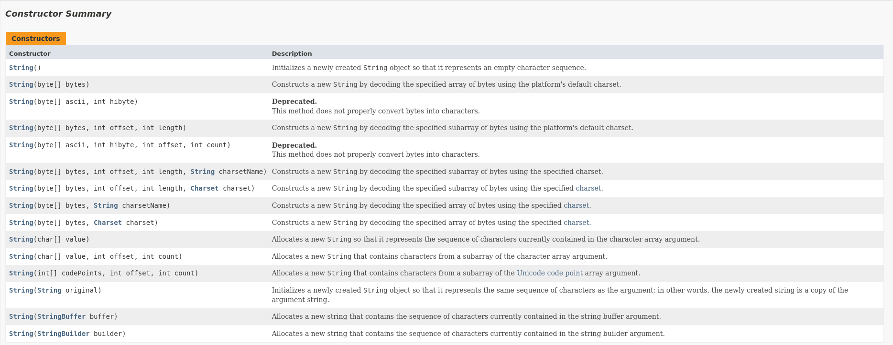

# 第 4 章 常用类

Java 之所以强大，根本在于它所提供的全面类库支持。在学习完面向对象编程后，我们就要结合 API 和源码深入学习一些常用类，熟悉方法的基本使用，学习借鉴类的设计。特别是一些工具类的使用，直接参考 API 文档才是最高效的，把语言作为一种有效的工具，文档作为辅助教材，需要什么用什么、用到什么查什么，这种动态、持续的学习是我们必须长期保持的态度。

## 4.1 Object

Object 类是所有 Java 类的根父类。

```java
public class ObjectTest {
    public static void main(String[] args) {
        HelloWorld hello = new HelloWorld();
        // class java.lang.Object
        System.out.println(hello.getClass().getSuperclass());
    }
}
```

### 4.1.1 Object 常用方法


1. equals()

    **==与 equals()的区别：**

    ==运算符可以使用在基本数据类型和引用类型变量中，应用于基本数据类型变量时比较数据是否相等，引用类型变量时比较对象的地址值是否相同；

    equals()方法只适用于引用类型，Object 类中 equals()方法的定义和==作用相同，可重写 equals()方法进行对象的比较。

    ```java
    // Object类中equals()方法的定义
    public boolean equals(Object obj) {
        return this == obj;
    }
    ```

    ```java
    // String类中equals()方法的定义
    public boolean equals(Object anObject) {
        if (this == anObject) {
            return true;
        } else {
            if (anObject instanceof String) {
                String aString = (String)anObject;
                if (this.coder() == aString.coder()) {
                    return this.isLatin1() ? StringLatin1.equals(this.value, aString.value) : StringUTF16.equals(this.value, aString.value);
                }
            }

            return false;
        }
    }
    ```

2. toString()

    当我们输入对象的引用时，实际就是调用当前对象的 toString()方法。可以重写 toString()方法进行特定信息的输出。

## 4.2 包装类

Java 对基本数据类型定义了相应的引用类型。

| 基本数据类型 | 引用类型  |
| ------------ | --------- |
| byte         | Byte      |
| short        | Short     |
| int          | Integer   |
| long         | Long      |
| float        | Float     |
| double       | Double    |
| boolean      | Boolean   |
| char         | Character |

### 4.2.1 基本数据类型和包装类的转化

1. 自动装箱

    由基本数据类型转换为包装类时，不再推荐通过数据值或字符串调用包装类构造器，而是使用自动装箱机制。自动装箱机制即编译器自动将基本数据类型值转换为对应的包装类。

    ```java
    Integer num = 5;
    System.out.println(num.toString());
    ```

2. 自动拆箱

    自动拆箱机制即编译器自动将包装类转换为对应的基本数据类型。

    ```java
    public class WrapperTest {
        public static void main(String[] args) {
            Integer i = new Integer(1);
            Integer j = new Integer(1);
            // display false
            System.out.println("i == j: " + (i == j));

            Integer m = 1;
            Integer n = 1;
            // display true
            System.out.println("m == n: " + (m == n));

            Integer x = 128;
            Integer y = 128;
            // display false
            System.out.println("x == y: " + (x == y));
        }
    }
    ```

对于`m == n`输出 true，`x == y`输出 false 的结果，我们一定感到诧异，同样使用自动装箱机制，怎么会出现不同的结果呢？

阅读 JDK 源码，我们会发现 Integer 中自动装箱时的代码为：

```java
private static class IntegerCache {
    static final int low = -128;
    static final int high;
    static final Integer[] cache;
    static Integer[] archivedCache;

    private IntegerCache() {
    }

    static {
        int h = 127;
        String integerCacheHighPropValue = VM.getSavedProperty("java.lang.Integer.IntegerCache.high");
        int size;
        if (integerCacheHighPropValue != null) {
            try {
                size = Integer.parseInt(integerCacheHighPropValue);
                 size = Math.max(size, 127);
                 h = Math.min(size, 2147483518);
            } catch (NumberFormatException var6) {
            }
        }

        high = h;
        VM.initializeFromArchive(Integer.IntegerCache.class);
        size = high - -128 + 1;
        if (archivedCache == null || size > archivedCache.length) {
            Integer[] c = new Integer[size];
            int j = -128;

            for(int k = 0; k < c.length; ++k) {
                c[k] = new Integer(j++);
            }

             archivedCache = c;
        }

        cache = archivedCache;

        assert high >= 127;
    }
}
```

它将使用频率较高的-128~127 之间的整数使用 IntegerCache 数组缓存，所以`Integer m = 1;`和`Integer m = 1;`是从缓存数组中取出同一个数组元素，无需构造对象；而`Integer x = 128;`和`Integer y = 128;`是在内存中重新构造对象，两个内存对象的地址必然不同。

### 4.2.2 包装类与 String 类的转化

1. String 转换为基本数据类型

    String 类转换基本数据类型时调用包装类的静态方法 parseXxx(String str)即可。

    ```java
    public class ConvertTest {
        public static void main(String[] args) {
            String str1 = "123";
            int num = Integer.parseInt(str1);
            System.out.println(++num);
        }
    }
    ```

2. 基本数据类型、包装类转换为 String 类型

    基本数据类型和包装类型转换为 String 类型时调用 String 重载的 valueOf(xxx)方法。

## 4.3 String 类

String 字符串类是日常使用非常频繁的一个类，其中包含很多有用的方法。

### 4.3.1 String 类源码分析

1. String 类基本特征

    ```java
    public final class String
        implements java.io.Serializable, Comparable<String>, CharSequence {

        @Stable
        private final byte[] value;

        private final byte coder;

        /** Cache the hash code for the string */
        private int hash; // Default to 0

        /** use serialVersionUID from JDK 1.0.2 for interoperability */
        private static final long serialVersionUID = -6849794470754667710L;

        static final boolean COMPACT_STRINGS;

        static {
            COMPACT_STRINGS = true;
        }
    ```

    - String 声明为 final 的，即不可被继承；
    - String 实现了 Serializable 接口，即字符串支持序列化；
    - String 实现了 Comparable 接口，即可比较大小；
    - String 内部定义了 final char[] value 用于存储字符串数据；
    - String 代表不可变的字符序列，即具有不可变性：
        - 对字符串重新赋值时，需要重新指定内存区域赋值，不能使用原有 value 进行赋值；
        - 对现有字符串进行连接操作时，需要重写指定内存区域赋值，不能使用原有的 value 进行赋值；
        - 当调用 String 的 replace()方法修改指定字符或字符串时，需要重写指定内存区域赋值，不能使用原有的 value 进行赋值；

2. String 类的构造器

    ```java
    // String
    public String() {
        this.value = "".value;
        this.coder = "".coder;
    }

    @HotSpotIntrinsicCandidate
    public String(String original) {
        this.value = original.value;
        this.coder = original.coder;
        this.hash = original.hash;
    }

    public String(char value[]) {
        this(value, 0, value.length, null);
    }

    public String(char value[], int offset, int count) {
        this(value, offset, count, rangeCheck(value, offset, count));
    }

    private static Void rangeCheck(char[] value, int offset, int count) {
        checkBoundsOffCount(offset, count, value.length);
        return null;
    }
    ```

    

### 4.3.2 String 类常用方法

1. length()

    源码解析：

    ```java
    /**
     * Returns the length of this string.
     * The length is equal to the number of <a href="Character.html#unicode">Unicode
     * code units</a> in the string.
     *
     * @return  the length of the sequence of characters represented by this
     *          object.
     */
    public int length() {
        return value.length >> coder();
    }

    byte coder() {
        return COMPACT_STRINGS ? coder : UTF16;
    }
    ```

    JDK9 以后，字符串采用 byte 类型的数组存储，同时维护了属性 coder，它是编码格式标识，LATIN1 或 UTF-16，是在 String 生成的时候自动的，如果字符串中都是能用 LATIN1 就能表示的就是 0，否则就是 UTF-16；coder（）方法的返回值，如果是 LATIN-1 就是右移 0 位，如果是 UTF-16 就右移 1 位，这样就能返回正确的字符串长度。

2. charAt(int index)

    源码解析：

    ```java
    /**
     * Returns the {@code char} value at the
     * specified index. An index ranges from {@code 0} to
     * {@code length() - 1}. The first {@code char} value of the sequence
     * is at index {@code 0}, the next at index {@code 1},
     * and so on, as for array indexing.
     *
     * @param      index   the index of the {@code char} value.
     * @return     the {@code char} value at the specified index of this string.
     *             The first {@code char} value is at index {@code 0}.
     * @exception  IndexOutOfBoundsException  if the {@code index}
     *             argument is negative or not less than the length of this
     *             string.
     */
    public char charAt(int index) {
        if (isLatin1()) {
            return StringLatin1.charAt(value, index);
        } else {
            return StringUTF16.charAt(value, index);
        }
    }
    ```

3. isEmpty()

    源码解析：

    ```java
    /**
     * Returns {@code true} if, and only if, {@link #length()} is {@code 0}.
     *
     * @return {@code true} if {@link #length()} is {@code 0}, otherwise
     * {@code false}
     *
     * @since 1.6
     */
    public boolean isEmpty() {
        return value.length == 0;
    }
    ```

4. 大小写转换

    - toLowerCase()

        代码示例：

        ```java
        /**
         * toLowerCase()
         */
        public static void testToLowerCase() {
            String str = "THAT FELL LIKE SUNSHINE WHERE IT WENT";
            String strLowerCase = str.toLowerCase();
            // str本身不可变
            System.out.println(str);
            System.out.println(strLowerCase);
        }
        ```

    - toUpperCase()

5. trim()

    删除头尾的空白字符。

    源码解析：

    ```java
    /**
     * Returns a string whose value is this string, with all leading
     * and trailing space removed, where space is defined
     * as any character whose codepoint is less than or equal to
     * {@code 'U+0020'} (the space character).
     *
     * This method may be used to trim space (as defined above) from
     * the beginning and end of a string.
     *
     * @return  a string whose value is this string, with all leading
     *          and trailing space removed, or this string if it
     *          has no leading or trailing space.
     */
    public String trim() {
        String ret = isLatin1() ? StringLatin1.trim(value)
                                : StringUTF16.trim(value);
        return ret == null ? this : ret;
    }

    // StringLatin1.trim()
    public static String trim(byte[] value) {
        int len = value.length;
        int st = 0;
        while ((st < len) && ((value[st] & 0xff) <= ' ')) {
            st++;
        }
        while ((st < len) && ((value[len - 1] & 0xff) <= ' ')) {
            len--;
        }
        return ((st > 0) || (len < value.length)) ?
            newString(value, st, len - st) : null;
    }
    ```

6. 判断相等

    - equals(Object obj)
    - equalsIgnoreCase(String anotherString)

7. 字符串连接

    - concat(String str)
    -   -

8. compareTo(String anotherString)

    涉及字符串排序。

9. 截取子字符串

    - subString(int beginIndex)

        源码解析：

        ```java
        /**
         * Returns a string that is a substring of this string. The
         * substring begins with the character at the specified index and
         * extends to the end of this string.
         *
         * @param      beginIndex   the beginning index, inclusive.
         * @return     the specified substring.
         * @exception  IndexOutOfBoundsException  if
         *             {@code beginIndex} is negative or larger than the
         *             length of this {@code String} object.
         */
        public String substring(int beginIndex) {
            if (beginIndex < 0) {
                throw new StringIndexOutOfBoundsException(beginIndex);
            }
            int subLen = length() - beginIndex;
            if (subLen < 0) {
                throw new StringIndexOutOfBoundsException(subLen);
            }
            if (beginIndex == 0) {
                return this;
            }
            return isLatin1() ? StringLatin1.newString(value, beginIndex, subLen)
                            : StringUTF16.newString(value, beginIndex, subLen);
        }
        ```

    - subString(int beginIndex, int endIndex)

        截取子字符串，左闭右开。

        源码解析：

        ```java
        /**
         * Returns a string that is a substring of this string. The
         * substring begins at the specified {@code beginIndex} and
         * extends to the character at index {@code endIndex - 1}.
         * Thus the length of the substring is {@code endIndex-beginIndex}.
         *
         * @param      beginIndex   the beginning index, inclusive.
         * @param      endIndex     the ending index, exclusive.
         * @return     the specified substring.
         * @exception  IndexOutOfBoundsException  if the
         *             {@code beginIndex} is negative, or
         *             {@code endIndex} is larger than the length of
         *             this {@code String} object, or
         *             {@code beginIndex} is larger than
         *             {@code endIndex}.
         */
        public String substring(int beginIndex, int endIndex) {
            int length = length();
            checkBoundsBeginEnd(beginIndex, endIndex, length);
            int subLen = endIndex - beginIndex;
            if (beginIndex == 0 && endIndex == length) {
                return this;
            }
            return isLatin1() ? StringLatin1.newString(value, beginIndex, subLen)
                            : StringUTF16.newString(value, beginIndex, subLen);
        }
        ```

10. 替换

    - replace(char oldChar, char newChar)
    - replace(CharSequence target, CharSequence replacement)
    - replaceAll(String regex, String replacement)
    - replaceFirst(String regex, String replacement)

11. 匹配

    - matches(String regex)

12. 拆分

    - split(String regex)
    - split(String regex, int limit)

### 4.3.3 String 与其他类型的转换

1. 与 char[]数组的转换

    - toCharArray()
    - 调用 String 的构造器

2. 与 byte[]数组的转换

    ```java
    public class StringToByteTest {
        public static void main(String[] args) {
            String str1 = "abc123";
            // 使用默认字符集编码
            byte[] byteArr1 = str1.getBytes();
            System.out.println(Arrays.toString(byteArr1));

            String str2 = "中国";
            byte[] byteArr2 = str2.getBytes();
            System.out.println(Arrays.toString(byteArr2));

            try {
                // 使用GBK字符集进行编码
                byte[] gbks = str2.getBytes("gbk");
                System.out.println(Arrays.toString(gbks));
            } catch (UnsupportedEncodingException e) {
                e.printStackTrace();
            }

            // 使用默认字符集解码
            String str3 = new String(byteArr2);
            System.out.println(str3);
        }
    }
    ```

## 4.4 StringBuffer 和 StringBuilder 类

### 4.4.1 String，StringBuffer 和 StringBuilder 类的异同

自 JDK 9.0 后，String 和 StringBuffer,StringBuilder 均底层都采用 byte[]数组存储。

-   String 类是不可变的字符序列；
-   StringBuffer 类是可变的字符序列，线程安全，效率低；
-   StringBuilder 类是可变的字符序列，JDK5.0 新增，线程不安全，效率高；

代码分析：

```java
String str = new String(); // byte[] value = new byte[0]
String str = new String("abc"); // byte[] value = new byte[] {'a', 'b', 'c'}

StringBuffer sb1 = new StringBuffer();  // byte[] value = new byte[16]
sb1.append('a');    // value[0] = 97;
sb1.append('b');    // value[2] = 98;

StringBuffer sb2 = new StringBuffer("abc"); // byte[] value = new byte["abc".length() + 16]
```

### 4.4.2 StringBuffer

StringBuffer 继承父类 AbstractStringBuilder，添加线程安全相关操作。关注基本操作：增、删、改、查、插等。

1. 构造器

    ```java
    // StringBuffer
    /**
     * Constructs a string buffer with no characters in it and an
     * initial capacity of 16 characters.
     */
    @HotSpotIntrinsicCandidate
    public StringBuffer() {
        super(16);
    }

    // AbstractStringBuilder
    AbstractStringBuilder(int capacity) {
        if (COMPACT_STRINGS) {
            value = new byte[capacity];
            coder = LATIN1;
        } else {
            value = StringUTF16.newBytesFor(capacity);
            coder = UTF16;
        }
    }
    ```

2. append(xxx)

    ```java
    // StringBuffer
    @Override
    @HotSpotIntrinsicCandidate
    public synchronized StringBuffer append(String str) {
        toStringCache = null;
        super.append(str);
        return this;
    }

    // AbstractStringBuilder
    /**
     * Appends the specified string to this character sequence.
     *
     * @param   str   a string.
     * @return  a reference to this object.
     */
    public AbstractStringBuilder append(String str) {
        if (str == null) {
            return appendNull();
        }
        int len = str.length();
        ensureCapacityInternal(count + len);
        putStringAt(count, str);
        count += len;
        return this;
    }
    ```

3. delete(int start, int end)
4. replace(int start, int end, String str)
5. insert(int offset, xxx)
6. reverse()

```java
/**
 * append()
 */
public static void testAppend() {
    StringBuffer stringBuffer = new StringBuffer();
    stringBuffer.append("hello");
    stringBuffer.append(" effort");
    System.out.println(stringBuffer);
}

/**
 * replace()
 */
public static void testReplace() {
    StringBuffer stringBuffer = new StringBuffer();
    stringBuffer.append("A great effort it may seem");
    stringBuffer.replace(2, 7, "wasted");
    System.out.println(stringBuffer);
}
```

### 4.4.3 StringBuilder

StringBuilder 与 StringBuffer 类似。

对比 String 和 StringBuffer, StringBuilder 执行效率：

```java
public class StringComparison {
    public static void main(String[] args) {
        long startTime = 0L;
        long endTime = 0L;

        String text = "";
        StringBuffer buffer = new StringBuffer("");
        StringBuilder builder = new StringBuilder("");

        // StringBuffer
        startTime = System.currentTimeMillis();
        for (int i = 0; i < 100000; i++) {
            buffer.append(String.valueOf(i));
        }
        endTime = System.currentTimeMillis();
        System.out.println("StringBuffer执行时间：" + (endTime - startTime));

        // StringBuilder
        startTime = System.currentTimeMillis();
        for (int i = 0; i < 100000; i++) {
            builder.append(String.valueOf(i));
        }
        endTime = System.currentTimeMillis();
        System.out.println("StringBuilder执行时间：" + (endTime - startTime));

        // String
        startTime = System.currentTimeMillis();
        for (int i = 0; i < 100000; i++) {
            text = text + i;
        }
        endTime = System.currentTimeMillis();
        System.out.println("String执行时间：" + (endTime - startTime));
    }
}
```

## 4.5 时间和日期类

时间和日期类在开发中较为常用，但 Java 在 JDK 1.0 中引入的 Date 类和 JDK 1.1 中引入的 Calendar 类都不是非常好用，直到 JDK 8.0 引入新的时间日期 API，时间和日期操作才变得简单，建议条件允许的情况下尽可能使用新时间日期 API。

### 4.5.1 JDK 8.0 之前的时间日期类

1. Date

    源码解析：

    ```java
    /**
     * Allocates a {@code Date} object and initializes it so that
     * it represents the time at which it was allocated, measured to the
     * nearest millisecond.
     *
     * @see     java.lang.System#currentTimeMillis()
     */
    public Date() {
        this(System.currentTimeMillis());
    }

    /**
     * Allocates a {@code Date} object and initializes it to
     * represent the specified number of milliseconds since the
     * standard base time known as "the epoch", namely January 1,
     * 1970, 00:00:00 GMT.
     *
     * @param   date   the milliseconds since January 1, 1970, 00:00:00 GMT.
     * @see     java.lang.System#currentTimeMillis()
     */
    public Date(long date) {
        fastTime = date;
    }
    ```

    其他构造方法不建议使用。

2. SimpleDateFormat

    ```java
    public class SimpleDateFormatTest {
        public static void main(String[] args) throws Exception {
            // 使用默认构造器
            SimpleDateFormat sdf = new SimpleDateFormat();

            Date date = new Date();
            System.out.println(date);

            String format = sdf.format(date);
            System.out.println(format);

            // 带参数的构造器
            SimpleDateFormat nsdf =
                new SimpleDateFormat("yyyy-MM-dd hh:mm:ss");
            // 字符串必须符合构造格式
            String nstr = "2001-07-04 18:13:00";
            Date ndate = nsdf.parse(nstr);
            System.out.println(ndate);

            // 字符串转换为数据库date类型
            String birth = "2022-01-10";
            SimpleDateFormat dateFormat = new SimpleDateFormat("yyyy-MM-dd");
            Date birthday = dateFormat.parse(birth);
            java.sql.Date birthDate = new java.sql.Date(birthday.getTime());
            System.out.println(birthDate);
        }
    }
    ```

3. Calendar

### 4.5.2 新时间日期 API

1. LocalDate、LocalTime 及 LocalDateTime 类的使用

    ```java
    public class LocalDateTimeTest {
        public static void main(String[] args) {
            LocalDate localDate = LocalDate.now();
            System.out.println(localDate);

            LocalTime localTime = LocalTime.now();
            System.out.println(localTime);

            LocalDateTime localDateTime = LocalDateTime.now();
            System.out.println(localDateTime);

            LocalDateTime birthday = LocalDateTime.of(1993, 12, 30, 14, 30, 00);
            System.out.println(birthday);

            // getXxx()
            System.out.println(localDateTime.getDayOfMonth());
            System.out.println(localDateTime.getDayOfWeek());
            System.out.println(localDateTime.getMonth());
            System.out.println(localDateTime.getMonthValue());

            // withXxx()
            LocalDate future = localDate.withDayOfMonth(16);
            System.out.println(localDate);
            System.out.println(future);
        }
    }
    ```

2. Instant 类

    ```java
    public class InstantTest {
        public static void main(String[] args) {
            // 获取本初子午线对应的标准时间
            Instant instant = Instant.now();
            System.out.println(instant);

            // 添加时间偏移量
            OffsetDateTime localTime = instant.atOffset(ZoneOffset.ofHours(8));
            System.out.println(localTime);
        }
    }
    ```

3. DateTimeFormatter

    ```java
    public class DateTimeFormatterTest {
        public static void main(String[] args) {
            // 方式一：预定义的标准格式
            DateTimeFormatter formatter = DateTimeFormatter.ISO_DATE_TIME;

            // 格式化
            LocalDateTime local = LocalDateTime.now();
            System.out.println(local);
            String str = formatter.format(local);
            System.out.println(str);

            //解析
            TemporalAccessor parse = formatter.parse(str);
            System.out.println(parse);

            // 方式二：自定义格式
            DateTimeFormatter primeFormatter =
                DateTimeFormatter.ofPattern("yyyy-MM-dd hh:mm");
            String primeStr = primeFormatter.format(LocalDateTime.now());
            System.out.println(primeStr);
        }
    }
    ```

## 4.6 比较器

现实生活经常遇到需要进行排序的场景，即需要根据对象某方面的属性进行大小的比较。Java 中通过实现 Comparable 或 Comparator 接口进行对象比较规则。

### 4.6.1 Comparable 接口

Comparable 是自然排序接口，String 及包装类等都实现了该接口，对于自定义类，可以实现 Comparable 接口，重写 compareTo()方法指定排序规则。

代码示例：

```java
public class Goods implements Comparable {
    private String name;
    private double price;

    /**
     *
     */
    public Goods() {
    }

    /**
     * @param name
     * @param price
     */
    public Goods(String name, double price) {
        this.name = name;
        this.price = price;
    }

    /**
     * @return the name
     */
    public String getName() {
        return name;
    }

    /**
     * @param name the name to set
     */
    public void setName(String name) {
        this.name = name;
    }

    /**
     * @return the price
     */
    public double getPrice() {
        return price;
    }

    /**
     * @param price the price to set
     */
    public void setPrice(double price) {
        this.price = price;
    }

    @Override
    public int compareTo(Object o) {
        if (o instanceof Goods) {
            Goods goods = (Goods) o;
            if (this.price > goods.price) {
                return 1;
            } else if(this.price < goods.price) {
                return -1;
            } else {
                return 0;
            }

            // return Double.compare(this.price, goods.price);
        }
        throw new RuntimeException("提示：数据类型异常");
    }

    @Override
    public String toString() {
        return "{" + this.name + ", " + this.price + "}";
    }
}
```

### 4.6.2 Comparator 接口

Comparator 是定制排序接口，主要用于元素类型没有实现 Comparable 接口或排序规则不适合当前操作等场景，可以重写 compare()方法指定排序规则。

代码示例：

```java
public class ComparatorTest {
    /**
     * String Comparator
     */
    public static void stringCompare() {
        String[] arr = new String[] {
            "young", "old", "every",
            "round", "blood", "greep"
        };

        Arrays.sort(arr, new Comparator() {

            @Override
            public int compare(Object o1, Object o2) {
                if (o1 instanceof String && o2 instanceof String) {
                    String str1 = (String) o1;
                    String str2 = (String) o2;
                    return -str1.compareTo(str2);
                }
                throw new RuntimeException("提示：输入的数据类型不一致");
            }
        });

        System.out.println(Arrays.toString(arr));
    }

    /**
     * Goods Comparator
     */
    public static void goodsCompare() {
        Goods[] arr = new Goods[5];
        arr[0] = new Goods("LenovoMouse", 34.9);
        arr[1] = new Goods("DellMouse", 43.5);
        arr[2] = new Goods("XiaomiMouse", 20.9);
        arr[3] = new Goods("HuaweiMouse", 50.5);
        arr[4] = new Goods("HuaweiMouse", 99.9);

        Arrays.sort(arr, new Comparator() {

            @Override
            public int compare(Object o1, Object o2) {
                if (o1 instanceof Goods && o2 instanceof Goods) {
                    Goods g1 = (Goods) o1;
                    Goods g2 = (Goods) o2;
                    if (g1.getName().equals(g2.getName())) {
                        return Double.compare(g1.getPrice(), g2.getPrice());
                    } else {
                        return g1.getName().compareTo(g2.getName());
                    }
                }
                throw new RuntimeException("提示：输入的数据类型不一致");
            }
        });
        System.out.println(Arrays.toString(arr));
    }

    public static void main(String[] args) {
        stringCompare();
        goodsCompare();
    }
}
```

## 4.7 System 类

System 类中有许多系统级的属性和控制方法，如标准输入输出及控制流。

System 类方法列表：


方法的使用建议参考 API 文档。

## 4.8 Arrays 类

Arrays 类包含许多操作数组的有效方法，可以看作一个静态工具类。

### 4.8.1 Arrays 类常用方法

1. binarySearch()
2. compare()
3. copyOf()
4. equals()
5. sort()
6. toString()

## 4.9 Math 类

java.lang.Math 类包含数学操作的许多实用方法，也是一个静态工具类。

### 4.9.1 Math 类常用方法

绝对值函数、三角函数、取整函数、对数函数、指数函数及最大、最小值等，方法的使用仍然建议直接查阅文档，参考示例进行。

## 4.10 枚举类

枚举类的对象是有限的、确定的；需要定义一组常量时，建议使用枚举类。

### 4.10.1 定义枚举类

1. 自定义枚举类

    ```java
    class Season {
        // 1. 声明Season对象的属性
        private final String seasonName;
        private final String seasonDesc;

        // 2. 私有化类的构造器，并为属性赋值
        private Season(String seasonName, String seasonDesc) {
            this.seasonName = seasonName;
            this.seasonDesc = seasonDesc;
        }

        // 3. 提供当前枚举类的多个对象
        public static final Season SPRING = new Season("春天", "春暖花开");
        public static final Season SUMMER = new Season("夏天", "夏日炎炎");
        public static final Season AUTUMN = new Season("秋天", "秋高气爽");
        public static final Season WINTER = new Season("冬天", "冰天雪地");

        // 4. 其他需求
        @Override
        public String toString() {
            return seasonName + ": " + seasonDesc;
        }
    }
    ```

2. enum 关键字

    ```java
    enum Season {
        SPRING("春天", "春暖花开"),
        SUMMER("夏天", "夏日炎炎"),
        AUTUMN("秋天", "秋高气爽"),
        WINTER("冬天", "冰天雪地");

        private final String seasonName;
        private final String seasonDesc;

        /**
         * @param seasonName
         * @param seasonDesc
         */
        private Season(String seasonName, String seasonDesc) {
            this.seasonName = seasonName;
            this.seasonDesc = seasonDesc;
        }
    }
    ```

### 4.10.2 Enum 类中的常用方法

Enum 类方法列表：


1. values()

    返回枚举类的对象数组，即遍历所有的枚举值。

2. valueOf(String str)

    把字符串转为对应的枚举类对象。

3. toString()

    返回当前枚举类对象常量的名称。
