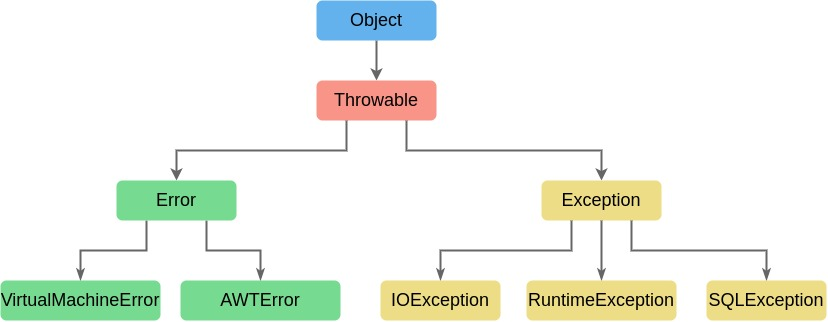

# 第 5 章 异常

我们编写的代码或多或多都会遇到各种各样的问题，无论是用户输入数据错误，还是设备问题，或者网络中断，在遇到类似这样的情况时，程序应当妥善地处理，而不是直接崩溃。Java 通过异常机制来处理各类异常情况，程序更加健壮。

## 5.1 异常概述

当程序在运行中出现问题时，应该能够返回到一种安全状态，让用户执行一些其他操作或者允许用户保存所有操作的结果，并终止程序。

异常处理的任务就是将程序的控制权从错误产生的地方转移到能够处理异常情况的处理器。

可能引发异常的情况有：

-   用户输入错误
-   设备错误
-   物理限制
-   代码错误

### 5.1.1 异常分类

异常都由 Throwable 继承而来，分为编译时异常和运行时异常，即 Error 和 Exception。

1. Error

    Error 类层次结构描述了运行时系统的内部错误和资源耗尽错误。

2. Exception

    主要包括派生于 RuntimeException 的异常和其他异常。

    RuntimeException 异常包含错误的类型转换、数组访问越界、访问 null 指针。

编译时异常是指执行`javac`命令时可能出现的异常；运行时异常是指执行`java`命令时可能出现的异常。



Java 将派生于 Error 和 RuntimeException 的异常称为非受查(unchecked)异常，其他异常称为受查(checked)异常。

### 5.1.2 常见异常示例

1. ArrayIndexOutOfBoundsException

    ```java
    // java.lang.ArrayIndexOutOfBoundsException
    int[] arr = new int[3];
    System.out.println(arr[3]);
    ```

2. ClassCastException

    ```java
     // java.lang.ClassCastException
     Object obj = new Date();
     String str = (String) obj;
    ```

3. NumberFormatException

    ```java
    // java.lang.NumberFormatException
    str = "abc";
    int num = Integer.parseInt(str);
    ```

4. ArithmeticException

    ```java
    // java.lang.ArithmeticException: / by zero
    int a = 5;
    int b = 0;
    System.out.println(a / b);
    ```

## 5.2 抛出异常

程序正常执行过程中，一旦出现异常，就会在异常代码处生成一个对应异常类的对象并抛出。抛出异常处后面的代码不再执行。简单理解即为“抛”。

```java
throw new Exception("Exception message");
// 抛出自定义异常
throw new MyException();
```

## 5.3 异常处理

Java 异常处理有 try-catch-finally 和 throws 两种机制。简单理解即为“抓”。

### 5.3.1 try-catch-finally

1. try-catch

    ```java
    try {
        // 可能出现异常的代码
    } catch (Exception e) {
        //TODO: handle exception
    }
    ```

    使用 try 块将可能出现异常的代码包装起来，执行过程中，一旦发生异常，册妈生成一个异常类对象，根据这个对象的类型，在 catch 块中进行匹配，一旦匹配到时，就进入 catch 块进行处理，处理完成后跳出 try-catch 结构继续执行后续代码。

    catch 块中的异常类型，如果有子父类关系，子类一定声明在父类之前。

2. try-catch-finally

    ```java
    try {
        // 可能出现异常的代码
    } catch (Exception e) {
        //TODO: handle exception
    } finally {
        // 一定会执行的代码
    }
    ```

    finally 代码块是可选的，即使 catch 块中出现异常或 try 块中有 return 语句，finally 块中的代码也一定会执行。

    对于数据库连接、输入输出流、网络编程 Socket 等资源，需要手动进行资源释放，一般声明在 finally 块中。

```java
import java.io.File;
import java.io.FileInputStream;
import java.io.FileNotFoundException;
import java.io.IOException;

/**
 * try-catch-finally
 */
public class FileReadTest {
    public static void main(String[] args) {
        FileInputStream fis = null;
        try {
            File file = new File("hello.txt");
            fis = new FileInputStream(file);

            int data = fis.read();
            while (data != -1) {
                System.out.print((char)data);
                data = fis.read();
            }
        } catch (FileNotFoundException e) {
            e.printStackTrace();
        } catch (IOException e) {
            e.printStackTrace();
        } finally {
            try {
                if (fis != null) {
                    fis.close();
                }
            } catch (Exception e) {
                e.printStackTrace();
            }
        }
    }
}
```

### 5.3.2 throws

throws 异常声明在方法定义的时候，指明方法可能会出现的异常类型。一旦方法执行时出现异常，就产生一个异常类对象并抛出，由方法的调用者负责异常处理。

```java
import java.io.File;
import java.io.FileInputStream;
import java.io.FileNotFoundException;
import java.io.IOException;

/**
 * throws
 */
public class ThrowsTest {
    public static void readFile() throws FileNotFoundException, IOException {
        File file = new File("hello.txt");
        FileInputStream fis = new FileInputStream(file);

        int data = fis.read();
        while (data != -1) {
            System.out.print((char)data);
            data = fis.read();
        }

        fis.close();
    }

    public static void main(String[] args) {
        // main()方法调用readFile()方法，处理异常
        try {
            readFile();
        } catch (Exception e) {
            e.printStackTrace();
        }
    }
}
```

## 5.4 自定义异常

实际中可能遇到标准异常没有充分描述清楚的问题，这种情况下，开发者可以自己定义异常。

-   自定义异常时自定义类继承现有异常结构；
-   提供全局常量 serivalVersionUID；
-   提供重载的构造器；

```java
public class MyException extends Exception {

    static final long serialVersionUID = -703489719074576L;

    public MyException() {
        super();
    }

    public MyException(String message) {
        super(message);
    }
}
```
