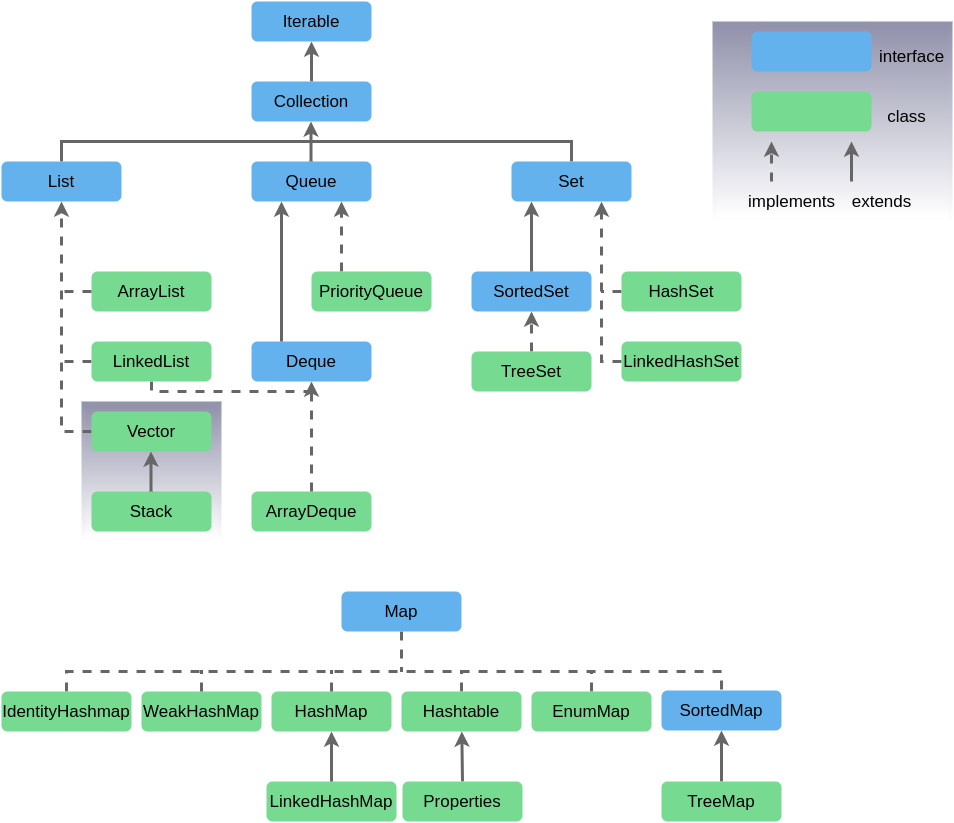
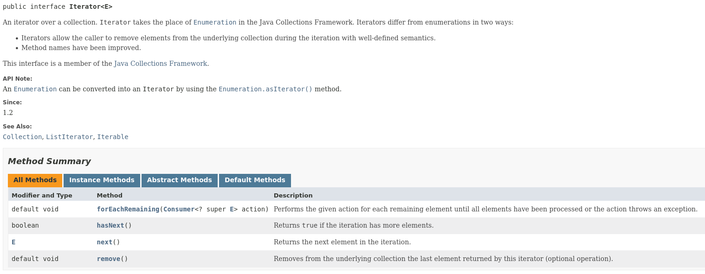
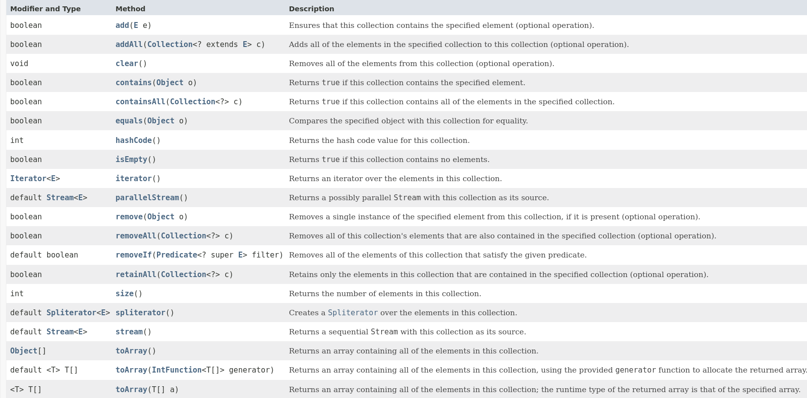
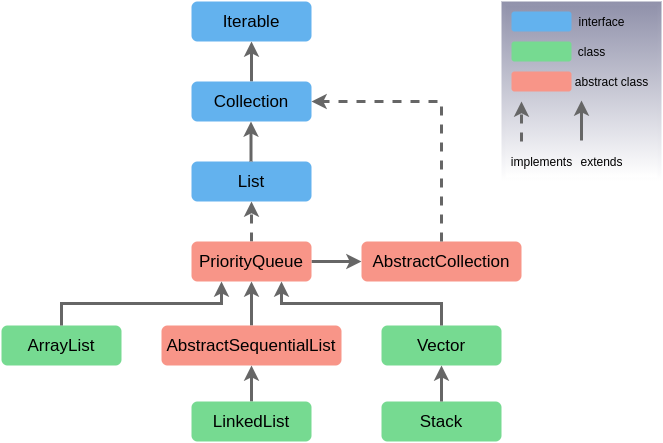
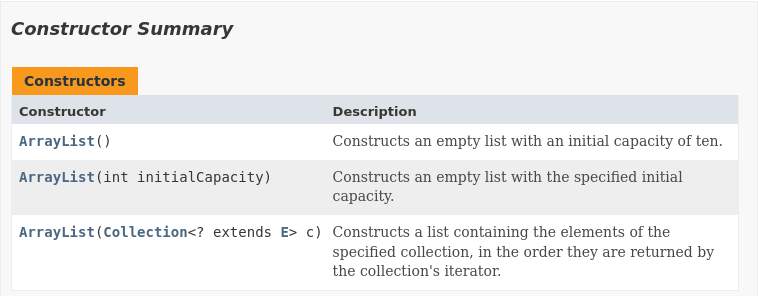
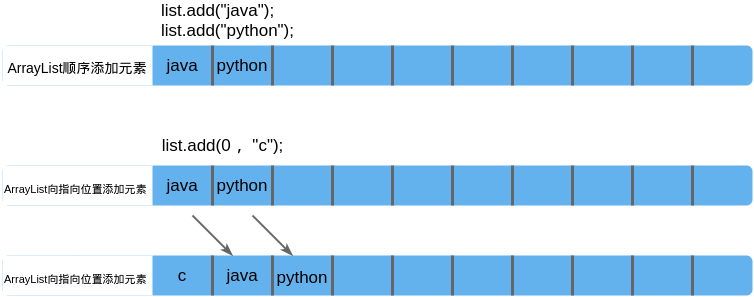
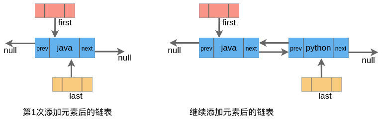
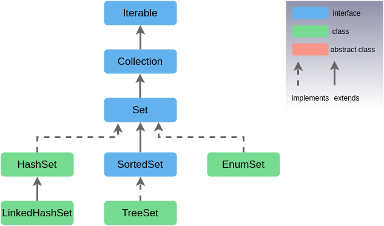
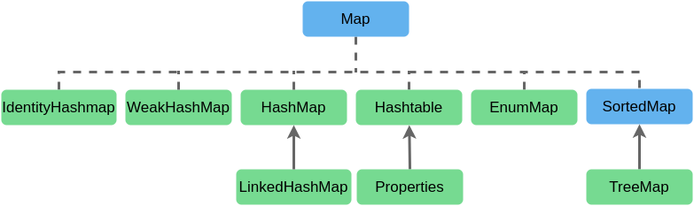
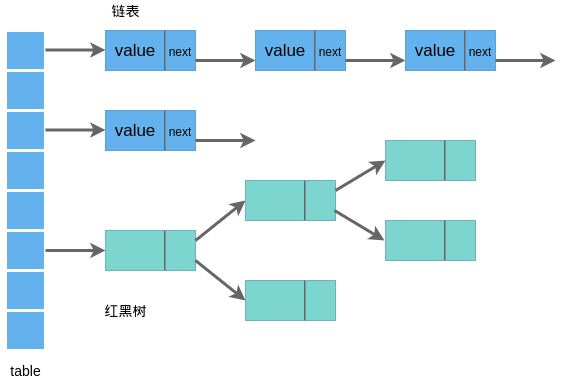

# 第 6 章 集合

## 6.1 集合概述

对象的操作要求必要时要存储对象，集合就像容器，可以动态地将多个对象的引用放入到容器中，容器对外提供访问接口。

### 6.1.1 数组存储特点

-   数组初始化后，容量就确定了，长度不可修改；
-   数组定义后，元素类型也随之确定；
-   数组中提供的方法很有限，添加、删除、插入等操作不方便；
-   数组存储的数据是有序、可重复的，对于无序、不可重复的操作需求无法满足。

为了避免数组存储数据时的一些局限，构建了集合，便于更方便、有效地进行对象操作。

### 6.1.2 集合体系



Java 集合可分为 Collection 和 Map 两个大类，Collection 接口操作单列数据，定义了存取一组对象的方法集合；Map 接口操作双列数据，保存具有映射关系（key-value）的集合。

`Collection`接口有`List`、`Set`、`Queue`三个子接口。

-   `List`(对付顺序的好帮手): 存储的元素是有序的、可重复的。
-   `Set`(注重独一无二的性质): 存储的元素是无序的、不可重复的。
-   `Queue`(实现排队功能的叫号机): 按特定的排队规则来确定先后顺序，存储的元素是有序的、可重复的。
-   `Map`(用 key 来搜索的专家): 使用键值对（key-value）存储，类似于数学上的函数 y=f(x)，"x" 代表 key，"y" 代表 value，key 是无序的、不可重复的，value 是无序的、可重复的，每个键最多映射到一个值。

## 6.2 Iterator 接口

Iterator 对象为迭代器，提供了对集合统一的访问遍历方式，其本身不提供盛装对象的能力，它最大的优势也是访问过程中无需知道集合内部元素的存储方式。



集合对象每次调用 iterator()方法都得到一个全新的迭代器对象，默认游标在集合的第一个元素之前。

## 6.3 Collection 接口

Collection 接口方法列表：



## 6.4 List 接口

List 接口中的数据元素是有序的、可重复的，每个元素都有对应的顺序索引，可以根据序号存取容器中的元素。

List 接口有 ArrayList、LinkedList 及 Vector 三个实现类，Vector 类是线程安全的 List 实现，由于遗留原因，不建议再使用。



### 6.4.1 ArrayList

ArrayList 是 List 接口的主要实现类，底层使用 Object[] 数组存储，占据连续的内存空间。

源码分析：

1. 重要成员变量：

```java
private static final int DEFAULT_CAPACITY = 10;
private static final Object[] EMPTY_ELEMENTDATA = {};
private static final Object[] DEFAULTCAPACITY_EMPTY_ELEMENTDATA = {};
transient Object[] elementData; // non-private to simplify nested class access
private int size;
```

2. 构造函数：

ArrayList 的构造方法共有三种：



```java
public ArrayList(int initialCapacity) {
    if (initialCapacity > 0) {
        // 构造指定大小的Object数组
        this.elementData = new Object[initialCapacity];
    } else if (initialCapacity == 0) {
        this.elementData = EMPTY_ELEMENTDATA;
    } else {
        throw new IllegalArgumentException("Illegal Capacity: "+
                                           initialCapacity);
    }
}

/**
 * Constructs an empty list with an initial capacity of ten.
 */
public ArrayList() {
    this.elementData = DEFAULTCAPACITY_EMPTY_ELEMENTDATA;
}
```

3. add()方法

执行代码

```java
List<String> list = new ArrayList<>();
```

时，ArrayList 将默认初始化一个名为 elementData 的 Object 数组，在向数组中添加元素时默认向数组尾部添加元素，在指定位置添加元素时，ArrayList 先将指定位置 index 后的元素后移 1 位，再添加元素。



```java
    /**
     * This helper method split out from add(E) to keep method
     * bytecode size under 35 (the -XX:MaxInlineSize default value),
     * which helps when add(E) is called in a C1-compiled loop.
     */
    private void add(E e, Object[] elementData, int s) {
        if (s == elementData.length)
            elementData = grow();
        elementData[s] = e;
        size = s + 1;
    }

    /**
     * Appends the specified element to the end of this list.
     *
     * @param e element to be appended to this list
     * @return {@code true} (as specified by {@link Collection#add})
     */
    public boolean add(E e) {
        modCount++;
        add(e, elementData, size);
        return true;
    }

    /**
     * Inserts the specified element at the specified position in this
     * list. Shifts the element currently at that position (if any) and
     * any subsequent elements to the right (adds one to their indices).
     *
     * @param index index at which the specified element is to be inserted
     * @param element element to be inserted
     * @throws IndexOutOfBoundsException {@inheritDoc}
     */
    public void add(int index, E element) {
        rangeCheckForAdd(index);
        modCount++;
        final int s;
        Object[] elementData;
        if ((s = size) == (elementData = this.elementData).length)
            elementData = grow();
        System.arraycopy(elementData, index,
                         elementData, index + 1,
                         s - index);
        elementData[index] = element;
        size = s + 1;
    }

```

在添加元素前，先进行当前集合大小与数组 elementData 长度的比较，若相等，则扩容。

```java
/**
     * Increases the capacity to ensure that it can hold at least the
     * number of elements specified by the minimum capacity argument.
     *
     * @param minCapacity the desired minimum capacity
     * @throws OutOfMemoryError if minCapacity is less than zero
     */
    private Object[] grow(int minCapacity) {
        return elementData = Arrays.copyOf(elementData,
                                           newCapacity(minCapacity));
    }

    private Object[] grow() {
        return grow(size + 1);
    }

    /**
     * Returns a capacity at least as large as the given minimum capacity.
     * Returns the current capacity increased by 50% if that suffices.
     * Will not return a capacity greater than MAX_ARRAY_SIZE unless
     * the given minimum capacity is greater than MAX_ARRAY_SIZE.
     *
     * @param minCapacity the desired minimum capacity
     * @throws OutOfMemoryError if minCapacity is less than zero
     */
    private int newCapacity(int minCapacity) {
        // overflow-conscious code
        // 旧数组的容量
        int oldCapacity = elementData.length;
        // 数组扩容后的大小：老数组大小+老数组大小/2
        int newCapacity = oldCapacity + (oldCapacity >> 1);
        if (newCapacity - minCapacity <= 0) {
            if (elementData == DEFAULTCAPACITY_EMPTY_ELEMENTDATA)
                return Math.max(DEFAULT_CAPACITY, minCapacity);
            if (minCapacity < 0) // overflow
                throw new OutOfMemoryError();
            return minCapacity;
        }
        return (newCapacity - MAX_ARRAY_SIZE <= 0)
            ? newCapacity
            : hugeCapacity(minCapacity);
    }

    private static int hugeCapacity(int minCapacity) {
        if (minCapacity < 0) // overflow
            throw new OutOfMemoryError();
        return (minCapacity > MAX_ARRAY_SIZE)
            ? Integer.MAX_VALUE
            : MAX_ARRAY_SIZE;
    }
```

数组扩容后，使用 Arrays.copyOf 进行复制。

```java
    public static <T> T[] copyOf(T[] original, int newLength) {
        return (T[]) copyOf(original, newLength, original.getClass());
    }

    public static <T,U> T[] copyOf(U[] original, int newLength, Class<? extends T[]> newType) {
        @SuppressWarnings("unchecked")
        T[] copy = ((Object)newType == (Object)Object[].class)
            ? (T[]) new Object[newLength]
            : (T[]) Array.newInstance(newType.getComponentType(), newLength);
        System.arraycopy(original, 0, copy, 0,
                         Math.min(original.length, newLength));
        return copy;
    }
```

System.arraycopy()方法在执行的拷贝操作时，会在内存中重新建立一个数组对象，如果数组中存储对象，仅拷贝对象地址。

ArrayList 在执行扩容操作需要额外的内存空间，应尽量避免频繁执行扩容操作，最好指定 ArrayList 的大小。

4. remove()

```java
    /**
     * Removes the element at the specified position in this list.
     * Shifts any subsequent elements to the left (subtracts one from their
     * indices).
     *
     * @param index the index of the element to be removed
     * @return the element that was removed from the list
     * @throws IndexOutOfBoundsException {@inheritDoc}
     */
    public E remove(int index) {
        Objects.checkIndex(index, size);
        final Object[] es = elementData;

        @SuppressWarnings("unchecked") E oldValue = (E) es[index];
        fastRemove(es, index);

        return oldValue;
    }

    /**
     * Private remove method that skips bounds checking and does not
     * return the value removed.
     */
    private void fastRemove(Object[] es, int i) {
        modCount++;
        final int newSize;
        if ((newSize = size - 1) > i)
            System.arraycopy(es, i + 1, es, i, newSize - i);
        es[size = newSize] = null;
    }

```

删除操作通过 fastRemove()方法调用 System.arraycopy()方法。

ArrayList 把添加、删除及数组大小调整等操作封装起来，我们使用时类似于操作数组，但不用关心元素如何移动。

### 6.4.2 LinkedList

LinkedList 底层使用双向链表结构存储，对于频繁的插入删除操作效率较高。

源码分析：

1. 成员变量

```java
    transient int size = 0;

    /**
     * Pointer to first node.
     */
    transient Node<E> first;

    /**
     * Pointer to last node.
     */
    transient Node<E> last;


    // LinkedList 双向链表结构为
    private static class Node<E> {
        E item;
        Node<E> next;
        Node<E> prev;

        Node(Node<E> prev, E element, Node<E> next) {
            this.item = element;
            this.next = next;
            this.prev = prev;
        }
    }
```

2. 构造函数

```java
    /**
     * Constructs an empty list.
     */
    public LinkedList() {
    }

    /**
     * Constructs a list containing the elements of the specified
     * collection, in the order they are returned by the collection's
     * iterator.
     *
     * @param  c the collection whose elements are to be placed into this list
     * @throws NullPointerException if the specified collection is null
     */
    public LinkedList(Collection<? extends E> c) {
        this();
        addAll(c);
    }
```

3. add()

```java
    /**
     * Links e as first element.
     */
    private void linkFirst(E e) {
        // 全局头结点指针
        final Node<E> f = first;
        // 构造新结点，新结点next指针指向原来头结点
        final Node<E> newNode = new Node<>(null, e, f);
        // first指向新结点
        first = newNode;
        if (f == null)
            last = newNode;         // 第一次时f为空，让全局last指针指向新结点
        else
            f.prev = newNode;       // 原来头结点的prev指针指向新节点
        size++;
        modCount++;
    }

    /**
     * Links e as last element.
     */
    void linkLast(E e) {
        final Node<E> l = last;
        final Node<E> newNode = new Node<>(l, e, null);
        last = newNode;
        if (l == null)
            first = newNode;
        else
            l.next = newNode;
        size++;
        modCount++;
    }

    /**
     * Inserts the specified element at the beginning of this list.
     *
     * @param e the element to add
     */
    public void addFirst(E e) {
        linkFirst(e);
    }

    /**
     * Appends the specified element to the end of this list.
     *
     * <p>This method is equivalent to {@link #add}.
     *
     * @param e the element to add
     */
    public void addLast(E e) {
        linkLast(e);
    }

    /**
     * Appends the specified element to the end of this list.
     *
     * <p>This method is equivalent to {@link #addLast}.
     *
     * @param e element to be appended to this list
     * @return {@code true} (as specified by {@link Collection#add})
     */
    public boolean add(E e) {
        linkLast(e);
        return true;
    }

```

3. get

```java
    /**
     * Returns the element at the specified position in this list.
     *
     * @param index index of the element to return
     * @return the element at the specified position in this list
     * @throws IndexOutOfBoundsException {@inheritDoc}
     */
    public E get(int index) {
        checkElementIndex(index);
        return node(index).item;
    }

    /**
     * Returns the (non-null) Node at the specified element index.
     */
    Node<E> node(int index) {
        // assert isElementIndex(index);

        if (index < (size >> 1)) {
            Node<E> x = first;
            for (int i = 0; i < index; i++)
                x = x.next;
            return x;
        } else {
            Node<E> x = last;
            for (int i = size - 1; i > index; i--)
                x = x.prev;
            return x;
        }
    }
```

获取指定位置元素时，通过判断`index`与`size>>1`的大小关系，将链表折为两半，如果 index 在前半段，就用 first 指针正向遍历，如果在后半段，则用 last 指针逆序遍历。

LinkedList 第一次添加元素后链表结构变为



4. 对比 ArrayList 和 LinkedList：

| 内容                 | ArrayList                  | LinkedList                   |
| -------------------- | -------------------------- | ---------------------------- |
| 存储空间占用         | 较小                       | 较大                         |
| 获取指定元素         | 速度快                     | 需要从链表头查找元素，速度慢 |
| 末尾添加元素         | 速度快                     | 速度快                       |
| 指定位置添加删除元素 | 需要大量移动元素，速度较慢 | 只需要修改链表指针，速度较快 |

通常情况下，优先使用 ArrayList 结构。

## 6.5 Set 接口

Set 接口存储数据具有无序、不可重复的特点。

Set 接口有 HashSet、LinkedHashSet 、 TreeSet 及 EnumSet 三个实现类，没有定义新的方法。



### 6.5.1 HashSet

HashSet 是 Set 接口的主要实现类，底层采用数组加链表的形式。

1. 重要成员变量

```java
    private transient HashMap<E,Object> map;

    // Dummy value to associate with an Object in the backing Map
    private static final Object PRESENT = new Object();
```

2. 构造函数

```java
    /**
     * Constructs a new, empty set; the backing {@code HashMap} instance has
     * default initial capacity (16) and load factor (0.75).
     */
    public HashSet() {
        map = new HashMap<>();
    }

    /**
     * Constructs a new set containing the elements in the specified
     * collection.  The {@code HashMap} is created with default load factor
     * (0.75) and an initial capacity sufficient to contain the elements in
     * the specified collection.
     *
     * @param c the collection whose elements are to be placed into this set
     * @throws NullPointerException if the specified collection is null
     */
    public HashSet(Collection<? extends E> c) {
        map = new HashMap<>(Math.max((int) (c.size()/.75f) + 1, 16));
        addAll(c);
    }

    /**
     * Constructs a new, empty set; the backing {@code HashMap} instance has
     * the specified initial capacity and the specified load factor.
     *
     * @param      initialCapacity   the initial capacity of the hash map
     * @param      loadFactor        the load factor of the hash map
     * @throws     IllegalArgumentException if the initial capacity is less
     *             than zero, or if the load factor is nonpositive
     */
    public HashSet(int initialCapacity, float loadFactor) {
        map = new HashMap<>(initialCapacity, loadFactor);
    }

    /**
     * Constructs a new, empty set; the backing {@code HashMap} instance has
     * the specified initial capacity and default load factor (0.75).
     *
     * @param      initialCapacity   the initial capacity of the hash table
     * @throws     IllegalArgumentException if the initial capacity is less
     *             than zero
     */
    public HashSet(int initialCapacity) {
        map = new HashMap<>(initialCapacity);
    }
```

3. add()

```java
    /**
     * Adds the specified element to this set if it is not already present.
     * More formally, adds the specified element {@code e} to this set if
     * this set contains no element {@code e2} such that
     * {@code Objects.equals(e, e2)}.
     * If this set already contains the element, the call leaves the set
     * unchanged and returns {@code false}.
     *
     * @param e element to be added to this set
     * @return {@code true} if this set did not already contain the specified
     * element
     */
    public boolean add(E e) {
        return map.put(e, PRESENT)==null;
    }
```

HashSet 是一个没有重复元素的集合，不保证元素的顺序， 实际上相当于只存储 key、不存储 value（统一使用一个 Object 对象） 的 Map。

向 Set 中添加数据，其所在类要重写 hashCode()和 equals()方法，要求尽可能保持一致性，即相等的对象必须具有相等的散列码。

### 6.5.2 LinkedHashSet

LinkedHashSet 是 HashSet 的子类，底层是基于 LinkedHashMap 实现的；遍历其内部数据时，可以按照添加的顺序遍历。

LinkedHashSet 在添加数据时，每个数据还维护了两个引用，记录数据的前后数据。对于频繁的遍历操作，LinkedHashSet 效率更高。

### 6.5.3 TreeSet

TreeSet 是一个有序集合，底层甚于 TreeMap 实现，其中添加的数据必须是相同类型，可以确保集合元素处于排序状态。

## 6.6 Map 接口



Map 存储 key-value 键值对。其中，key 是无序、不可重复的，使用 Set 存储所有的 key;value 是无序、可重复的，使用 Collection 存储所有 value。一个 key-value 键值对构成了一个 Entry 对象，Map 中的 entry 是无序、不可重复的，使用 Set 存储所有的 entry。

### 6.6.1 HashMap

HashMap 类是 Map 接口的主要实现类，线程不安全，但执行效率高，应用广泛。

1. HashMap 底层实现原理



JDK 7.0 前，HashMap 底层采用数组和链表形式，执行代码

```java
HashMap map = new HashMap();
```

后底层创建了长度是 16 的一维数组`Entry[] table`；

```java
map.put(key1, value1);
```

首先调用 key1 所在类的 hashCode()方法计算 key1 的哈希值，此哈希值通过计算后得到在 Entry 数组中的存储位置，

-   如果该位置上的数据为空，此时 key1-value1 添加成功；

-   如果位置上数据不为空，则比较 key1 与已经存在的一个或多个数据的哈希值，

    -   若 key1 的哈希值与已存在数据的哈希值不同，则 key1-value1 添加成功（键值对和原来的数据以链表的方式存储）；
    -   若 key1 的哈希值与已存在的某个数据的哈希值相同，则调用 key1 所在类的 equals()方法，

        -   若 equals()返回 false，则 key1-value1 添加成功（键值对和原来的数据以链表的方式存储）；
        -   若 equals()返回 true，则使用 value1 替换相同 key 的 value 值。

数据不断添加的过程中，HashMap 容量不断增大，当超出临界值（且要存放的位置非空）时，默认将容量扩大到原来的 2 倍，并复制原有的全部数据。

---

JDK 8.0 后，HashMap 底层采用 Node[]数组，执行

```java
HashMap map = new HashMap();
```

时并没有创建长度为 16 的数组；首次调用 put()方法时，底层创建数组；底层结构采用数组、链表和红黑树的结构，当数组某个索引位置上的元素以链表形式存储个数大于 8 且当前数组长度大于 64 时，此索引位置上的所有数据改为红黑树存储。

-   DEFAULT_INITIAL_CAPACITY：HashMap 默认容量为 16
-   DEFAULT_LOAD_FACTOR：默认加载因子 0.75
-   threshold：扩容的临界值为 16\*0.75=12
-   TREEIFY_THRESHOLD：Bucket 中链表长度大于该默认值 8，转化为红黑树
-   MIN_TREEIFY_CAPACITY：Bucket 中的 Node 被树化时最小的 hash 表容量为 64

2. 成员变量

```java
    /**
     * The default initial capacity - MUST be a power of two.
     */
    static final int DEFAULT_INITIAL_CAPACITY = 1 << 4; // aka 16

    /**
     * The maximum capacity, used if a higher value is implicitly specified
     * by either of the constructors with arguments.
     * MUST be a power of two <= 1<<30.
     */
    static final int MAXIMUM_CAPACITY = 1 << 30;

    /**
     * The load factor used when none specified in constructor.
     */
    static final float DEFAULT_LOAD_FACTOR = 0.75f;

    /**
     * The bin count threshold for using a tree rather than list for a
     * bin.  Bins are converted to trees when adding an element to a
     * bin with at least this many nodes. The value must be greater
     * than 2 and should be at least 8 to mesh with assumptions in
     * tree removal about conversion back to plain bins upon
     * shrinkage.
     */
    static final int TREEIFY_THRESHOLD = 8;

    /**
     * The bin count threshold for untreeifying a (split) bin during a
     * resize operation. Should be less than TREEIFY_THRESHOLD, and at
     * most 6 to mesh with shrinkage detection under removal.
     */
    static final int UNTREEIFY_THRESHOLD = 6;

    /**
     * The smallest table capacity for which bins may be treeified.
     * (Otherwise the table is resized if too many nodes in a bin.)
     * Should be at least 4 * TREEIFY_THRESHOLD to avoid conflicts
     * between resizing and treeification thresholds.
     */
    static final int MIN_TREEIFY_CAPACITY = 64;

    /**
     * Basic hash bin node, used for most entries.  (See below for
     * TreeNode subclass, and in LinkedHashMap for its Entry subclass.)
     */
    static class Node<K,V> implements Map.Entry<K,V> {
        final int hash;
        final K key;
        V value;
        Node<K,V> next;

        Node(int hash, K key, V value, Node<K,V> next) {
            this.hash = hash;
            this.key = key;
            this.value = value;
            this.next = next;
        }
    }
```

### 6.6.2 LinkedHashMap

LinkedHashMap 是 HashMap 的子类，可以实现在遍历 map 元素时，按照添加的顺序进行遍历，对于频繁的遍历操作，执行效率高于 HashMap。

LinkedHashMap 是在 HashMap 底层结构的基础上，添加了一对指针，指向前后的数据，以实现顺序遍历。

```java
/**
 * HashMap.Node subclass for normal LinkedHashMap entries.
 */
static class Entry<K,V> extends HashMap.Node<K,V> {
    Entry<K,V> before, after;
    Entry(int hash, K key, V value, Node<K,V> next) {
        super(hash, key, value, next);
    }
}
```

### 6.6.3 TreeMap

TreeMap 可以实现按照添加的 key-value 键值对进行排序和遍历，底层采用红黑树实现。

TreeMap 中添加 key-value 键值对，要求 key 必须是由同一个类创建的对象，实现 Comparable 或 Comparator 接口，以此进行自然排序和定制排序。

## 6.7 Collections 工具类

Collections 是操作集合的工具类，提供了大量静态方法对集合进行构造、排序、查找和修改等操作。

### 6.7.1 排序

```java
void reverse(List list)//反转
void shuffle(List list)//随机排序
void sort(List list)//按自然排序的升序排序
void sort(List list, Comparator c)//定制排序，由Comparator控制排序逻辑
void swap(List list, int i , int j)//交换两个索引位置的元素
void rotate(List list, int distance)//旋转。当distance为正数时，将list后distance个元素整体移到前面。当distance为负数时，将 list的前distance个元素整体移到后面
```

### 6.7.2 查找、替换

```java
int binarySearch(List list, Object key)//对List进行二分查找，返回索引，注意List必须是有序的
int max(Collection coll)//根据元素的自然顺序，返回最大的元素。 类比int min(Collection coll)
int max(Collection coll, Comparator c)//根据定制排序，返回最大元素，排序规则由Comparatator类控制。类比int min(Collection coll, Comparator c)
void fill(List list, Object obj)//用指定的元素代替指定list中的所有元素
int frequency(Collection c, Object o)//统计元素出现次数
int indexOfSubList(List list, List target)//统计target在list中第一次出现的索引，找不到则返回-1，类比int lastIndexOfSubList(List source, list target)
boolean replaceAll(List list, Object oldVal, Object newVal)//用新元素替换旧元素
```
