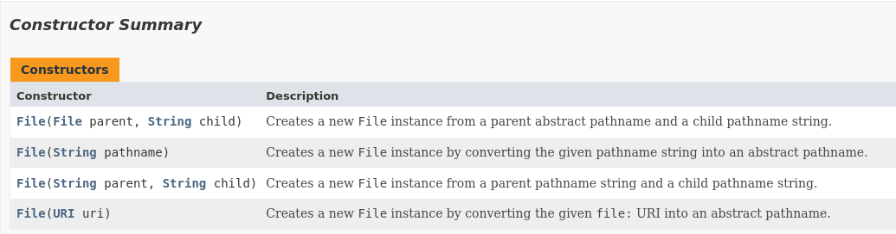

# 第 7 章 IO 流

IO 即 Input/Output，输入输出。输入是指从我外部将数据读入内存；输出是指把数据从内存输出至外部，这里所说的外部，可以是文件、网络等。

IO 流是顺序读写数据的模式，是单向流动的。

## 7.1 File 类

计算机系统中，文件是重要的数据存储方式，Java 标准库提供 File 类操作文件或目录。

File 类的一个对象代表一个文件或目录，可以通过 File 类的方法对文件或目录进行创建、删除、重命名等操作，如果要读取或写入文件内容，必须使用 IO 流来完成。

### 7.1.1 文件和目录

构造 File 对象，即使传入的文件或目录不存在，代码也不会出错，构造 File 对象本身并不导致任何磁盘操作，只有调用某些具体方法时，才真正进行磁盘操作。

### 7.1.2 File 类常用方法

1. 构造器

    

```java
import java.io.File;
import java.io.IOException;
import java.time.LocalTime;

public class FileTest {

    public static void main(String[] args) throws IOException {
        // 相对路径：相对于当前目录
        // 绝对路径：
        File file = new File("hello.txt");
        // 文件创建
        if (!file.exists()) {
            file.createNewFile();
            System.out.println("创建成功");
        } else {
            file.delete();
            System.out.println("删除成功");
        }

        // 文件目录创建
        File directory = new File("./test");
        boolean mkdir = directory.mkdir();
        if (mkdir) {
            System.out.println("目录创建成功");
        } else {
            System.out.println("目录创建失败");
        }

        // 常用方法
        System.out.println("path: " + file.getAbsolutePath());
        System.out.println("name: " + file.getName());
        System.out.println("parent: " + file.getParent());
        System.out.println("length: " + file.length());
        System.out.println("lastModified: " + file.lastModified());
        System.out.println("isFile: " + file.isFile());
        System.out.println("isDirectory: " + file.isDirectory());
        System.out.println("exits: " + file.exists());
        System.out.println("canRead: " + file.canRead());
        System.out.println("canWrite: " + file.canWrite());
    }
}
```

## 7.2 IO 流

### 7.2.1 IO 流的概念与分类

I/O 即 Input/Output，主要处理设备间的数据传输，Java 中数据输入输出都以流(stream)的方式进行。

流按照数据单位不同可分为字节流(8bit)和字符流(16bit)，按照数据流向不同可分为输入流和输出流，按照流角色不同可分为节点流和处理流。

### 7.2.2 Java IO 流体系结构

| 分类     | 字节输入流           | 字节输出流            | 字符输入流        | 字符输出流         |
| -------- | -------------------- | --------------------- | ----------------- | ------------------ |
| 抽象基类 | InputStream          | OutputStream          | Reader            | Writer             |
| 访问文件 | FileInputStream      | FileOutputStream      | FileReader        | FileWriter         |
| 访问数组 | ByteArrayInputStream | ByteArrayOutputStream | CharArrayReader   | CharArrayWriter    |
| 访问管道 | PipedInputStream     | PipedOutputStream     | PipedReader       | PipedWriter        |
| 访问字符 |                      |                       | StringReader      | StringWriter       |
| 缓冲流   | BufferedInputStream  | BufferedOutputStream  | BufferedReader    | BufferedWriter     |
| 转换流   |                      |                       | InputStreamReader | OutputStreamWriter |
| 对象流   | ObjectInputStream    | ObjectOutputStream    |                   |                    |
|          | FilterInputStream    | FilterOutputStream    | FilterReader      | FilterWriter       |
| 打印流   |                      | PrintStream           |                   | PrintWriter        |

InputStream 和 OutputStream 是抽象类，是所有输入流和输出流的超类；

## 7.3 常见流的使用

### 7.3.1 字符流

1. 字符输入流

    ```java
    /**
     * 从内存读入文件并输出至控制台
     */
    public static void testFileReader() {
        FileReader fr = null;
        try {
            // 1. 实例化File类对象
            File file = new File("hello.txt");
            // 2. 实例化流
            fr = new FileReader(file);
            // 3. 数据读入
            /*
            int data = fr.read();
            while (data != -1) {
                System.out.print((char)data);
                data = fr.read();
            }
            */

            char[] cbuf = new char[5];
            int len;
            while ((len = fr.read(cbuf)) != -1) {
                for (int i = 0; i < len; i++) {
                    System.out.print(cbuf[i]);
                }
            }
        } catch (IOException e) {
            e.printStackTrace();
        } finally {
            // 4. 关闭流
            try {
                if (fr != null) {
                    fr.close();
                }
            } catch (IOException e) {
                e.printStackTrace();
            }
        }

        System.out.println();
    }
    ```

2. 字符输出流

    ```java
    /**
     * 文件写出
     */
    public static void testFileWriter() {
        FileWriter fw = null;
        try {
            // 1. 实例化File类对象
            File file = new File("hi.txt");
            // 2. 实例化FileWriter
            fw = new FileWriter(file);
            // 3. 写出数据
            fw.write("I have a dream\n");
            fw.write("You need to have a dream");
        } catch (IOException e) {
            e.printStackTrace();
        } finally {
            // 4. 关闭流
            try {
                if (fw != null) {
                    fw.close();
                }
            } catch (IOException e) {
                e.printStackTrace();
            }
        }
    }
    ```

    对于文本文件，使用字符流处理。

### 7.3.2 字节流

对于非文本文件，使用字节流处理。

```java
/**
 * 文件复制
 *
 * @param srcPath 源文件
 * @param destPath 目的文件
 */
public static void copyFile(String srcPath, String destPath) {
    FileInputStream fis = null;
    FileOutputStream fos = null;

    try {
        // 1. 实例化文件
        File srcFile = new File(srcPath);
        File destFile = new File(destPath);

        // 2. 实例化流
        fis = new FileInputStream(srcFile);
        fos = new FileOutputStream(destFile);

        // 3. 处理数据
        byte[] buffer = new byte[1024];
        int length;
        while ((length = fis.read(buffer)) != -1) {
            fos.write(buffer, 0, length);
        }
        System.out.println("复制成功");
    } catch (IOException e) {
        e.printStackTrace();
    } finally {
        // 4. 关闭流
        try {
            if (fis != null) {
                fis.close();
            }
        } catch (IOException e) {
            e.printStackTrace();
        }

        try {
            if (fos != null) {
                fos.close();
            }
        } catch (IOException e) {
            e.printStackTrace();
        }
    }
}
```

### 7.3.3 缓冲流

缓冲流主要用于提高文件读取和写入速度。

1. 字符缓冲流

    ```java
    public class BufferedReaderWriterTest {
        public static void copyFileWithBuffered(String src, String dest) {
            FileReader fr = null;
            FileWriter fw = null;
            BufferedReader br = null;
            BufferedWriter bw = null;

            try {
                // 1. 实例化文件
                File srcFile = new File(src);
                File destFile = new File(dest);
                // 2. 实例化字符流
                fr = new FileReader(srcFile);
                fw = new FileWriter(destFile);
                // 3. 实例化缓冲流
                br = new BufferedReader(fr);
                bw = new BufferedWriter(fw);
                // 4. 数据处理
                // 方式一：
                char[] cbuf = new char[128];
                int length;
                while ((length = br.read(cbuf)) != -1) {
                    bw.write(cbuf, 0, length);
                }

                // 方式二：
                // String data;
                // while ((data = br.readLine()) != null) {
                //     bw.write(data);
                //     bw.newLine();
                // }
                System.out.println("复制成功");
            } catch (IOException e) {
                e.printStackTrace();
            } finally {
                // 5. 关闭资源
                try {
                    if (br!= null) {
                        br.close();
                    }
                } catch (IOException e) {
                    e.printStackTrace();
                }

                try {
                    if (bw != null) {
                        bw.close();
                    }
                } catch (IOException e) {
                    e.printStackTrace();
                }
            }
        }

        public static void main(String[] args) {
            long startTime = System.currentTimeMillis();

            String srcPath = "livehappily.txt";
            String destPath = "livehappily_copy.txt";
            copyFileWithBuffered(srcPath, destPath);

            long endTime = System.currentTimeMillis();
            System.out.println("Copy time: " + (endTime - startTime) + "ms");
        }
    }
    ```

2. 字节缓冲流

    ```java
    public class BufferedInputOutputStreamTest {

        public static void copyFileWithBuffered(String src, String dest) {
            FileInputStream fis = null;
            FileOutputStream fos = null;
            BufferedInputStream bis = null;
            BufferedOutputStream bos = null;
            try {
                // 1. 实例化File对象
                File srcFile = new File(src);
                File destFile = new File(dest);

                // 2. 实例化节点流
                fis = new FileInputStream(srcFile);
                fos = new FileOutputStream(destFile);

                // 3. 实例化缓冲流
                bis = new BufferedInputStream(fis);
                bos = new BufferedOutputStream(fos);

                // 4. 数据处理：读取，写入
                byte[] buffer = new byte[1024];
                int length;
                while ((length = bis.read(buffer)) != -1) {
                    bos.write(buffer, 0, length);
                }
                System.out.println("复制成功");
            } catch (IOException e) {
                e.printStackTrace();
            } finally {
                // 5. 关闭资源：先关闭外层流，再关闭内层流
                // close bos
                try {
                    if (bos != null) {
                        bos.close();
                    }
                } catch (IOException e) {
                    e.printStackTrace();
                }
                // close bis
                try {
                    if (bis != null) {
                        bis.close();
                    }
                } catch (IOException e) {
                    e.printStackTrace();
                }
            }

        }

        public static void main(String[] args) {
            long startTime = System.currentTimeMillis();

            String srcPath = "/home/szhxiao/TheSpringFestival.mp4";
            String destPath = "TheSpringFestival_copy.mp4";
            copyFileWithBuffered(srcPath, destPath);

            long endTime = System.currentTimeMillis();
            System.out.println("Copy time: " + (endTime - startTime) + "ms");
        }
    }
    ```

### 7.3.4 转换流

转换流提供字节流与字符流之间的转换。

### 7.3.5 打印流

```java
public class PrintStreamTest {
    public static void main(String[] args) {
        PrintStream ps = null;

        try {
            FileOutputStream fos = new FileOutputStream(new File("text.txt"));
            ps = new PrintStream(fos, true);
            if (ps != null) {
                System.setOut(ps);
            }

            for (int i = 0; i <= 255; i++) {
                System.out.print((char) i);
                if (i % 50 == 0) {
                    System.out.println();
                }
            }
        } catch (FileNotFoundException e) {
            e.printStackTrace();
        } finally {
            try {
                if (ps != null) {
                    ps.close();
                }
            } catch (Exception e) {
                e.printStackTrace();
            }
        }
    }
}
```

### 7.3.6 数据流

### 7.3.7 对象流

对象序列化：将基本数据类型或对象转换为二进制流，可持久存储或通过网络传输；
对象反序列化：获取了二进制流后读取恢复为基本类型数据或对象。

对象可序列化需要满足要求类实现 Serializable 接口，提供全局常量 serialVersionUID 并保证类内部所有属性都是可序列化的（基本数据类型默认可序列化）。

注：static 和 transient 修饰的成员变量不能被序列化。

### 7.3.8 随机存储文件流

## 7.4 常用工具类

Java 提供了 Files 和 Paths 两个工具类，方便读写文件。

Files 工具类提供了 read()、copy()、delete()、exists()、move()等操作文件和目录的快捷方法，建议阅读文档使用。
