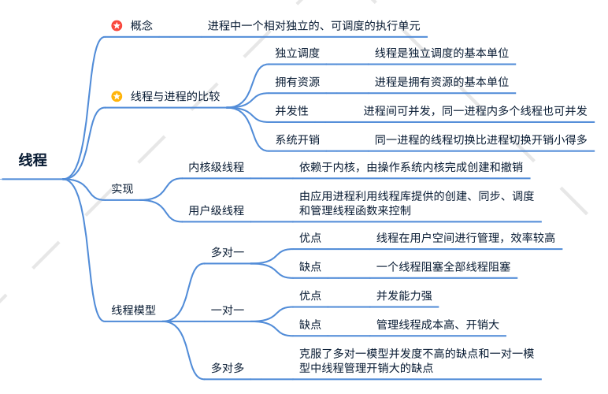

# 第 9 章 多线程

## 9.1 基本概念

### 9.1.1 程序、进程和线程

1. 程序

    程序是为完成特定任务、用某种语言编写的一组指令集合，即一段静态代码。

2. 进程

    

    进程是程序的一次执行过程，或是正在运行的一个程序，是一个动态的过程。

    进程是资源分配的基本单位，系统在运行时会为每个进程分配不同的内存区域。

3. 线程

    

    线程，进程可进一步细化为线程，是一个程序内部的一条执行路径。

    线程是程序调度和执行的基本单位，每个线程拥有独立的运行栈和程序计数器。

### 9.1.2 并行与并发

1. 并行

    多个 CPU 同时执行多个任务。

2. 并发

    一个 CPU 同时执行多个任务。

## 9.2 线程的创建

### 9.2.1 继承 Thread 类

    Thread 类文档描述为：

    `One is to declare a class to be a subclass of Thread. This subclass should override the run method of class Thread. An instance of the subclass can then be allocated and started.`

    ```java
    class PrimeThread extends Thread {
        long minPrime;
        PrimeThread(long minPrime) {
            this.minPrime = minPrime;
        }

        public void run() {
            // compute primes larger than minPrime
        }
    }

    public class ThreadTest {
        public static void main(String[] args) {
            PrimeThread p = new PrimeThread(143);
            p.start();
        }
    }
    ```

### 9.2.2 实现 Runnable 接口

    `The other way to create a thread is to declare a class that implements the Runnable interface. That class then implements the run method. An instance of the class can then be allocated, passed as an argument when creating Thread, and started. `

    ```java
    class PrimeRun implements Runnable {
        long minPrime;
        PrimeRun(long minPrime) {
            this.minPrime = minPrime;
        }

        public void run() {
            // compute primes larger than minPrime
        }
     }

    public class ThreadTest {
        public static void main(String[] args) {
            PrimeRun p = new PrimeRun(143);
            new Thread(p).start();
        }
    }
    ```

-   两种创建方式的比较

    开发中优先选择实现 Runnable 接口的创建方式，原因是：

    -   实现的方式没有类的单继承局限性；
    -   实现的方式更适合多个线程共享数据的情况。

    两种方式都需要重写 run()方法。

### 9.2.3 实现 Callable 接口


### 9.2.4 使用线程池

使用线程池的优点：

-   提高响应速度（减少创建新线程的时间）；
-   降低资源消耗（重复复用线程池中的线程，不需要每次都创建）；
-   便于线程管理。

## 9.3 线程的使用

### 9.3.1 Thread 类常用方法

1.  start()

    `Causes this thread to begin execution; the Java Virtual Machine calls the run method of this thread.`

    启动当前线程，调用当前线程的 run()方法。

2.  run()

    `If this thread was constructed using a separate Runnable run object, then that Runnable object's run method is called; otherwise, this method does nothing and returns.`

    通常需要重写 Thread 类中的 run()方法，将创建的线程要执行的操作声明其中。

3.  currentThread()

    静态方法，返回执行当前代码的线程。

4.  yield()

    `A hint to the scheduler that the current thread is willing to yield its current use of a processor.`

    释放当前 CPU 的执行权。

5.  join()

    `Waits for this thread to die.pgn`

    阻塞当前线程直至新线程执行完毕。

6.  sleep()

    `Causes the currently executing thread to sleep (temporarily cease execution) for the specified number of milliseconds, subject to the precision and accuracy of system timers and schedulers.`

    让当前线程“睡眠”指定毫秒。

注意：使用任何类的方法，最优先都应当参考 API。

### 9.3.2 线程的调度


1. 调度策略

    - 抢占式
    - 非抢占式

2. 线程优先级

    - 优先级

        - MAX_PRIORITY: 10
        - MIN_PRIORITY: 1
        - NORM_PRIORITY: 5

    - 获取和设置线程优先级

        - getPriority(): 获取线程优先级
        - setPriority(): 设置线程优先级

    注意：高优先级的线程要抢占低优先级线程 CPU 执行权，但从概述上讲，高优先级线程执行概述较高，并不意味着只有当高优先级线程执行结束后，低优先级线程才执行。

## 9.4 线程的生命周期

### 9.4.1 线程的状态

1. 新建

    当一个 Thread 类或子类的对象被声明并创建时，新生的线程对象处于新建状态。

2. 就绪

    处于新建状态的线程被 start()后，将进入线程队列等待 CPU 时间片，具备了运行的条件，只是没有得到 CPU 资源。

3. 运行

    就绪的线程被调度并获得 CPU 资源，即进入运行状态，run()方法中定义了线程的操作和功能。

4. 阻塞

    在某种特殊情况下，被挂起或执行输入输出操作时，线程释放 CPU 并临时中断执行，进入阻塞状态。

5. 死亡

    线程完成全部工作或因异常结束或提前被强制终止，即为死亡状态。

### 9.4.2 线程状态转换


## 9.5 线程同步

Java 中通过同步机制来解决线程的案例问题。

### 9.5.1 同步代码块

使用关键字 synchronized 实现。

```java
synchronized(同步监视器) {
    // 需要被同步的代码，即操作共享数据的代码
}
```

同步监视器即为锁，任何一个类的对象都可以充当锁，多个线程必须共用同一把锁。

在实现 Runnable 接口创建多线程的方式中，可以考虑使用 this 来充当同步监视器；在继承 Thread 类创建多线程的方式中，慎用 this 充当同步监视器，可以考虑使用当前类充当。

### 9.5.2 同步方法

如果操作共享数据的方式完整地声明在某个方法中，可以将方法声明为同步的。

同步方法仍涉及同步监视器，只是不需要显式声明，其中，非静态同步方法的监视器是 this，静态同步方法监视器是当前类本身。

```java
public synchronized void function() {
    // 同步代码
}
```

### 9.5.3 死锁


### 9.5.4 锁

JDK5.0 后，Java 可显式定义同步锁对象来实现同步，同步锁使用 Lock 对象充当。

synchronized 与 Lock 的比较：

-   相同点：

    -   都可以解决线程安全问题

-   不同点：

    -   synchronized 机制在执行完相应的同步代码后，自动释放同步监视器；
    -   Lock 需要手动启动同步(lock())，结束同步后手动释放锁(unlock())；

## 9.6 线程通信

1. wait()

    当前线程进入阻塞状态，并释放同步监视器。

2. notify()

    唤醒被 wait()的线程，多个线程时，唤醒优先级高的。

3. notifyAll()

    唤醒所有被 wait()线程。
