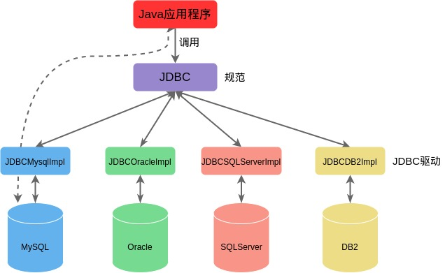

# 第 13 章 JDBC 编程

## 13.1 JDBC 概述

### 13.1.1 数据的持久化

### 13.1.2 Java 数据存储技术

1. JDBC 直接访问数据库
2. JDO
3. 第三方工具

### 13.1.3 JDBC 体系结构



-   面向应用的 API
-   面向数据库的 API

JDBC 是一套用于数据库操作的接口，程序员只需要面向接口进行编程；不同的数据库厂商，需要针对接口提供不同的实现。

## 13.2 获取数据库连接

```java
// jdbc.properties
url=jdbc:mysql://localhost:3306/test
user=root
password=mysql
driver=com.mysql.jdbc.Driver


public static void testConnection5() {
    Connection conn = null;
    try {
        // 1. 读取配置文件的基本信息
        InputStream is = ConnectionTest.class.getClassLoader().getResourceAsStream("jdbc.properties");

        Properties pros = new Properties();
        pros.load(is);;

        String user = pros.getProperty("user");
        String password = pros.getProperty("password");
        String url = pros.getProperty("url");
        String driver = pros.getProperty("driver");

        // 2. 加载驱动
        Class.forName(driver);

        // 3. 获取连接
        conn = DriverManager.getConnection(url, user, password);
        System.out.println(conn);
    } catch (SQLException e) {
        e.printStackTrace();
    } catch (ClassNotFoundException e) {
        e.printStackTrace();
    } catch (IOException e) {
        e.printStackTrace();
    } finally {
        try {
            conn.close();
        } catch (SQLException e) {
            e.printStackTrace();
        }
    }
}
```

## 13.3 使用 PreparedStatement 实现 CRUD 操作

### 13.3.1 Java 与 SQL 数据类型对应表

| Java 类型          | SQL 类型                   |
| ------------------ | -------------------------- |
| boolean            | BIT                        |
| byte               | TINYINT                    |
| short              | SMALLINT                   |
| int                | INTEGER                    |
| long               | BIGINT                     |
| String             | CHAR, VARCHAR, LONGVARCHAR |
| byte array         | BINARY, VAR BINARY         |
| java.sql.Date      | DATE                       |
| java.sql.Time      | TIME                       |
| java.sql.Timestamp | TIMESTAMP                  |

### 13.3.2 增删改操作

```java
import java.io.IOException;
import java.sql.Connection;
import java.sql.PreparedStatement;
import java.sql.SQLException;

/**
 * 数据库通用增删改操作
 */
public class Update {
    /**
     * 通用增删改操作
     *
     * @param sql 预编译SQL语句
     * @param args 可变参数列表
     */
    public static void update(String sql, Object ...args) {
        Connection conn = null;
        PreparedStatement ps = null;
        try {
            // 1. 获取数据库连接
            conn = JDBCUtils.getConnection();
            // 2. 预编译sql语句
            ps = conn.prepareStatement(sql);
            // 3. 填充占位符，占位符个数等于可变形参个数
            for (int i = 0; i < args.length; i++) {
                ps.setObject(i+1, args[i]);
            }
            // 4. 执行操作
            ps.execute();
        } catch (SQLException e) {
            e.printStackTrace();
        } catch (IOException e) {
            e.printStackTrace();
        } catch (ClassNotFoundException e) {
            e.printStackTrace();
        } finally {
            // 5. 关闭资源
            JDBCUtils.closeResource(conn, ps);
        }
    }

    public static void main(String[] args) {

    }
}
```

### 13.3.3 查询操作

```java

import java.lang.reflect.Field;
import java.sql.Connection;
import java.sql.PreparedStatement;
import java.sql.ResultSet;
import java.sql.ResultSetMetaData;
import java.util.ArrayList;
import java.util.List;

/**
 * 数据库通用查询操作
 */
public class Query {
    /**
     * 查询返回一条记录
     *
     * @param clazz 对象类
     * @param sql 预编译SQL语句
     * @param args 可变参数
     * @param <T> 类型
     * @return 一个对象
     */
    public static <T> T getInstance(Class<T> clazz, String sql, Object...args) {
        Connection conn = null;
        PreparedStatement ps = null;
        ResultSet rs = null;

        try {
            conn = JDBCUtils.getConnection();
            ps = conn.prepareStatement(sql);
            // 填充占位符
            for (int i = 0; i < args.length; i++) {
                ps.setObject(i+1, args[i]);
            }
            // 获取结果集
            rs = ps.executeQuery();

            // 获取结果集元数据
            ResultSetMetaData rsmd = rs.getMetaData();
            int columnCount = rsmd.getColumnCount();

            if (rs.next()) {
                T t = clazz.getDeclaredConstructor().newInstance();
                // 处理一行数据中的每一列
                for (int i = 0; i < columnCount; i++) {
                    // 获取列值
                    Object columnValue = rs.getObject(i+1);
                    // 获取列别名
                    String columnLabel = rsmd.getColumnLabel(i+1);

                    // 每个属性赋值
                    Field field = clazz.getDeclaredField(columnLabel);
                    field.setAccessible(true);
                    field.set(t, columnValue);

                }
                return t;
            }

        } catch (Exception e) {
            e.printStackTrace();
        } finally {
            JDBCUtils.closeResource(conn, ps, rs);
        }
        return null;
    }

    /**
     * 查询返回多条记录
     *
     * @param clazz 对象类
     * @param sql 预编译SQL语句
     * @param args 可变参数
     * @param <T> 类型
     * @return 多个对象
     */
    public static <T> List<T> getForList(Class<T> clazz, String sql, Object...args) {
        Connection conn = null;
        PreparedStatement ps = null;
        ResultSet rs = null;

        try {
            conn = JDBCUtils.getConnection();
            ps = conn.prepareStatement(sql);
            // 填充占位符
            for (int i = 0; i < args.length; i++) {
                ps.setObject(i+1, args[i]);
            }
            // 获取结果集
            rs = ps.executeQuery();

            // 获取结果集元数据
            ResultSetMetaData rsmd = rs.getMetaData();
            int columnCount = rsmd.getColumnCount();

            // 创建集合对象
            List<T> list = new ArrayList<>();

            while (rs.next()) {
                T t = clazz.getDeclaredConstructor().newInstance();
                // 处理一行数据中的每一列，给对象赋值
                for (int i = 0; i < columnCount; i++) {
                    // 获取列值
                    Object columnValue = rs.getObject(i+1);
                    // 获取列别名
                    String columnLabel = rsmd.getColumnLabel(i+1);

                    // 每个属性赋值
                    Field field = clazz.getDeclaredField(columnLabel);
                    field.setAccessible(true);
                    field.set(t, columnValue);

                }
                list.add(t);
            }
            return list;
        } catch (Exception e) {
            e.printStackTrace();
        } finally {
            JDBCUtils.closeResource(conn, ps, rs);
        }
        return null;
    }

    public static void main(String[] args) {

    }
}

```

## 13.4 操作 BLOB 类型字段

### 13.4.1 插入 BLOB 类型数据

```java
public static void testInsertBlob() {
    Connection conn = null;
    PreparedStatement ps = null;

    try {
        conn = JDBCUtils.getConnection();
        String sqlInsert = "INSERT INTO customers (name, email, birth, photo) VALUES (?,?,?,?)";

        ps = conn.prepareStatement(sqlInsert);

        ps.setObject(1, "林纳斯・托瓦斯");
        ps.setObject(2, "linus@163.com");
        ps.setObject(3, "1975-09-11");
        FileInputStream fis = new FileInputStream(new File("src/chapter_13/kirin.png"));
        ps.setBlob(4, fis);

        ps.execute();

    } catch (IOException e) {
        e.printStackTrace();
    } catch (ClassNotFoundException e) {
        e.printStackTrace();
    } catch (SQLException e) {
        e.printStackTrace();
    } finally {
        JDBCUtils.closeResource(conn, ps);
    }
}
```

### 13.4.2 读取 BLOB 类型数据

```java
public static void testQueryBlob() {
    Connection conn = null;
    PreparedStatement ps = null;
    ResultSet rs = null;

    InputStream is = null;
    FileOutputStream fos = null;

    try {
        conn = JDBCUtils.getConnection();
        String sqlQuery = "SELECT id, name, email, birth, photo FROM customers c WHERE id=?";
        ps = conn.prepareStatement(sqlQuery);

        ps.setObject(1, 14);

        rs = ps.executeQuery();
        if (rs.next()) {
            int id = rs.getInt("id");
            String name = rs.getString("name");
            String email = rs.getString("email");
            Date birth = rs.getDate("birth");

            Customer customer = new Customer(id, name, email, birth);

            // 将Blob类型字段下载，以文件方式保存在本地
            Blob photo = rs.getBlob("photo");
            is = photo.getBinaryStream();
            fos = new FileOutputStream("src/chapter_13/photo.jpg");
            byte[] buffer = new byte[1024];
            int len;
            while ((len = is.read(buffer)) != -1) {
                fos.write(buffer, 0, len);
            }
        }
    } catch (IOException e) {
        e.printStackTrace();
    } catch (ClassNotFoundException e) {
        e.printStackTrace();
    } catch (SQLException e) {
        e.printStackTrace();
    } finally {
        try {
            if (is != null) {
                is.close();
            }
        } catch (IOException e) {
            e.printStackTrace();
        }

        try {
            if (fos != null) {
                fos.close();
            }
        } catch (IOException e) {
            e.printStackTrace();
        }

        JDBCUtils.closeResource(conn, ps, rs);
    }
}
```

## 13.5 批量插入

```java
public void testInsert() {
    Connection conn = null;
    PreparedStatement ps = null;

    try {
        conn = JDBCUtils.getConnection();
        // 设置不允许自动提交
        conn.setAutoCommit(false);

        String sqlInsert = "INSERT INTO goods (name) VALUES (?)";
        ps = conn.prepareStatement(sqlInsert);

        for (int i = 0; i < 20000; i++) {
            ps.setObject(1, "name_" + i);

            // 1. 攒sql
            ps.addBatch();

            if (i % 500 == 0) {
                // 2. 执行batch
                ps.executeBatch();
                // 3. 清空batch
                ps.clearBatch();
            }
        }
        // 提交数据
        conn.commit();
    } catch (IOException e) {
        e.printStackTrace();
    } catch (ClassNotFoundException e) {
        e.printStackTrace();
    } catch (SQLException e) {
        e.printStackTrace();
    } finally {
        JDBCUtils.closeResource(conn, ps);
    }
}
```

## 13.6 数据库事务

### 13.6.1 数据库事务概述

事务是一种逻辑操作单元，使数据从一种状态变换到另一种状态。

事务处理原则：保证所有事务作为一个工作单元执行，即使出现故障，都不能改变这种执行方式。

数据一旦提交就不可回滚。

导致数据自动提交的操作：DDL 操作、DML 操作（默认情况），关闭连接时。

### 13.6.2 事务的 ACID 属性

1. 原子性（Atomicity）

    事务是一个不可分割的工作单位，事务中的操作要么都发生，要么都不发生。

2. 一致性（Consistency）

    事务必须使数据库从一个一致性状态变换到另一个一致性状态。

3. 隔离性（Isolation）

    一个事务的执行不能被其他事务干扰，即一个事务内部的操作及使用的数据对并发的其他事务是隔离的，并发执行

4. 持久性（Durability）

    一个事务一旦被提交，它对数据库中的数据的改变是永久性的，接下来的其他操作和数据库故障不应该对其有任何影响。

### 13.6.3 数据库并发问题

1. 并发问题

    - 脏读
    - 不可重复读
    - 幻读

2. 隔离级别

    | 隔离级别                       | 描述                                                                                                                                       |
    | ------------------------------ | ------------------------------------------------------------------------------------------------------------------------------------------ |
    | READ UNCOMMITTED(读未提交数据) | 允许事务读取被其他事务提交的变更，脏读、不可重复读和幻读的问题都会出现                                                                     |
    | READ COMMITED(读已提交的数据)  | 只允许事务读取已经被其它事务提交的变更，可以避免脏读，不可重复读和幻读的问题仍然可能出现                                                   |
    | REPEATABLE READ(可重复读)      | 确保事务可以多次从一个字段中读取相同的值，在这个事务持续期间，禁止其他事务对这个字段进行更新，可以避免脏读和不可重复读，幻读的问题仍然存在 |
    | SERIALIZABLE(串行化)           | 确保事务可以从一个表中读取相同的行，在这个事务持续期间，禁止其他事务对该表执行插入、更新和删除操作，所有并发问题都可以避免，但性能十分低下 |

## 13.7 DAO 及其实现类

## 13.8 数据库连接池

### 13.8.1 JDBC 数据库连接池的必要性

### 13.8.2 数据库连接池

### 13.8.3 c3p0 数据库连接池

### 13.8.4 dbcp 数据库连接池

### 13.8.5 druid 数据库连接池

## 13.9 Apache-DBUtils 实现 CRUD 操作

### 13.9.1 Apache-DBUtils 简介

commons-dbutils 是 Apache 提供的一个开源 JDBC 工具类库，封装了数据库增删改查操作

### 13.9.2 主要 API 使用
