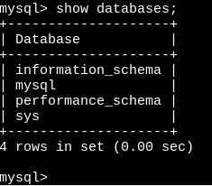

# 第 15 章 MySQL 数据库

## 15.1 数据库

### 15.1.1 数据库概述

1. 数据库

    数据库(database)是存储数据的“仓库”，保存了一系列有组织的数据，本质是一个文件系统。

2. 数据库管理系统

    操作管理数据库的大型软件，用于建立、使用和维护数据库，对数据库统一进行管理和控制。可通过数据库管理系统访问数据库中表内的数据。

3. 结构化查询语言

    专门与数据库通信的语言。

4. RDBMS 与非 RDBMS

    关系型数据库把复杂的数据结构归结为简单的二元关系（即二维表格形式），

    优势：复杂查询、事务支持。

    非关系型数据库

### 15.1.2 关系型数据库设计规则

1. 表、记录、字段

    E-R(entity-relationship，实体-联系)模型中三个主要概念：实体集、属性、联系集。

    一个实体集对应于数据库中的一个表，一个实体对应于数据库表中的一行(row)，也称为一条记录(record)，一个属性对应于数据库表中的一列，也称为一个字段。

2. 表的关联关系

    - 一对一关系

        建表原则：可将常用信息存储在一个表，不常用信息存储在另一个表。

    - 一对多关系

        建表原则：在从表（多方）创建一个字段，字段作为外键指向主表。

    - 多对多关系

        表示多对多关系，必须创建第三个表，称为联接表，它将多对多关系划分为两个一对多关系。

    - 自我引用

## 15.2 MySQL 数据库

### 15.2.1 MySQL 数据库安装使用

### 15.2.2 MySQL 配置

### 15.2.3 MySQL 常用命令

1. 登录：

    ```sql
    mysql -u root -p
    ```

2. 查询数据库

    ```sql
    show databases;
    ```

    

    其中，mysql 数据库存储用户信息，information_schema 存储元数据信息，performance_schema 收集性能信息。

3. 指定数据库

    ```sql
    use test;
    ```

4. 查询数据表

    ```sql
    show tables;
    show tables from mysql;
    ```

5. 查看表结构

    ```sql
    desc table_name;
    ```

6. 查看所在数据库

    ```sql
    select database();
    ```

7. 查看数据库版本

    ```sql
    select version();
    ```

### 15.2.4 图形化操作界面

1. DBeaver Community
2. Beekeeper Studio

## 15.3 SQL 语言

### 15.3.1 SQL 概述

### 15.3.2 SQL 分类

1. DDL

    数据定义语言。

    CREATE, ALTER, DROP, RENAME, TRUNCATE,

2. DML

    数据操作语言。

    INSERT, DELETE, UPDATE, SELECT

3. DCL

    数据控制语言。

    COMMIT, ROLLBACK, SAVEPOINT, GRANT, REVOKE,

### 15.3.3 SQL 规则规范

1. 基本规则

    - SQL 可以写在一行或者多行，必要时使用缩进
    - 每条命令以`;`或`\g`或`\G`结束
    - 关键字不能被缩写也不能分行
    - 标点符号
        - 所有的括号、单引号、双引号是成对结束的
        - 字符串型和日期时间类里的数据可使用单引号表示
        - 列的别名，尽量使用双引号，不建议省略 as

2. 书写规范

    推荐采用统一的书写规范：

    - 数据库名、表名、表别名、字段名、字段别名等都小写
    - SQL 关键字、函数名、绑定变量等都大写

## 15.4 查询

### 15.4.1 基础查询

```sql
SELECT 查询列表 FROM 表名;
```

查询列表可以是表中的字段、常量、表达式、函数，查询结果是一个虚拟表格。

示例：

```sql
-- 1. 查询表中的单个字段
SELECT name FROM student_inf;

-- 2. 查询表中的多个字段
SELECT first_name, last_name, job_id FROM employees;

-- 3. 查询表中所有字段
SELECT * FROM employees;

-- 4. 查询常量值
SELECT  '疯狂Java讲义';

-- 5. 查询表达式
SELECT 25*25;

-- 6. 查询函数
SELECT VERSION();

-- 7. 为字段命名别名
SELECT first_name AS 姓, last_name AS 名  FROM employees;
SELECT VERSION() 版本;
SELECT 15*15 AS "out put";

-- 8. 去重
SELECT DISTINCT department_id FROM employees;

-- 9. 空值参与运算
-- 空值参与运算，结果一定为空，实际解决使用IFNULL
SELECT employee_id, salary AS '月工资',
salary * (1 + IFNULL(commission_pct, 0)) * 12 AS '年工资',
commission_pct
FROM employees;

-- 10. 着重号
SELECT * FROM `order`;

--  11. 字段连接
SELECT CONCAT(student_id, ' -> ',  name) AS "学生信息"  FROM student_inf;

-- 12. 显示表结构
DESCRIBE employees;
DESC countries;
```

### 15.4.2 条件查询

```sql
SELECT
    查询列表
FROM
    表名
WHERE
    筛选条件
```

示例：

```sql
-- 1. 按条件表达式筛选
SELECT * FROM employees WHERE last_name = 'King';
SELECT * FROM employees WHERE salary > 10000;

-- 2. 按逻辑表达式筛选
SELECT enrolment_id, semester, `year`
FROM enrolment_inf
WHERE student_id >= 20050232 AND course_code <= 3;

-- 练习. 查询工资大于12000的员工姓名和工资
SELECT first_name, last_name, salary
FROM employees
WHERE salary > 12000;
-- 练习. 查询员工号为176的员工姓名和部门号
SELECT first_name, last_name, department_id
FROM employees
WHERE employee_id = 176;

-- 3. 模糊查询
-- like, 可以进行模式匹配
SELECT * FROM course_inf ci WHERE name LIKE '疯狂%';
SELECT * FROM course_inf ci WHERE name LIKE '%Java%';

-- between and，包含值域
SELECT * FROM student_inf si
WHERE student_id
BETWEEN 20050232 AND 20050233;

-- in,列表值类型必须一致或兼容
SELECT enrolment_id, student_id FROM enrolment_inf ei WHERE course_code IN ('002');

-- is null,
-- is not null
-- 安全等于<=>，可读性不高
SELECT student_id FROM enrolment_inf ei WHERE course_code <=> 3;
```

### 15.4.3 排序查询

```sql
-- 使用ORDER BY对查询到的数据进行排序操作
-- ASC(ascend)代表升序，DESC(descend)代表降序，默认升序
SELECT employee_id, first_name, last_name, salary
FROM employees e
ORDER BY salary DESC;

-- 列的别名只能在 ORDER BY 中使用
SELECT employee_id, first_name, salary, salary * 12 annual_sal
FROM employees e
ORDER BY annual_sal;

-- WHERE 应声明在FROM之后，ORDER BY之前
SELECT employee_id, first_name, last_name, salary
FROM employees e
WHERE department_id IN (50, 60, 70)
ORDER BY department_id DESC;

-- 二级排序
-- 显示员工信息，按department_id的降序排列，salary的升序排列
SELECT employee_id, first_name, last_name, salary, department_id
FROM employees e
ORDER BY department_id DESC, salary ASC;
```

### 15.4.4 分页操作

```sql
-- MySQL使用limit实现数据分页显示

-- 每面显示20条记录，显示第1页
SELECT employee_id, first_name, last_name, salary
FROM employees e
LIMIT 0, 20;

-- 每面显示20条记录，显示第2页
SELECT employee_id, first_name, last_name, salary
FROM employees e
LIMIT 20, 20;

-- SELECT 字段名
-- FROM 表名
-- LIMIT (pageNo-1) * pageSize, pageSize

-- WHERE, ORDER BY, LIMIT声明顺序
SELECT employee_id, first_name, last_name, salary
FROM employees e
WHERE salary > 6000
ORDER BY salary DESC
LIMIT 0, 20;

-- MySQL 新特性： LIMIT ... OFFSET ...
SELECT employee_id, first_name, last_name, salary
FROM employees e
LIMIT 2 OFFSET 31;
```

## 15.5 运算符

### 15.5.1 算术运算符

算术运算符主要用于数据运算，可以连接运算符前后的两个数据或表达式，对数值或表达式进行加、减、乘、除、取模运算。

| 运算符 | 作用                     | 示例                             |
| ------ | ------------------------ | -------------------------------- |
| +      | 计算两个值或表达式的和   | `SELECT A + B`                   |
| -      | 计算两个值或表达式的差   | `SELECT A - B`                   |
| \*     | 计算两个值或表达式的积   | `SELECT A * B`                   |
| /, DIV | 计算两个值或表达式的商   | `SELECT A / B`, `SELECT A DIV B` |
| %, MOD | 计算两个值或表达式的余数 | `SELECT A % B`, `SELECT A MOD B` |

```sql
-- 1. 算术运算符
-- +, -, \*, /, % =
SELECT employee_id, first_name, last_name, salary
FROM employees
WHERE employee_id % 2 = 0;
```

### 15.5.2 比较运算符

比较运算符用来对表达式左边的操作数和右边的操作数进行比较，比较的结果为真则返回 1，比较的结果为假则返回 0，其他情况返回 NULL。

| 运算符 | 作用                                                             |
| ------ | ---------------------------------------------------------------- |
| =      | 判断两个值或表达式是否相等                                       |
| <=>    | 安全地判断两个值、字符串或表达式是否相等                         |
| <>(!=) | 判断两个值、字符串或表达式是否不相等                             |
| <      | 判断前面的值、字符串或表达式是否小于后面的值、字符串或表达式     |
| <=     | 判断前面的值、字符串或表达式是否小于等于后面的值、字符串或表达式 |
| >      | 判断前面的值、字符串或表达式是否大于后面的值、字符串或表达式     |
| >=     | 判断前面的值、字符串或表达式是否大于等于后面的值、字符串或表达式 |

| 运算符      | 作用                                     |
| ----------- | ---------------------------------------- |
| IS NULL     | 判断一个值、字符串或表达式是否为空       |
| IS NOT NULL | 判断值、字符串或表达式是否不为空         |
| LEAST       | 在多个值中返回最小值                     |
| GREATEST    | 在多个值中返回最大值                     |
| BETWEEN AND | 判断一个值是否在两个值之间               |
| IN          | 判断一个值是否为列表中的任何一个值       |
| NOT IN      | 判断一个值是否不是一个列表中的任意一个值 |
| LIKE        | 判断一个值是否符合模糊匹配规则           |
| REGEXP      | 判断一个值是否符合正则表达式的规则       |
| RLIKE       | 判断一个值是否符合正则表达式的规则       |

```sql
-- 2.1 = <=>, <>, !=, <, <=, >, >=
-- 字符串存在隐匿转换，如果转换数值不成功，则视为0
SELECT 1 = 2, 1 != 2, 1 = '1', 1 = 'a', 0 = 'a'
FROM DUAL;
-- 两边都是字符串时，按照ANSI的比较规则进行比较
SELECT 'a' = 'a', 'ab' = 'ab', 'a' = 'b'
FROM DUAL;
-- 有NULL参与比较，结果为NULL
SELECT 1 = NULL, NULL = NULL
FROM DUAL;

SELECT first_name, last_name, salary
FROM employees e
WHERE salary = 6000;
-- WHERE commission_pct = NULL;

-- <=>为NULL而生
SELECT 1 <=> NULL, NULL <=> NULL
FROM DUAL;

-- 练习：查询employees表中commission_pct为NULL的数据
SELECT first_name, last_name, salary
FROM employees e
WHERE commission_pct <=> NULL;

-- 2.2 关键字
-- IS NULL, IS NOT NULL, ISNULL
SELECT first_name, last_name, salary
FROM employees e
WHERE commission_pct IS NULL;

SELECT first_name, last_name, salary
FROM employees e
WHERE ISNULL(commission_pct);

SELECT first_name, last_name, salary
FROM employees e
WHERE commission_pct IS NOT NULL;

-- LEAST() GREATEST()
SELECT LEAST('g', 'b', 't', 'm'), GREATEST('g', 'b', 't', 'm')
FROM DUAL;

SELECT LEAST(first_name, last_name)
FROM employees;

-- BETWEEN 条件下界 AND 条件上界 (包含边界)
SELECT employee_id, first_name, last_name,salary
FROM employees e
WHERE salary BETWEEN 6000 AND 8000;

SELECT employee_id, first_name, last_name,salary
FROM employees e
WHERE salary NOT BETWEEN 6000 AND 8000;

-- IN(set), NOT IN(set)
SELECT employee_id, first_name, last_name, salary, department_id
FROM employees e
WHERE department_id IN (10, 20, 30);

SELECT employee_id, first_name, last_name, salary
FROM employees e
WHERE salary NOT IN (6000, 7000, 8000);

-- LIKE 模糊查询
-- % 代表不确定个数的字符（0， 1， 或多个）
-- 查询last_name中包含字符'a'的员工信息
SELECT employee_id, first_name, last_name, salary
FROM employees e
WHERE first_name LIKE '%a%';

-- 查询last_name中以字符'a'开头的员工信息
SELECT employee_id, first_name, last_name, salary
FROM employees e
WHERE first_name LIKE 'a%';

-- 查询last_name中包含字符'a'且包含字符'e'的员工信息
SELECT employee_id, first_name, last_name, salary
FROM employees e
WHERE first_name LIKE '%a%' AND first_name LIKE '%e%';

-- _代表一个不确定的字符
-- 查询第2个字符是'a'的员工信息
SELECT employee_id, first_name, last_name, salary
FROM employees e
WHERE first_name LIKE '_a%';

-- REGEXP, RLIKE 正则表达式
```

### 15.5.3 逻辑运算符

| 运算符   | 作用     |
| -------- | -------- |
| NOT, !   | 逻辑非   |
| AND, &&  | 逻辑与   |
| OR, \|\| | 逻辑或   |
| XOR      | 逻辑异或 |

```sql
SELECT employee_id, first_name, last_name, salary, department_id
FROM employees e
WHERE department_id = 10 OR department_id = 20;

SELECT employee_id, first_name, last_name, salary, department_id
FROM employees e
WHERE department_id = 50 AND salary > 6000;

SELECT employee_id, first_name, last_name, salary, department_id
FROM employees e
WHERE department_id = 50 XOR salary > 6000;
```

### 15.5.4 位运算

位运算是在二进制数上进行计算的运算符，位运算符先瘵操作数变成二进制数，然后进行位运算，最后将计算结果从二进制变回十进制。

| 运算符 | 作用     |
| ------ | -------- |
| &      | 按位与   |
| \|     | 按位或   |
| ^      | 按位异或 |
| ~      | 按位取反 |
| >>     | 按位右移 |
| <<     | 按位左移 |

## 15.6 多表查询

```sql
-- 多表查询

DESC employees;

DESC locations;

-- 出现笛卡尔积的错误
SELECT employee_id, department_name
FROM employees, departments;

-- 多表查询需要有连接条件
SELECT employee_id, first_name, last_name, department_name
FROM employees, departments
WHERE employees.department_id = departments.department_id ;

-- 如果查询语句中出现了多个表中都存在的字段，则必须指明此字段所在的表
-- SQL优化的角度，建议多表查询时，每个字段前都指明其所在表
SELECT emp.employee_id, emp.first_name, emp.department_id, dept.department_name
FROM employees emp, departments dept
WHERE emp.department_id = dept.department_id ;

-- 如果有n个表实现多表查询，需要至少n-1个连接条件
SELECT emp.employee_id, emp.last_name, dept.department_name, l.city
FROM employees emp, departments dept, locations l
WHERE emp.department_id = dept.department_id
AND dept.location_id = l.location_id;

-- 多表查询分类
/*
 * 1. 等值连接与非等值连接
 * 2. 自连接和非自连接
 * 3. 内连接和外连接
 */

-- 非等值连接
SELECT *
FROM job_grades jg;

SELECT e.first_name, e.salary, jg.grade_level
FROM employees e , job_grades jg
WHERE e.salary BETWEEN jg.lowest_sal AND jg.highest_sal
ORDER BY e.salary DESC;

-- 自连接
SELECT * FROM employees e;

-- 查询员工id、员工姓名及其管理者的id和姓名
SELECT emp.employee_id, emp.first_name Employee, mgr.employee_id, mgr.first_name Manager
FROM employees emp, employees mgr
WHERE emp.manager_id = mgr.employee_id;

-- 内连接：合并具有同一列的两个以上的表的行，结果集中不包含一个表与另一个表不匹配的行
-- 外连接：合并具有同一列的两个以上的表的行，结果集中除了包含一个表与另一个表匹配的行
--        还查询到了左表或右表中不匹配的行
-- 外连接分为：左外连接，右外连接，满外连接

-- 查询所有员工的first_name, department_name信息
SELECT emp.employee_id, emp.first_name, emp.department_id, dept.department_name
FROM employees emp, departments dept
WHERE emp.department_id = dept.department_id ;

-- SQL99语法
-- 使用JOIN ... ON 方式实现多表查询

-- SQL99实现内连接
SELECT employee_id, first_name, department_name
-- FROM employees e INNER JOIN departments d
FROM employees e JOIN departments d
ON e.department_id = d.department_id;

SELECT employee_id, first_name, department_name, city
FROM employees e JOIN departments d
ON e.department_id = d.department_id
JOIN locations l
ON d.location_id = l.location_id;

-- SQL99实现外连接
-- 左外连接
SELECT employee_id, first_name, department_name
-- FROM employees e LEFT OUTER JOIN departments d
FROM employees e LEFT JOIN departments d
ON e.department_id = d.department_id;

-- 右外连接
SELECT employee_id, first_name, department_name
FROM employees e RIGHT JOIN departments d
ON e.department_id = d.department_id;

-- 满外连接

-- MySQL不支持FULL满外连接
-- SELECT employee_id, first_name, department_name
-- FROM employees e FULL JOIN departments d
-- ON e.department_id = d.department_id;

-- UNION 和 UNION ALL的使用
-- UNION会执行去重操作
-- UNION ALL 不会执行去重操作
-- 如果明确知道合并数据后的结果数据不存在重复数据，或者不需要去除重复数据，
-- 尽量使用UNION ALL语句，以提高查询效率

-- 内连接
SELECT employee_id, first_name, department_name
FROM employees e JOIN departments d
ON e.department_id = d.department_id;

-- 左外连接
SELECT employee_id, first_name, department_name
FROM employees e LEFT JOIN departments d
ON e.department_id = d.department_id;

-- 右外连接
SELECT employee_id, first_name, department_name
FROM employees e RIGHT JOIN departments d
ON e.department_id = d.department_id;

SELECT employee_id, first_name, department_name
FROM employees e LEFT JOIN departments d
ON e.department_id = d.department_id
WHERE d.department_id IS NULL;

SELECT employee_id, first_name, department_name
FROM employees e RIGHT JOIN departments d
ON e.department_id = d.department_id
WHERE e.department_id IS NULL;

-- 满外连接
SELECT employee_id, first_name, department_name
FROM employees e LEFT JOIN departments d
ON e.department_id = d.department_id
UNION ALL
SELECT employee_id, first_name, department_name
FROM employees e RIGHT JOIN departments d
ON e.department_id = d.department_id
WHERE e.department_id IS NULL;
```

## 15.7 单行函数

```sql
SELECT function_name(实参列表) FROM 表名;
```

### 15.7.1 数值函数

```sql
-- 数值函数

-- 1.基本函数
-- abs 求绝对值
SELECT ABS(-123);
SELECT ABS(32);

-- sign 取符号，负数-1，正数1，0取0
SELECT SIGN(-23), SIGN(43), SIGN(0);

-- PI
SELECT PI();

-- round 四舍五入
SELECT ROUND(1.65);
SELECT ROUND(1.567, 2);
SELECT ROUND(123.456, -1);

-- ceil 向上取整，返回>=该参数的最小整数
SELECT CEIL (3.14);
SELECT CEIL (-2.01);

-- floor 向下取整，返回<=该参数的最大整数
SELECT FLOOR(9.99);
SELECT FLOOR(-2.01);

-- truncate 截断
SELECT TRUNCATE(2.38546, 2);
SELECT TRUNCATE(123.456, -1);

-- mod 取模
SELECT MOD (13, 5);

-- sqrt 开根号
SELECT SQRT(2);

-- rand 随机数
SELECT RAND(), RAND(), RAND(10), RAND(10), RAND(-1), RAND(-1);

-- least 返回最小值
SELECT LEAST(10, 8, 13, -11, -5);

-- greatest 返回最大值
SELECT GREATEST(10, 8, 13, -11, -5);

-- 2. 三角函数
-- 角度与弧度互换函数
-- RADIANS(x) 角度转化为弧度，x为角度值
-- DEGREE(x) 弧度转化为角度，x为弧度值
SELECT RADIANS(90);
SELECT RADIANS(180);
SELECT DEGREES(PI()/2);
SELECT DEGREES(PI());

-- sin 正弦值
SELECT SIN(RADIANS(30));
SELECT (SQRT(2)/2);
SELECT SIN(RADIANS(45));

-- asin 反正弦值
SELECT DEGREES(ASIN(1));

-- cos 余弦值
SELECT COS(RADIANS(60)) ;
SELECT (SQRT(3)/2);
SELECT COS(RADIANS(30));

-- acos 反余弦值
SELECT DEGREES(ACOS(0.5));

-- tan 正切值
SELECT TAN(RADIANS(45));

-- atan 反正切值
SELECT DEGREES(ATAN(1));
SELECT DEGREES(ATAN(SQRT(3)));

-- 3. 指数和对数函数
SELECT POW(2, 5),POWER(2, 4), EXP(2);
SELECT LN(EXP(2)), LOG2(16);

-- 4. 进制转换
SELECT BIN(10), HEX(10);
SELECT CONV(10, 2, 10);
```

### 15.7.2 字符函数

```sql
-- char_length 字符长度
SELECT CHAR_LENGTH('bilibili');
SELECT CHAR_LENGTH('学习函数');

-- length 获取参数值字节数
SELECT  LENGTH ('China');
SELECT  LENGTH ('中国');

-- concat拼接字符串
SELECT CONCAT(emp.last_name, ' worked for ', mgr.last_name)
FROM employees emp JOIN employees mgr
WHERE emp.manager_id = mgr.employee_id;

SELECT CONCAT_WS(' - ', 'hello', 'world', 'yaoguang');

-- INSERT 替换字符
-- 字符串索引从1开始
SELECT INSERT('hello world', 2, 3, 'aaaa');

-- replace
SELECT REPLACE ('The project keeps track of your progress', 'project', 'program');

-- upper, lower
SELECT UPPER('china');
SELECT LOWER('KEEP GOING');

-- substr,索引从1开始
SELECT SUBSTR('碧血剑', 1, 2) out_put;

-- left, right
SELECT LEFT ('hello', 2), RIGHT('world', 3);

-- instr
SELECT INSTR('西北望，射天狼', '天狼');

-- lpad用指定的字符实现左填充指定长度，实现右对齐
SELECT LPAD('endure', 10, '-');

-- rpad用指定的字符实现右填充指定长度，实现左对齐
SELECT RPAD('going', 10, '*');

-- trim
SELECT LENGTH(TRIM('     蓦然回首       '));
SELECT TRIM('hello' FROM 'hello那人却在灯火阑珊处hellohello');

-- repeat
SELECT REPEAT('hello', 4);

-- space
SELECT LENGTH(SPACE(5));

-- locate
SELECT LOCATE('l', 'hello world');

-- field
SELECT FIELD('mm', 'gg', 'jj', 'mm', 'dd', 'nn');

-- elt
SELECT  ELT(2, 'a', 'b', 'c', 'd');
```

### 15.7.3 日期时间函数

```sql
-- 1. 获取时间、日期
-- curdate()，返回当前系统日期，只包含年月日
SELECT CURDATE();
SELECT CURRENT_DATE();

-- curtime()，返回当前时间，只包含时分秒
SELECT CURTIME();
SELECT CURRENT_TIME();

-- now()，返回当前系统日期和时间
SELECT NOW();
SELECT SYSDATE();
SELECT CURRENT_TIMESTAMP();
SELECT LOCALTIME();
SELECT LOCALTIMESTAMP();
SELECT UTC_TIMESTAMP();

-- 2. 日期与时间戳的转换
SELECT UNIX_TIMESTAMP();
SELECT FROM_UNIXTIME(1657615561);

-- str_to_date 将字符转换为日期
SELECT STR_TO_DATE ('2021-12-10','%Y-%c-%d') AS 时间

-- date_format 将日期转换为字符串
SELECT DATE_FORMAT(NOW(), '%y年%m月%d日') AS out_put;

-- 3. 获取月份、星期、天数等
SELECT YEAR(CURDATE()), MONTH(CURDATE()), DAY(CURDATE());

SELECT MONTHNAME('2022-07-12'), DAYNAME(CURDATE());

-- 4. 日期操作函数
SELECT EXTRACT(DAY FROM NOW());
SELECT EXTRACT(HOUR_MINUTE FROM NOW());

-- 5. 时间和秒钟的转换函数
SELECT TIME_TO_SEC(CURTIME());
SELECT SEC_TO_TIME(45377);

-- 6. 计算日期和时间函数
SELECT NOW(), DATE_ADD(NOW(), INTERVAL 1 YEAR);
SELECT NOW(), DATE_SUB(NOW(), INTERVAL 1 DAY);

-- 7. 日期的格式化和解析
SELECT DATE_FORMAT(CURDATE(), '%Y-%M-%D');
SELECT DATE_FORMAT(NOW(), '%y-%m-%d');
SELECT TIME_FORMAT(CURTIME(), '%H:%i:%s');

SELECT STR_TO_DATE('2022-07-12 20:56:45', '%Y-%m-%d %H:%i:%s');

SELECT GET_FORMAT(DATE, 'USA');
SELECT DATE_FORMAT(CURDATE(), GET_FORMAT(DATETIME, 'ISO'));
```

### 15.7.4 流程控制函数

```sql
-- IF函数
SELECT IF (3>2, '大', '小');

SELECT employee_id, first_name, salary,
IF(salary >= 6000, '高工资', '低工资') details
FROM employees;

-- IFNULL
SELECT employee_id, first_name, commission_pct,
IFNULL(commission_pct, 0) details
FROM employees;

-- CASE WHEN .. WHEN ... THEN 函数
SELECT employee_id, first_name, salary,
CASE WHEN salary >= 15000 THEN '白骨精'
	 WHEN salary >= 10000 THEN '潜力股'
	 WHEN salary >= 8000 THEN '小屌丝'
	 ELSE '草根'
END details
FROM employees;

-- 练习：查询部门为10，20，30的员工信息，
-- 若部门号为10，则打印其工资的1.1倍
-- 若部门号为20，则打印其工资的1.2倍
-- 若部门号为30，则打印其工资的1.3位
SELECT employee_id, first_name, department_id, salary,
CASE department_id WHEN 10 THEN salary * 1.1
				   WHEN 20 THEN salary * 1.2
				   WHEN 30 THEN salary * 1.3
END detials
FROM employees
WHERE department_id IN(10, 20, 30);
```

## 15.8 聚合函数

对一组数据进行汇总的函数，输入的是一组数据的集合，输出的是单个值。

### 15.8.1 常见聚合函数

```sql
-- 1. 常见的聚合函数
-- SUM() 只适用于数值类型的字段
SELECT SUM(salary) FROM employees;

-- AVG() 只适用于数值类型的字段
SELECT AVG(salary) FROM employees;

-- MAX()
SELECT MAX(salary) FROM employees;
SELECT MAX(first_name) FROM employees;
SELECT MAX(hire_date) FROM employees;

-- MIN()
SELECT MIN(salary) FROM employees;
SELECT MIN(first_name) FROM employees;
SELECT MIN(hire_date) FROM employees;

-- COUNT() 计算指定字段在查询结果中出现的个数
SELECT COUNT(employee_id) FROM employees;
SELECT COUNT(salary) FROM employees;

SELECT commission_pct
FROM employees
WHERE commission_pct IS NOT NULL;
-- 计算指定字段出现的个数时，不计算NULL值
SELECT COUNT(commission_pct) FROM employees;

-- 使用InnoDB存储引擎时，COUNT(*)效率最高
SELECT COUNT(*) FROM employees;

SELECT AVG(commission_pct), SUM(commission_pct)/COUNT(commission_pct),
SUM(commission_pct) / COUNT(*)
FROM employees;
```

### 15.8.2 GROUP BY

```sql
-- 查询各个部门的平均工资、最高工资
SELECT department_id, AVG(salary)
FROM employees
GROUP BY department_id;

-- 查询各个job_id的平均工资
SELECT job_id, AVG(salary)
FROM employees
GROUP BY job_id;

-- 查询各个department_id, job_id的平均工资
SELECT department_id, job_id, AVG(salary)
FROM employees
GROUP BY department_id, job_id;
-- 或
SELECT job_id, department_id, AVG(salary)
FROM employees
GROUP BY job_id, department_id;

-- 结论1: SELECT 中出现的非组函数的字段必须声明在GROUP BY中；
-- 反之，GROUP BY 中声明的字段可以不出现在SELECT中。
-- 结论2: GROUP BY 声明在FROM后、WHERE后，ORDER BY 前面、LIMIT 前面
-- 结论3: GROUP BY中使用WITH ROLLUP

SELECT department_id, AVG(salary)
FROM employees
GROUP BY department_id WITH ROLLUP;
```

### 15.8.3 HAVING

```sql
-- 如果过滤条件中使用了聚合函数，必须使用HAVING来替换WHERE
-- HAVING 在开发中一般配合 GROUP BY使用
-- 必须声明在 GROUP BY 的后面

-- 查询各个部门中最高工资比10000高的部门信息
SELECT department_id, MAX(salary)
FROM employees e
GROUP BY department_id
HAVING MAX(salary) > 10000;

-- 当过滤条件中有聚合函数时，此聚合条件必须声明在HAVING中
-- 当过滤条件中没有聚合函数时，则过滤条件声明在WHERE中或HAVING中都可以，
-- 建议声明在WHERE中

-- 查询id为10，20，30，40的部门中最高工资比10000高的部门信息
-- 方式1，推荐使用，执行效率高
SELECT department_id, MAX(salary)
FROM employees e
WHERE department_id IN (10, 20, 30, 40)
GROUP BY department_id
HAVING MAX(salary) > 10000;
-- 方式2
SELECT department_id, MAX(salary)
FROM employees e
GROUP BY department_id
HAVING MAX(salary) > 10000 AND department_id IN (10, 20, 30, 40);
```

## 15.9 SQL 底层执行原理

### 15.9.1 SELECT 语句的完整结构

```sql
-- sql92
SELECT ... (存在聚合函数)
FROM ...
WHERE 多表的连接条件 AND 不包含聚合函数的过滤条件
GROUP BY ...
HAVING 包含聚合函数的过滤条件
ORDER BY ... (ASC/DESC)
LIMIT ...

-- sql99
SELECT ... (存在聚合函数)
FROM ... (LEFT/RIGHT)JOIN ... ON 多表连接条件
(LEFT/RIGHT)JOIN ... ON...
WHERE 多表的连接条件
GROUP BY ...
HAVING 包含聚合函数的过滤条件
ORDER BY ... (ASC/DESC)
LIMIT ...
```

### 15.9.2 SQL 语句执行顺序

1. FROM ... -> ON -> (LEFT/RIGHT JOIN) -> WHERE -> GROUP BY -> HAVING
2. SELECT -> DISTINCT
3. ORDER BY -> LIMIT

## 15.10 子查询

SQL 了查询的使用大大增强了 SELECT 查询的能力。

### 15.10.1 子查询需求

```sql
-- 1. 需求：谁的工资比Abel高？
-- 方式:子查询
SELECT employee_id, last_name, salary
FROM employees
WHERE salary > (
				SELECT salary
				FROM employees
				WHERE last_name = 'Abel'
);
```

-   子查询在主查询之前一次执行完成，子查询结果被主查询使用
-   子查询分类：单行子查询、多行子查询
-   注意：1. 子查询要包含在括号内 2. 将子查询放在比较条件的右侧 3. 单行操作符对应单行子查询、多行操作符对应多行子查询

### 15.10.2 单行子查询

```sql
-- 2. 单行子查询
-- 单行操作符：= > >= < <=
-- 查询工资大于149号员工工资的员工信息
SELECT employee_id, first_name, salary
FROM employees
WHERE salary > (
				SELECT salary
				FROM employees
				WHERE employee_id = 149
);

-- 查询job_id与141号员工相同，salary比143号员工多的员工姓名，job_id和工资
SELECT employee_id, first_name, job_id, salary
FROM employees
WHERE job_id = (
				SELECT job_id
				FROM employees
				WHERE employee_id = 141
				)
AND salary > (
				SELECT salary
				FROM employees
				WHERE employee_id = 143
			 );

-- 查询公司工资最少的员工的last_name,job_id和salary
SELECT employee_id, last_name, job_id, salary
FROM employees
WHERE salary = (
				SELECT MIN(salary)
				FROM employees
				);

-- 查询与141号员工的manager_id和department_id相同的其他员工的
-- employee_id, manager_id, department_id
SELECT employee_id, manager_id, department_id
FROM employees
WHERE manager_id = (
					SELECT manager_id
					FROM employees
					WHERE employee_id = 141
					)
AND department_id = (
					 SELECT department_id
					 FROM employees
					 WHERE employee_id = 141
					 )
AND employee_id <> 141;

-- 查询最低工资大于50号部门最低工资的部门id和其最低工资
SELECT department_id, MIN(salary)
FROM employees
WHERE department_id IS NOT NULL
GROUP BY department_id
HAVING MIN(salary) > (
					  SELECT MIN(salary)
					  FROM employees
					  WHERE department_id = 50
					  );
```

### 15.10.3 多行子查询

多行比较操作符：

| 操作符 | 含义                                                     |
| ------ | -------------------------------------------------------- |
| IN     | 等于列表中的任意一个                                     |
| ANY    | 需要和单行比较操作符一起使用，和子查询返回的某一个值比较 |
| ALL    | 需要和单行比较操作符一起使用，和子查询返回的所有值比较   |
| SOME   | 实际上是 ANY 的别名，作用相同，一般常使用 ANY            |

```sql
-- 多行子查询操作符：IN ANY ALL SOME
SELECT employee_id, first_name
FROM employees
WHERE salary IN (
				 SELECT MIN(salary)
				 FROM employees
				 GROUP BY department_id
				);

-- 查询其他job_id中比job_id为IT_PROG部门任一工资低的
-- 员工的员工号、姓名、job_id及salary
SELECT employee_id, first_name, job_id, salary
FROM employees
WHERE salary < ANY (
					SELECT salary
					FROM employees
					WHERE job_id = 'IT_PROG'
					)
AND job_id <> 'IT_PROG';

-- 查询其他job_id中比job_id为IT_PROG部门所有工资低的
-- 员工的员工号、姓名、job_id及salary
SELECT employee_id, first_name, job_id, salary
FROM employees
WHERE salary < ALL (
					SELECT salary
					FROM employees
					WHERE job_id = 'IT_PROG'
					)
AND job_id <> 'IT_PROG';

-- 查询平均工资最低的部门id
-- 方式1:
SELECT department_id
FROM employees
GROUP BY department_id
HAVING AVG(salary) = (
					  	SELECT MIN(avg_sal)
						FROM (
							  SELECT AVG(salary) avg_sal
							  FROM employees
							  GROUP BY department_id
							  ) dept_avg_sal
					  );

-- 方式2:
SELECT department_id
FROM employees
GROUP BY department_id
HAVING AVG(salary) <= ALL (
					  SELECT AVG(salary) avg_sal
					  FROM employees
					  GROUP BY department_id
					  );
```

### 15.10.4 相关子查询

```sql
-- 查询员工中工资大于本部门平均工资的员工的last_name, salary和其department_id
SELECT employee_id, last_name, salary, department_id
FROM employees e1
WHERE salary > (
				SELECT AVG(salary)
				FROM employees e2
				WHERE department_id = e1.department_id
);

-- 查询员工的id, first_name, salary, 按照department_name排序
SELECT employee_id, first_name, salary,
FROM employees e
ORDER BY (
			SELECT department_name
			FROM departments d
			WHERE e.department_id = d.department_id
) ASC;

/*
 * 在SELECT中，除了GROUP BY 和 LIMIT之外，其他位置都可以声明子查询
 *
 * SELECT .... (存在聚合函数)
 * FROM ... (LEFT/RIGHT)JOIN ... ON 多表连接条件
 * (LEFT / RIGHT)JOIN ... ON ...
 * GROUP BY ..., ...
 * HAVING 包含聚合函数的过滤条件
 * ORDER BY ..., ... (ASC / DESC)
 * LIMIT ..., ...
 */

-- 若employees表中employee_id与job_history表中employee_id相同的数目不小于2
-- 输出这些相同id的员工的employee_id,last_name和其job_id
SELECT employee_id, last_name, job_id
FROM employees e
WHERE 2 <= (
			SELECT COUNT(*)
			FROM job_history jh
			WHERE e.employee_id = jh.employee_id
);

/*
 * 关联子查询通常也会和EXISTS操作符一起使用，用来检查在子查询中是否存在满足条件的行
 * 如果在子查询中不存在满足条件的行，条件返回FALSE，继续在子查询中查找
 * 如果在子查询中存在满足条件的行，不在子查询中继续查找，条件返回TRUE
 */

-- 查询公司管理者的employee_id, last_name, job_id, department_id信息
-- 方式1
SELECT DISTINCT mgr.employee_id, mgr.last_name, mgr.job_id, mgr.department_id
FROM employees emp JOIN employees mgr
ON emp.manager_id = mgr .employee_id;
-- 方式2
SELECT employee_id, last_name, job_id, department_id
FROM employees e
WHERE employee_id IN (
						SELECT DISTINCT manager_id
						FROM employees
);
-- 方式3
SELECT employee_id, last_name, job_id, department_id
FROM employees e1
WHERE EXISTS (
				SELECT *
				FROM employees e2
				WHERE e1.employee_id = e2.manager_id
);

-- 查询departments表中，不存在于employees表中的部门的department_id和department_name
-- 方式1
SELECT d.department_id, department_name
FROM employees e RIGHT JOIN departments d
ON e.department_id = d.department_id
WHERE e.department_id IS NULL;
-- 方式2
SELECT department_id, department_name
FROM departments d
WHERE NOT EXISTS (
				SELECT *
				FROM employees e
				WHERE d.department_id = e.department_id
);
```

## 15.11 数据处理

### 15.11.1 创建和管理基础

1. 一条数据存储过程

    创建数据库 -> 确认字段 -> 创建数据表 -> 插入数据

2. 标识符命名规则

    - 同一个数据库服务器中数据库不能重名，同一个数据库中表不能重名，同一个表中字段不能重名
    - 数据库名、表名不得超过 30 个字符，变量名限制为 29 个
    - 数据库名、表名、字段名等对象名中不包含空格
    - 避免与保留字、数据库系统或常用方法冲突
    - 保持字段和类型一致

### 15.11.2 创建和管理数据库

```sql
-- 1. 创建数据库
-- 方式1
CREATE DATABASE test1;

-- 方式2
CREATE DATABASE test2 CHARACTER SET '';

-- 方式3
-- 如果要创建的数据库已存在，则不受影响
-- 如果要创建的数据库不存在，则创建成功
CREATE DATABASE IF NOT EXISTS test3 CHARACTER SET 'utf8'

-- 2. 管理数据库
-- 查看当前连接中的数据库
SHOW DATABASES;

-- 切换数据库
USE databasename;

-- 查看当前使用的数据库
SELECT DATABASE() FROM DUAL;

-- 查看创建数据库的结构
SHOW CREATE DATABASE testdb;

-- 查看当前数据库中保存的数据表
SHOW TABLES;

-- 查看指定数据库中保存的数据表
SHOW TABLES FROM mysql;

-- 3. 修改数据库
-- 更改数据库字符集
ALTER DATABASE test2 CHARCTER SET 'utf8';

-- 4. 删除数据库
-- 方式1
DROP DATABASE test2;
-- 方式2（推荐）
DROP DATABASE IF EXISTS test2;
```

### 15.11.3 MySQL 中的数据类型

| 数据类型         | 示例                                                                |
| ---------------- | ------------------------------------------------------------------- |
| 整数类型         | TINYINT, SMALLINT, MEDIUMINT, INT, BIGINT                           |
| 浮点类型         | FLOAT, DOUBLE                                                       |
| 定点数类型       | **DECIMAL**                                                         |
| 位类型           | BIT                                                                 |
| 日期和日期类型   | YEAR, TIME, DATE, DATETIME, TIMESTAMP                               |
| 文本字符串类型   | CHAR, VARCHAR, TINYTEXT, TEXT, MEDIUMTEXT, LONGTEXT                 |
| 枚举类型         | ENUM                                                                |
| 集合类型         | SET                                                                 |
| 二进制字符串类型 | BINARY, VARBINARY, TINYBLOB, BLOB, MEDIUMBLOB, LONGBLOG             |
| JSON 类型        | JSON 对象,JSON 数组                                                 |
| 空间数据类型     | 单值：GEOMETRY, POINT, LINESTRING, POLYGON                          |
|                  | 集合：MULTIPOINT, MULTILINESTRING, MULTIPOLYGON, GEOMETRYCOLLECTION |

常用数据类型：

| 数据类型      | 描述                                                                             |
| ------------- | -------------------------------------------------------------------------------- |
| INT           | 从-2^31 到 2^31 的整形数据，存储大小为 4 个字节                                  |
| CHAR(size)    | 定长字符数据，若未指定，默认为 1 个字符，最大长度 255                            |
| VARCHAR(size) | 可变长字符数据，根据字符串实际长度保存，必须指定长度                             |
| FLOAT(M, D)   | 单精度，占 4 个字节，M=整数位+小数位，D=小数位，D<=M<=255, 0<=D<=30, 默认 M+D<=6 |
| DOUBLE(M, D)  | 双精度，占 8 个字节，D<=M<=255, 0<=D<=30, 默认 M+D<=15                           |
| DECIMAL(M, D) | 高精度小数，战胜 M+2 个字节, D<=M<=65, 0<=D<=30, 最大取值范围与 DOUBLE 相同      |
| DATE          | 日期类型，格式`YYYY-MM-DD`                                                       |
| BLOB          | 二进制形式的长文本数据，最大可达 4G                                              |
| TEXT          | 长文本数据，最大可达 4G                                                          |

### 15.11.4 创建和管理数据表

```sql
-- 1. 创建数据表
CREATE TABLE IF NOT EXISTS myempl(
id INT,
emp_name VARCHAR(15),
hire_date DATE
);

-- 查看表结构
DESC myempl;

-- 查看创建表的语句结构
SHOW CREATE TABLE myempl;

-- 查看全部表数据
SELECT * FROM employees e;

-- 基于现有表创建表，同时导入数据
CREATE TABLE myempl
AS
SELECT * FROM employees e
WHERE department_id = 100;

-- 练习1: 创建表employees_copy，实现对employees表的复制，包括表数据
CREATE TABLE employees_copy
AS
SELECT * FROM employees;

-- 练习2: 创建表employees_blank，实现对employees表的复制，不包括表数据
CREATE TABLE employees_blank
AS
SELECT * FROM employees
WHERE 1 = 2;

-- 2. 管理表

-- 修改表
-- 添加字段，默认添加至表的最后一个字段
ALTER TABLE myempl
ADD salary DOUBLE(10, 2);

ALTER TABLE myempl
ADD phone_number VARCHAR(20) SECOND;

-- 修改字段，数据类型、长度、默认值
ALTER TABLE myempl
MODIFY first_name VARCHAR(25);

-- 重命名字段

ALTER TABLE myempl
CHANGE salary monthly_salary DOUBLE(10,2);

-- 删除字段
ALTER TABLE myempl
DROP COLUMN department_id;

-- 重命名表
RENAME TABLE myempl
TO employees_finance;


-- 删除表，慎重操作（不仅删除表结构，同时删除表中的数据，释放表空间）
DROP TABLE IF EXISTS employees_blank;

-- 清空表，（清空表中所有数据，保留表结构）
TRUNCATE TABLE employees_copy;
SELECT * FROM employees_copy;

-- DCL中的COMMIT和ROLLBACK
-- COMMIT:提交数据，一旦提交成功，数据被永久保存在数据库中，数据不可回滚
-- ROLLBACK:回滚数据，一旦执行，可以实现数据回滚到最近的一次COMMIT之后

-- 对比TRUNCATE TABLE和DELETE FROM
-- 相同点：都可以实现对表中所有数据的删除，同时保留表结构
-- 不同点：
-- 		TRUNCATE TABLE:一旦执行操作，表数据全部清除，数据不可回滚
-- 		DELETE FROM:一旦执行操作，可以全部清除表数据（不带WHERE），可以实现数据回滚


-- DDL和DML
-- 	DDL操作一旦执行，数据不可回滚，慎重操作！
-- 	DML操作默认情况下一旦执行数据不可回滚，如果在执行前执行了 SET autocommit = FALSE ，则执行DML操作可以实现回滚

-- DELETE FROM
-- 1
COMMIT;
-- 2
SELECT * FROM employees_finance;
-- 3
SET autocommit = FALSE;
-- 4
DELETE FROM employees_finance;
-- 5
SELECT * FROM employees_finance;
-- 6
ROLLBACK;
-- 7
SELECT * FROM employees_finance;

-- TRUNCATE TABLE
-- 1
COMMIT;
-- 2
SELECT * FROM employees_finance;
-- 3
SET autocommit = FALSE;
-- 4
TRUNCATE TABLE employees_finance;
-- 5
SELECT * FROM employees_finance;
-- 6
ROLLBACK;
-- 7
SELECT * FROM employees_finance;
```

### 15.11.5 数据增删改

```SQL
-- 数据处理之增删改

CREATE TABLE IF NOT EXISTS empl (
id INT,
empl_name VARCHAR(15),
hire_date DATE,
salary DOUBLE(10,2)
);

DESC empl;

-- 1. 添加数据
-- 方式1：条一条添加数据

-- 注意：一定要按照声明的字段先后顺序添加
INSERT INTO empl
VALUES(1, 'Tom', '2020-12-21', 3400.58);
-- 没有指明的字段默认为null
INSERT INTO empl (id, hire_date, salary, empl_name)
VALUES (2, '1999-09-10', 4500, 'Jerry');
-- 同时插入多条记录
INSERT INTO empl (id, empl_name, hire_date, salary)
VALUES
(3, 'Jim', '2022-09-03', 8200),
(4, '张俊', '1988-04-10', 5600.45);

-- 方式2：将查询结果插入到表中
SELECT * FROM empl;
SELECT * FROM employees;

-- 查询字段一定要与添加到的表的字段一一对应
INSERT INTO empl(id, empl_name, hire_date, salary)
-- 查询语句
SELECT employee_id, last_name, hire_date, salary
FROM employees
WHERE department_id IN (50, 60);

-- 2. 更新数据
-- UPDATE ... SET ... WHERE ...
-- 可以实现批量修改
UPDATE empl
SET empl_name = 'Jun Zhang'
WHERE id = 4;

UPDATE empl
SET hire_date = CURDATE(), salary = 7500
WHERE id = 4;

-- 练习：将表中姓名包含字符a的提薪20%
UPDATE empl
SET salary = salary * 1.2
WHERE empl_name LIKE '%a%';

-- 3. 删除数据
-- DELETE FROM ... WHERE ...
DELETE FROM empl
WHERE id = 1;

-- DML操作默认情况下，执行完毕后会自动提交数据，
-- 如果希望执行完毕后不自动提交数据，需要使用SET autocommit = FALSE

-- 4. MySQL8新特性：计算列
-- 计算列，就是某一列的值是通过其他列计算得到的
CREATE TABLE test1(
a INT,
b INT,
c INT GENERATED ALWAYS AS (a+b) VIRTUAL
);

INSERT INTO test1 (a, b)
VALUES (10, 20);
```

**综合案例**

```sql
-- 1. 创建数据库library
CREATE DATABASE IF NOT EXISTS library;
USE library;

-- 2. 创建表
-- 表结构：
-- id  图书编号  INT
-- name 图书名  VARCHAR(50)
-- authors 作者 VARCHAR(100)
-- price  价格  decimal
-- pubdate  出版时间 YEAR
-- note  说明  VARCHAR(100)
-- num  库存  INT

CREATE TABLE IF NOT EXISTS book (
book_id INT,
book_name VARCHAR(50),
authors VARCHAR(100),
price DECIMAL,
pubdate YEAR,
note VARCHAR(100),
num INT
);

DESC book;

-- 3. 向表中添加数据
-- 不指定字段名称，插入第一条记录
INSERT INTO book
VALUES
(1, 'Tal of AAA', 'Dickes', 23, '1995', 'novel', 11);

-- 指定所有字段名称，插入第二条记录

INSERT INTO book (book_id, book_name, authors, price, pubdate, note, num)
VALUES
(2, 'EmmaT', 'Jane Lura', 35, '1993', 'joke', 22);

-- 同时插入多条记录
INSERT INTO book (book_id, book_name, authors, price, pubdate, note, num)
VALUES
(3, 'Story of Jane', 'Jane Tim', 40, '2001', 'novel', 0),
(4, 'Lovey Day', 'George Byron', 20, '2005', 'novel', 30),
(5, 'Old Land', 'Honore Blade', 30, '2010', 'law', 0),
(6, 'The Battle', 'Upton Sara', 30, '1999', 'medicine', 40),
(7, 'Rose Hood', 'Richard Haggard', 28, '2008', 'cartoon', 28);

-- 4. 将小说类型的书的价格都增加5
UPDATE book
SET price = price + 5
WHERE note='novel';

-- 5. 将名称为EmmaT的书的价格改为40， 并将说明改为drama
UPDATE book
SET price = 40, note = 'drama'
WHERE book_name = 'EmmaT';

-- 6. 删除库存为0的记录
DELETE FROM book
WHERE num = 0;

-- 7. 统计书名中包含a字母的书
SELECT book_name FROM book
WHERE book_name LIKE '%a%';

-- 8. 统计书名中包含a字母的书的数量和库存总量
SELECT COUNT(*) , SUM(num)
FROM book
WHERE book_name LIKE '%a%';

-- 9. 找出novel类型的书，按照价格降序排列
SELECT * FROM book
WHERE note = 'novel'
ORDER BY price DESC;

-- 10. 查询图书信息，按照库存量降序排列，如果库存量相同的按照note升序排列
SELECT * FROM book
ORDER BY num DESC, note ASC;

-- 11. 按照note分类统计书的数量
SELECT note, COUNT(*)
FROM book
GROUP BY note;

-- 12. 按照note分类统计书的库存量，显示库存量超过30本的
SELECT note, SUM(num)
FROM book b
GROUP BY note
HAVING SUM(num) > 30;

-- 13. 查询所有图书，每页显示5本，显示第二页
SELECT *
FROM book b
LIMIT 5,5;

-- 14. 按照note分类统计书的库存量，显示库存量最多的
SELECT note, SUM(num) sum_num
FROM book b
GROUP BY note
ORDER BY sum_num DESC
LIMIT 0, 1;

-- 15. 查询书名达到10个字符的书，不包括其中的空格
SELECT *
FROM book b
WHERE CHAR_LENGTH(REPLACE(book_name, ' ', '')) >= 10;

-- 16. 查询书名和类型，其中note值为novel显示小说，
-- law显示法律，medicine显示医药， cartoon显示卡通，joke显示笑话
SELECT book_name, note,
CASE note WHEN 'novel' THEN '小说'
		  WHEN 'law' THEN '法律'
		  WHEN 'medicine' THEN '医药'
		  WHEN 'cartoon' THEN '卡通'
		  WHEN 'joke' THEN '笑话'
		  ELSE '其他'
		  END '类型'
FROM book b;

-- 17. 查询书名、库存，其中num值超过30本的，显示滞销，大于0并低于10的
-- 显示畅销，为0的显示需要无货
SELECT book_name AS '书名', num AS '库存',
CASE WHEN num > 30 THEN '滞销'
		 WHEN num > 0 AND num < 10 THEN '畅销'
		 WHEN num = 0 THEN '无货'
		 ELSE '正常'
		 END '销量'
FROM book b ;

-- 18. 统计每一种note的库存量，并合计总量
SELECT IFNULL(note, '合计库存') AS '类型', SUM(num)
FROM book b
GROUP BY note WITH ROLLUP;

-- 19. 统计每一种note的数量，并合计总量
SELECT IFNULL(note, '合计总量') AS '类型', COUNT(*)
FROM book b
GROUP BY note WITH ROLLUP;

-- 20. 统计库存量前三名的图书
SELECT *
FROM book b
ORDER BY num DESC
LIMIT 0, 3;

-- 21. 找出最早出版的一本书
SELECT *
FROM book b
ORDER BY pubdate ASC
LIMIT 0, 1;

-- 22. 找出novel中价格最高的一本书
SELECT *
FROM book b
WHERE note = 'novel'
ORDER BY price DESC
LIMIT 0, 1;

-- 23. 找出书名中字数最多的一本，不含空格
SELECT *
FROM book b
ORDER BY CHAR_LENGTH(REPLACE(book_name, ' ', '')) DESC
LIMIT 0, 1;
```

## 15.12 MySQL 数据类型

### 15.12.1 数据类型

1. MySQL 中的数据类型

| 数据类型         | 类型举例                                                            |
| ---------------- | ------------------------------------------------------------------- |
| 整数类型         | TINYINT, SMALLINT, MEDIUMINT, INT, BIGINT                           |
| 浮点类型         | FLOAT, DOUBLE                                                       |
| 定点数类型       | **DECIMAL**                                                         |
| 位类型           | BIT                                                                 |
| 日期和日期类型   | YEAR, TIME, DATE, DATETIME, TIMESTAMP                               |
| 文本字符串类型   | CHAR, VARCHAR, TINYTEXT, TEXT, MEDIUMTEXT, LONGTEXT                 |
| 枚举类型         | ENUM                                                                |
| 集合类型         | SET                                                                 |
| 二进制字符串类型 | BINARY, VARBINARY, TINYBLOB, BLOB, MEDIUMBLOB, LONGBLOG             |
| JSON 类型        | JSON 对象,JSON 数组                                                 |
| 空间数据类型     | 单值：GEOMETRY, POINT, LINESTRING, POLYGON                          |
|                  | 集合：MULTIPOINT, MULTILINESTRING, MULTIPOLYGON, GEOMETRYCOLLECTION |

2. 常见数据类型的属性

| MySQL 关键字       | 含义                     |
| ------------------ | ------------------------ |
| NULL               | 数据列可包含 NULL 值     |
| NOT NULL           | 数据列不允许包含 NULL 值 |
| DEFAULT            | 默认值                   |
| PRIMARY KEY        | 主键                     |
| AUTO_INCREMENT     | 自动递增，知用于整数类型 |
| UNSIGNED           | 无符号                   |
| CHARACTER SET name | 指定一个字符集           |

### 15.12.2 整数类型

1. 类型介绍

    | 整数类型     | 字节 | 有符号数取值范围                         | 无符号数取值范围         |
    | ------------ | ---- | ---------------------------------------- | ------------------------ |
    | TINYINT      | 1    | -128 ~ 127                               | 0 ~ 255                  |
    | SMALLINT     | 2    | -32768 ~ 32767                           | 0 ~ 65535                |
    | MEDIUMINT    | 3    | -8388608 ~ 8388607                       | 0 16777215               |
    | INT, INTEGER | 4    | -2147483648 ~ 2147483647                 | 0 ~ 4294967295           |
    | BIGINT       | 8    | -922337203685475808 ~ 922337203685475807 | 0 ~ 18446744073709551615 |

2. 适用场景

    | 整数类型     | 应用                                       | 示例                                   |
    | ------------ | ------------------------------------------ | -------------------------------------- |
    | TINYINT      | 一般用于枚举数据                           | 系统设定聚会范围很小且固定的场景       |
    | SMALLINT     | 较小范围的统计数据                         | 统计工厂的固定资产库存数量等           |
    | MEDIUMINT    | 较大整数的计算                             | 车站每日的客流量                       |
    | INT, INTEGER | 聚会范围足够大，一般情况下不用考虑超限问题 | 商品编号                               |
    | BIGINT       | 处理特别巨大的整数时使用                   | 门户网站点击量，证券公司衍生产生持仓等 |

    实际工作中，系统故障的成本远远超过增加几个字段存储空间所产生的成本，建议首先确保数据不会超过取值范围，在此前提下再考虑如何节省存储空间。

```sql
CREATE TABLE t_int(
i1 TINYINT,
i2 SMALLINT,
i3 MEDIUMINT,
i4 INTEGER,
i5 BIGINT
);

DESC t_int;

INSERT INTO t_int(i1)
VALUES (15), (-12), (-128), (127);

SELECT * FROM t_int;
```

### 15.12.3 浮点类型

浮点类型，在 MySQL 中单精度使用 4 字节，双精度使用 8 字节，

浮点类型有个缺陷就是不精准，尽可能避免使用`=`来判断两个数是否相等。

```sql
CREATE TABLE t_double (
f1 FLOAT,
f2 FLOAT(5, 2),
d1 DOUBLE,
d2 DOUBLE(5, 2)
);

DESC t_double;

INSERT INTO t_double (f1, f2)
VALUES(123.45, 567.890);

SELECT * FROM t_double;

-- 存在四舍五入
INSERT INTO t_double (d1, d2)
VALUES(123.45, 234.567);
```

### 15.12.4 定点数类型

DECIMAL(M, D)表示高精度小数，其中 M 被称为精度，D 称为标度，DECIMAL(M, D)的最大取值范围与 DOUBLE 类型一样，但其有效数据范围由 M 和 D 决定。

定点数类型取值范围相对小，但是精准，没有误差，适合于对精度要求极高的场景。

```sql
CREATE TABLE t_decimal(
d1 DECIMAL,
d2 DECIMAL(5, 2)
);

DESC t_decimal;

INSERT INTO t_decimal (d1)
VALUES (123), (123.45);

SELECT * FROM t_decimal;

INSERT INTO t_decimal(d2)
VALUES (999.99);

-- 存在四舍五入
INSERT INTO t_decimal (d2)
VALUES (67.567);
```

### 15.12.5 位类型：BIT

| 二进制字符串类型 | 长度 | 长度范围   | 占用空间           |
| ---------------- | ---- | ---------- | ------------------ |
| BIT(M)           | M    | 1<= M <=64 | 约为(M+7)/8 字字节 |

```sql
CREATE TABLE t_bit (
b1 BIT,
b2 BIT(5),
b3 BIT(64)
);

DESC t_bit;

INSERT INTO t_bit (b1)
VALUES(0), (1);

SELECT * FROM t_bit;

INSERT INTO t_bit (b2)
VALUES (31);

SELECT BIN(b1),BIN(b2), HEX(b1), HEX(b2)
FROM t_bit;
```

### 15.12.6 日期与时间类型

| 类型      | 名称     | 字节 | 日期格式            | 最小值                  | 最大值                  |
| --------- | -------- | ---- | ------------------- | ----------------------- | ----------------------- |
| YEAR      | 年       | 1    | YYYY 或 YY          | 1901                    | 2155                    |
| TIME      | 时间     | 3    | HH:MM:SS            | -838:59:59              | 838:59:59               |
| DATE      | 日期     | 3    | YYYY-MM-SS          | 1000-01-01              | 9999-12-03              |
| DATETIME  | 日期时间 | 8    | YYYY-MM-DD HH:MM:SS | 1000-01-01 00:00:00     | 9999-12-31 23:59:59     |
| TIMESTAMP | 日期时间 | 4    | YYYY-MM-DD HH:MM:SS | 1970-01-01 00:00:00 UTC | 2038-01-19 03:14:07 UTC |

```sql
CREATE TABLE t_date (
d1 DATE
);

DESC t_date;

INSERT INTO t_date
VALUES ('2020-10-01'), ('2022-09-06');

SELECT * FROM t_date;

INSERT INTO t_date
VALUES (CURDATE()), (NOW());

CREATE TABLE t_time (
t1 TIME
);

DESC t_time;

INSERT INTO t_time
VALUES ('2 12:30:29'), ('15:37:42'), ('1 05'), ('45');

SELECT * FROM t_time ;

INSERT INTO t_time
VALUES (NOW()), (CURRENT_TIME());

CREATE TABLE t_datetime(
dt DATETIME
);

DESC t_datetime;

INSERT INTO t_datetime
VALUES ('2021-01-01 06:50:30'), ('99-01-01 00:00:00');

SELECT * FROM t_datetime;

INSERT INTO t_datetime
VALUES (NOW());

CREATE TABLE t_timestamp(
ts TIMESTAMP
);

DESC t_timestamp ;

-- TIMESTAMP底层存储毫秒值，即距离1970-01-01 00:00:00的毫秒数值
-- TIMESTAMP在存储数据时需要对当前所在时区进行转换，查询数据时再将时间转换回当前时区
-- 使用TIMESTAMP存储的同一个时间值，在不同的时区查询时会显示不同的时间
INSERT INTO t_timestamp
VALUES (CURRENT_TIMESTAMP());

SELECT * FROM t_timestamp;

-- Incorrect datetime value:
-- INSERT INTO t_timestamp
-- VALUES ('2038-01-20 03:14:07');
```

开发使用最多的日期时间类型是**DATETIME**，它包含了完整的日期和时间信息，取值范围也最大，使用较方便。

一般存储注册时间、商品发布时间等时，建议使用 TIMESTAMP。

### 15.12.7 文本字符串类型

| 文本字符串类型 | 值的长度 | 长度范围             | 战胜的存储空间         |
| -------------- | -------- | -------------------- | ---------------------- |
| CHAR(M)        | M        | 0 <= M <= 255        | M 个字节               |
| VARCHAR(M)     | M        | 0 <= M <= 65535      | M+1 个字节             |
| TINYTEXT       | L        | 0 <= L <= 255        | L+2 个字节             |
| TEXT           | L        | 0 <= L <= 65535      | L+2 个字节             |
| MEDIUMTEXT     | L        | 0 <= L <= 16777215   | L+3 个字节             |
| LONGTEXT       | L        | 0 <= L <= 4294967295 | L+4 个字节             |
| ENUM           | L        | 1 <= L <= 65535      | 1 或 2 个字节          |
| SET            | L        | 0 <= L <= 64         | 1, 2, 3, 4 或 8 个字节 |

1.  CHAR 与 VARCHAR:

    | 类型       | 特点     | 空间         | 时间   | 适用场景             |
    | ---------- | -------- | ------------ | ------ | -------------------- |
    | CHAR(M)    | 固定长度 | 浪费存储空间 | 效率高 | 存储不大，速度要求高 |
    | VARCHAR(M) | 可变长度 | 节省存储空间 | 效率低 | 非 CHAR 的情况       |

    MySQL 数据库使用 InnoDB 存储引擎，建议使用 VARCHAR 类型。对于 InnoDB，内部的行存储格式没有区分固定长度和可变长度列，主要影响性能的因素是数据行使用的存储总量。

2.  TEXT 类型

    | 文本字符串类型 | 特点               | 长度 | 长度范围                         | 占用的存储空间 |
    | -------------- | ------------------ | ---- | -------------------------------- | -------------- |
    | TINYTEXT       | 小文本，可变长度   | L    | 0 <= L <= 255                    | L+2 个字节     |
    | TEXT           | 文本，可变长度     | L    | 0 <= L <= 65535                  | L+2 个字节     |
    | MEDIUMTEXT     | 中等文本，可变长度 | L    | 0 <= L <= 16777215               | L+3 个字节     |
    | LONGTEXT       | 大文本，可变长度   | L    | 0 <= L <= 4294967295(相当于 4GB) | L+4 个字节     |

    TEXT 可以存储比较大的文本段，搜索速度稍慢。

    TEXT 和 BLOB 类型的数据删除后容易导致“空洞”，使得文件碎片比较多，频繁使用的表不建议包含 TEXT 类型字段，建议单独分出去使用一个表。

```sql
-- CHAR类型
CREATE TABLE t_char (
c1 CHAR,
c2 CHAR(5)
);

DESC t_char;

INSERT INTO t_char
VALUES ('a', 'hello');

SELECT * FROM t_char;

INSERT INTO t_char (c2)
VALUES ('千山鸟飞绝');

SELECT CONCAT(c2, '***')
FROM t_char;

-- VARCHAR
CREATE TABLE t_varchar(
name VARCHAR(5)
);

DESC t_varchar;

INSERT INTO t_varchar
VALUES('摇光科技');

SELECT * FROM t_varchar;

-- TEXT
CREATE TABLE t_text (
tx TEXT
);

INSERT INTO t_text
VALUES ('海内存知己，天涯若比邻');

SELECT * FROM t_text;
```

### 15.12.8 ENUM 类型

```sql
CREATE TABLE t_enum(
season ENUM('春', '夏', '秋', '冬')
);

DESC t_enum ;

INSERT INTO t_enum
VALUES (1), ('3');

SELECT * FROM t_enum;
```

### 15.12.9 SET 类型

```sql
CREATE TABLE t_set (
score SET ('A', 'B', 'C', 'D')
);

INSERT INTO t_set (score)
VALUES ('A');

INSERT INTO t_set (score)
VALUES ('A,B,C,D');

SELECT * FROM t_set ;
```

### 15.12.10 二进制字符串类型

1. BINARY 与 VARBINARY 类型

    二进制字符串类型主要存储一些二进制数据，如图片、音频、视频等数据。

    | 二进制字符串类型 | 特点     | 值的长度           | 占用空间   | 备注       |
    | ---------------- | -------- | ------------------ | ---------- | ---------- |
    | BINARY(M)        | 固定长度 | M(0 <= M <= 255)   | M 个字节   |
    | VARBINARY(M)     | 可变长度 | M(0 <= M <= 65535) | M+1 个字节 | 必须指定 M |

2. BLOB 类型

    BLOB 是一个二进制对象，可容纳可变数量的数据。

    | 二进制字符串类型 | 值的长度 | 长度范围                         | 占用空间   |
    | ---------------- | -------- | -------------------------------- | ---------- |
    | TINYBLOB         | L        | 0 <= L <= 255                    | L+1 个字节 |
    | BLOB             | L        | 0 <= L <= 65535(相当于 64KB)     | L+2 个字节 |
    | MEDIUMBLOB       | L        | 0 <= L <= 16777215(相当于 16MB)  | L+3 个字节 |
    | LONGBLOB         | L        | 0 <= L <= 4294967295(相当于 4GB) | L+4 个字节 |

    BLOB 类型主要存储二进制的大对象，如图片、音频、视频等。

    实际工作中，往往不会在数据库中使用 BLOB 类型存储大对象数据，通常将图片、音频和视频文件存储到服务器硬盘上，并将文件的访问路径存储到数据库中。

```sql
-- BINARY与VARBINARY类型

CREATE TABLE t_binary(
b1 BINARY,
b2 BINARY(3),
b3 VARBINARY(10)
);

DESC t_binary;

INSERT INTO t_binary (b1, b2)
VALUES ('A', 'abc');

SELECT * FROM t_binary;

INSERT INTO t_binary (b2, b3)
VALUES ('AB', 'ab');

-- BLOB类型
CREATE TABLE t_blob(
id INT,
image MEDIUMBLOB
);

DESC t_blob ;

INSERT INTO t_blob (id)
VALUES(1);

SELECT * FROM t_blob;
```

TEXT 和 BLOB 使用注意事项：

-   BLOB 和 TEXT 值也会引起一些问题，特别是执行了大量删除或更新操作时，数据表中会留下很大的“空洞”
-   如果需要对大文本字段进行模糊查询，MySQL 提供了前缀索引，但仍然要在不必要的时候避免检索的大型 BLOB 或 TEXT 值
-   把 BLOB 或 TEXT 列**分离到单独的表**中，会减少主表中的碎片，可得到固定长度数据行的性能优势

### 15.12.11 JSON 类型

JSON 是一种轻量级的数据交换格式，易于阅读和缩写，也易于机器解析和生成，有效地提升网络传输效率。

JSON 可以将 JavaScript 对象中表示的一组数据转换为字符串，可以在网络或者程序之间轻松地传递这个字符串，并在需要时将其不愿为各编程语言所支持的数据格式。

### 15.12.12 选择建议

在定义数据类型时，如果确定是整数，就用 INT；如果是小数，一定用定点数类型 DECIMAL(M,D)；如果是日期与时间，就用 DATETIME。

## 15.13 约束

### 15.13.1 约束(constraint)概述

1. 为什么需要约束

    数据完整性是批数据的精确性和可靠性，是防止数据库中存在不符合语义规定的数据和防止因错误信息的输入输出造成无效操作或错误信息而提出的。

    SQL 以约束的方式对表数据进行额外的条件限制：

    | 完整性描述       | 举例                                           |
    | ---------------- | ---------------------------------------------- |
    | 实体完整性       | 同一个表中，不能存在两条完全相同无法区分的记录 |
    | 域完整性         | 年龄范围，性别范围等                           |
    | 引用完整性       | 员工所在部门，在部门表中存在                   |
    | 用户自定义完整性 | 用户名唯一、密码不能为空                       |

2. 什么是约束

    约束是对表中字段的限制。

3. 约束的分类

    - 约束的字段个数：单列约束、多列约束
    - 约束的作用范围

        - 列级约束：将约束声明在对应字段后
        - 表级约束：表中所有字段声明结束，在所有字段后声明的约束

    - 约束的作用

        - not null 非空约束
        - unique 唯一性约束
        - primary key 主键约束
        - foreign key 外键约束
        - check 检查约束
        - default 默认值约束

```sql
-- 查看表中约束
SELECT * FROM information_schema.TABLE_CONSTRAINTS tc
WHERE TABLE_NAME = 'employees';
```

### 15.13.2 非空约束

```sql
-- 非空约束
-- 1. 创建表添加非空约束
CREATE TABLE t_not_null(
id INT NOT NULL,
name VARCHAR(15) NOT NULL,
email VARCHAR(25),
salary DECIMAL(10,2)
);

DESC t_not_null;

INSERT INTO t_not_null(id, name, email, salary)
VALUES (1, 'Tom', 'tom@126.com', 3400);

SELECT * FROM t_not_null;

-- 2. 修改添加非空约束
ALTER TABLE t_not_null
MODIFY email VARCHAR(25) NOT NULL;

-- 3. 修改删除非空约束
ALTER TABLE t_not_null
MODIFY email VARCHAR(25) NULL;
```

### 15.13.3 唯一性约束

```sql
-- 唯一性约束
-- 限制某个字段或列的值不能重复

-- 1. 创建表时添加约束
CREATE TABLE t_unique (
id INT UNIQUE,
name VARCHAR(15),
email VARCHAR(25),
salary DECIMAL(10,2),
-- 表级约束
CONSTRAINT uk_email UNIQUE(email)
);

DESC t_unique;

SELECT * FROM information_schema.TABLE_CONSTRAINTS tc
WHERE TABLE_NAME = 't_unique';

INSERT INTO t_unique(id, name, email, salary)
VALUES (1, 'Tom', 'tom@126.com', 5200);

SELECT * FROM t_unique;

-- Duplicate entry '1' for key 't_unique.id'
-- INSERT INTO t_unique(id, name, email, salary)
-- VALUES (1, 'Tom', 'tom@126.com', 5200);

-- 可以向声明为UNIQUE的字段添加NULL值，且可以多次添加
INSERT INTO t_unique(id, name, email, salary)
VALUES (2, 'Jerry', NULL, 5300);

INSERT INTO t_unique(id, name, email, salary)
VALUES (3, 'Jerry', NULL, 5300);

-- 2. 修改添加唯一性约束
ALTER TABLE t_unique
ADD CONSTRAINT uk_name UNIQUE(name);

ALTER TABLE t_unique
MODIFY name VARCHAR(15) UNIQUE;

-- 3. 复合唯一性约束
CREATE TABLE t_user(
id INT,
`name` VARCHAR(15),
`password` VARCHAR(20),
CONSTRAINT uk_t_user_name_pwd UNIQUE(`name`, `password`)
);

DESC t_user;

INSERT INTO t_user
VALUES (1, 'Tom', 'abc');

SELECT * FROM t_user;

-- 案例：复合的唯一性约束案例
CREATE TABLE student (
	sid INT,
	sname VARCHAR(20),
	tel CHAR(11) UNIQUE KEY,
	cardid CHAR(18) UNIQUE KEY
);

CREATE TABLE course (
	cid INT,
	cname VARCHAR(20)
);

CREATE TABLE student_course (
	id INT,
	sid INT,
	cid INT,
	score INT,
	UNIQUE KEY (sid, cid)
);

INSERT INTO student
VALUES(1, '张三', '13710011002', '101223199012015623');

INSERT INTO student
VALUES(2, '李四', '13710011003', '101223199012015624');

INSERT INTO course
VALUES(1001, 'Java'), ('1002', 'MySQL');

SELECT * FROM student;

SELECT * FROM course;

INSERT INTO student_course
VALUES(1, 1, 1001, 89),
(2, 1, 1002, 90),
(3, 2, 1001, 88),
(4, 2, 1002, 56);

SELECT * FROM student_course;

-- 4. 删除唯一性约束
-- 添加唯一性约束的列上也会自动创建唯一索引
-- 删除唯一约束只能通过删除唯一索引的方式删除
-- 删除时需要指定唯一索引名，唯一索引名就和唯一约束名一样
-- 如果创建唯一约束时未指定名称，如果是单列，就默认和列名相同；
-- 如果是组合列，默认和()中排在第一个的列名相同，也可以自定义唯一性约束名

SELECT * FROM information_schema.TABLE_CONSTRAINTS tc
WHERE table_name = 't_unique';

-- 删除唯一性索引
ALTER TABLE t_unique
DROP INDEX uk_name;
```

### 15.13.4 PRIMARY KEY 约束

```sql
-- PRIMARY KEY 约束
-- 主键约束相当于唯一约束和非空约束的组合
-- 一个表中只能有一个主键约束

-- 1. 在创建表时添加主键约束
CREATE TABLE t_primary(
-- 列级约束
id INT PRIMARY KEY,
name VARCHAR(15),
email VARCHAR(25),
salary DECIMAL(10, 2)
);

CREATE TABLE t_primary(
id INT,
name VARCHAR(15),
email VARCHAR(25),
salary DECIMAL(10, 2),
-- 表级约束
-- MySQL的主键名总是PRIMARY，就算自己命名也没用
CONSTRAINT pk_id PRIMARY KEY(id)
);

SELECT * FROM information_schema.TABLE_CONSTRAINTS tc
WHERE table_name = 't_primary';

INSERT INTO t_primary(id, name, email, salary)
VALUES (1, 'Tom', 'tom@126.com', 5200);

SELECT * FROM t_primary;

-- 2. 修改表时添加主键约束
CREATE TABLE t_test_primary(
id INT,
name VARCHAR(15),
email VARCHAR(25),
salary DECIMAL(10, 2)
);

DESC t_test_primary;

ALTER TABLE t_test_primary
ADD PRIMARY KEY (id);

-- 3. 删除主键约束(实际开发中不会去删除主键约束)
LATER TABLE t_test_primary
DROP PRIMARY KEY;
```

### 15.13.5 自增列：AUTO_INCREMENT

```sql
-- 自增列：AUTO_INCREMENT
-- 1. 创建表时添加自增列
CREATE TABLE t_auto_increment(
id INT PRIMARY KEY AUTO_INCREMENT,
name VARCHAR(15)
);

INSERT INTO t_auto_increment (name)
VALUES('Tom');
INSERT INTO t_auto_increment (name)
VALUES('Jerry');

SELECT * FROM t_auto_increment;

-- 2. 修改表时添加自增列
ALTER TABLE table_name
MODIFY id INT AUTO_INCREMENT;

-- 3. 删除自增列
ALTER TABLE table_name
MODIFY id INT;

-- 4. MySQL 8.0新特性——自增变量的持久化
-- MySQL 8.0将自增主键的计数器持久化到重做日志中，
-- 每次计数器发生改变，都会将其写入重做日志中
-- 如果数据库重启，InnoDB会根据重做日志中的信息来初始化计数器的内存值
```

### 15.13.6 FORIGN KEY 约束

```sql
--  外键约束
-- 限定某个表的某个字段的引用完整性
-- 主表：被引用的表，被参考的表
-- 从表：引用另人的表，参考别人的表

-- 1. 创建表时添加外键约束
-- 先创建主表
CREATE TABLE t_dept(
dept_id INT,
dept_name VARCHAR(15)
);
-- 主表必须有主键约束或唯一性约束
ALTER TABLE t_dept
ADD PRIMARY KEY (dept_id);

-- 再创建从表
CREATE TABLE t_empl(
emp_id INT PRIMARY KEY AUTO_INCREMENT,
emp_name VARCHAR(15),
dept_id INT,
-- 表级约束
CONSTRAINT fk_emp_dept_id FOREIGN KEY (dept_id) REFERENCES t_dept(dept_id)
);

DESC t_empl;

SELECT * FROM information_schema.TABLE_CONSTRAINTS tc
WHERE TABLE_NAME = 't_empl';

-- 2. 外键效果
INSERT INTO t_dept
VALUES (10, 'IT');

INSERT INTO t_empl
VALUES(1001, 'Tom', 10);

SELECT * FROM t_empl te;

-- 3. 修改表时添加外键约束
ALTER TABLE child_table_name
ADD CONSTRAINT fk_table_row_name FOREIGN KEY(row_name) REFERENCES table_name(row_name);

-- 4. 约束等级
-- Casecade方式：在父表上update/delete记录时，同步update/delete掉子表的匹配记录
-- Set null方式：在父表上update/delete记录时，将子表上匹配记录的列设为null，但是要注意子表的外键列不能为not null
-- No action方式：如果子表中有匹配的记录，则不允许对父表对应候选键进行update/delete操作
-- Restrict方式：同no action，都是立即检查外键约束
-- Set default方式：父表有变更时，子表将外键列设置成一个默认的值，但Innodb不能识别

-- 对于外键约束，最好采用：NO UPDATE CASCADE ON DELETE RESTRICT的方式

-- 5. 删除外键约束
-- 先删除外键约束
-- ALTER TABLE 从表名 DROP FOREIGN KEY 外键约束名
ALTER TABLE t_empl
DROP FOREIGN KEY fk_emp_dept_id;

SELECT * FROM information_schema.TABLE_CONSTRAINTS tc
WHERE TABLE_NAME = 't_empl';

-- 再删除外键约束对应的普通索引
SHOW INDEX FROM t_empl;
-- ALTER TABLE 从表名 DROP INDEX 索引名
ALTER TABLE t_empl
DROP INDEX fk_emp_dept_id;

-- MySQL中的外键约束需要消耗系统资源，对于大并发的SQL操作，可能会不适合，
-- 建议在应用层面完成检查数据一致性的逻辑
```

### 15.13.7 CHECK 约束

```sql
-- CHECK约束
-- 检查某个字段的值是否符合要求，一般指值的范围

CREATE TABLE t_check(
id INT PRIMARY KEY AUTO_INCREMENT,
name VARCHAR(15),
salary DECIMAL(10, 2) CHECK(salary > 2000)
);

INSERT INTO t_check
VALUES (1, 'Tom', 2500);

SELECT * FROM t_check;

-- Check constraint 't_check_chk_1' is violated.
INSERT INTO t_check
VALUES (2, 'Jerry', 3500);
```

### 15.13.8 DEFAULT 约束

```sql
-- DEFAULT约束
-- 给某个字段/某列指定默认值
-- 一旦设置默认值，在插入数据时，如果此字段没有显式赋值，则使用默认值

-- 1. 创建表时指定默认值约束
CREATE TABLE t_default(
id INT PRIMARY KEY AUTO_INCREMENT,
name VARCHAR(15),
salary DECIMAL(10, 2) DEFAULT 2000.00
);

DESC t_default;

INSERT INTO t_default(id, name)
VALUES (1, 'Tom');

-- 2. 修改表时添加默认值约束
-- ALTER TABLE table_name
-- MODIFY row_name type DEFAULT default_value

CREATE TABLE t_default_alter(
id INT PRIMARY KEY AUTO_INCREMENT,
name VARCHAR(15),
salary DECIMAL(10, 2)
);

ALTER TABLE t_default_alter
MODIFY salary DECIMAL(10, 2) DEFAULT 4500.00;

DESC t_default_alter;

-- 3. 删除约束
ALTER TABLE t_default_alter
MODIFY salary DECIMAL(10, 2);
```

## 15.14 视图

### 15.14.1 视图概述

1. 为什么使用视图？

    视图一方面可以帮我们使用表的一部分而不是所有的表，另一方面也可以针对不同的用户制定不同的查询视图。

2. 视图的理解

    视图是一种虚拟表，本身是不具有数据的，战胜很少的内存空间。

    **视图建立在已有表的基础**上，视图赖以建立的表称为基表。

    视图的创建和删除只影响视图本身，不影响对应的基表，但是当对视图中的数据进行增加、删除和修改操作时，数据表中的数据会相应地发生变化，反之亦然。

    向视图提供数据内容的语句为 SELECT 语句，可以将视图理解为存储起来的 SELECT 语句。

    视图，是向用户提供基表数据的另一种表现形式。

3. 视图的优点

    - 操作简单
    - 减少数据冗余
    - 数据安全
    - 适应灵活多变的需求

4. 视图的缺点

    如果实际数据表的结构变更了，就需要及时对相关视图进行维护。

### 15.14.2 创建视图

```sql
CREATE [OR REPLACE]
[ALGORITHM = {UNDEFINED | MERGE | TEMPTABLE}]
VIEW 视图名称
AS 查询语句
[WITH [CASCADED | LOCAL ] CHECK OPTION]


CREATE VIEW 视图名称
AS 查询语句
```

```sql
-- 1. 针对于单表
CREATE VIEW v_empl
AS
SELECT employee_id, first_name, email, salary
FROM employees;

SELECT * FROM v_empl;

-- 小括号内字段个数与SELECT中字段个数相同
CREATE VIEW v_empl2(emp_id, name, monthly_salary)
AS
SELECT employee_id, first_name, salary
FROM employees
WHERE salary > 8000;
SELECT * FROM v_empl2;

-- 2. 针对多表
CREATE VIEW v_emp_dept
AS
SELECT e.employee_id, e.first_name, e.department_id, d.department_name
FROM employees e JOIN departments d
ON e.department_id = d.department_id;

SELECT * FROM v_emp_dept;

-- 场景：复用视图进行数据格式化
CREATE VIEW v_emp_info
AS
SELECT CONCAT(e.first_name, '(', d.department_name, ')') emp_info
FROM employees e JOIN departments d
ON e.department_id = d.department_id;

SELECT * FROM v_emp_info;
```

### 15.14.3 查看视图

```sql
-- 查看视图
-- 1. 查看数据库的表对象、视图对象
SHOW TABLES;

-- 2. 查看视图结构
DESCRIBE v_emp_dept_info;

-- 3. 查看视图的属性信息
SHOW TABLE STATUS LIKE 'v_emp_dept_info';

-- 4. 查看视图的详细定义信息
SHOW CREATE VIEW v_emp_dept_info;
```

### 15.14.4 更新视图数据

```sql
-- 更新视图中的数据
-- 1. 一般情况下，可以更新视图数据
SELECT * FROM v_empl;
SELECT employee_id, first_name, email, salary
FROM employees;

-- 更新视图数据，会导致基表中数据的修改
UPDATE v_empl
SET salary = 20000
WHERE employee_id = 101;

-- 更新基表数据，视图数据同步修改
UPDATE employees
SET salary = 17000
WHERE employee_id = 101;

-- 2. 不能更新视图中的数据
-- The target table v_emp_sal of the UPDATE is not updatable
UPDATE v_emp_sal
SET avg_sal = 5000
WHERE department_id = 30;

-- 虽然可以更新视图数据，但总的来说，视图作为虚拟表，主要用于方便查询，不建议更新视图数据
-- 对视图数据的更改，都是通过对实际数据表里数据的操作来完成的
```

### 15.14.5 修改视图

```sql
-- 修改视图
DESC v_emp_dept_info;

-- 方式1
CREATE OR REPLACE VIEW v_emp_dept_info
AS
SELECT e.employee_id, e.first_name, e.email, e.salary, d.department_name
FROM employees e JOIN departments d
ON e.department_id = d.department_id;

SELECT * FROM v_emp_dept_info;

-- 方式2
ALTER VIEW v_empl2
AS
SELECT employee_id, first_name, email, salary, hire_date
FROM employees;

SELECT * FROM v_empl2;
```

### 15.14.6 删除视图

```sql
-- 删除视图

SHOW TABLES;

DROP VIEW v_epm_info;

DROP VIEW IF EXISTS v_empl2;
```

## 15.15 存储过程与函数

### 15.15.1 存储过程概述

存储过程是一组经过预先编译的 SQL 语句的封装。

执行过程：存储过程预先存储在 MySQL 服务器上，需要执行的时候，客户端只需要向服务器端发出调用存储过程的命令，服务器端就可以把预先存储好的一系列 SQL 语句全部执行。

1. 优点：

    - 简化操作，提高 SQL 语句的重用性，减少开发压力
    - 减少操作过程中的失误，提高效率
    - 减少网络传输量
    - 减少了 SQL 语句暴露在网络上的风险，提高了数据查询的安全性

2. 缺点：

    - 可移植性差
    - 调度困难
    - 存储过程版本管理很困难
    - 不适合高并发的场景

### 15.15.2 存储过程的使用

```sql
CREATE PROCEDCURE 存储过程名(IN | OUT | INOUT 参数名 参数类型...)
[characteristics]
BEGIN
    存储过程体
END
```

```sql
-- 创建存储过程
-- 类型1:无参数，无返回值

-- 示例1:创建存储过程select_all_data()，查看employees表的所有数据
DELIMITER $

CREATE PROCEDURE select_all_data()
BEGIN
	SELECT * FROM employees;
END $

DELIMITER ;

-- 存储过程的调用

CALL select_all_data();

-- 示例2:创建存储过程avg_employee_salary()，返回所有员工的平均工资
DELIMITER $

CREATE PROCEDURE avg_employee_salary()
BEGIN
	SELECT AVG(salary) FROM employees;
END $

DELIMITER ;

CALL avg_employee_salary();

-- 示例3:创建存储过程max_salary()，查看employees表的最高薪资值
DELIMITER $

CREATE PROCEDURE max_salary()
BEGIN
	SELECT MAX(salary) FROM employees;
END $

DELIMITER ;

CALL max_salary();

-- 类型2:带OUT

-- 示例2:创建存储过程min_salary()，查看employees表的最低薪资值，
-- 并将最低薪资通过OUT参数ms输出

DESC employees;

DELIMITER $

CREATE PROCEDURE min_salary(OUT mins DOUBLE)
BEGIN
	SELECT MIN(salary) INTO mins
	FROM employees;
END $

DELIMITER ;

-- 调用
CALL min_salary(@mins);

-- 查看变量值
SELECT @mins;

-- 类型3:带IN

-- 示例5:创建存储过程someone_salary()，查看employees表中某个员工的薪资
-- 并用IN参数empname输入员工姓名

DELIMITER $

CREATE PROCEDURE someone_salary(IN empname VARCHAR(20))
BEGIN
	SELECT salary FROM employees
	WHERE first_name = empname;
END $

DELIMITER ;

-- 调用方式1
CALL someone_salary('Shelli');

-- 调用方式2
SET @empname := 'Shelli';
CALL someone_salary(@empname);

SELECT * FROM employees WHERE first_name = 'Shelli';

-- 类型4:带IN和OUT

-- 示例6:创建存储过程select_salary()，查看某个员工的薪资
-- 使用IN参数empname输入员工姓名，用OUT参数empsalary输出员工薪资

DELIMITER $

CREATE PROCEDURE select_salary(IN empname VARCHAR(20), OUT empsalary DOUBLE(10, 2))
BEGIN
	SELECT salary INTO empsalary
	FROM employees
	WHERE first_name = empname;
END $

DELIMITER ;

SET @empname = 'Valli';
CALL select_salary(@empname, @empsalary);
SELECT @empsalary;

SELECT * FROM employees WHERE first_name = 'Valli';

-- 类型5:带INOUT

-- 示例7:创建存储过程select_mgr_name()，查询某个员工领导姓名
-- 使用INOUT参数empname输入员工姓名，输出领导姓名

DELIMITER $

CREATE PROCEDURE select_mgr_name(INOUT empname VARCHAR(20))
BEGIN
	SELECT first_name INTO empname
	FROM employees
	WHERE employee_id = (
						SELECT manager_id
						FROM employees
						WHERE first_name = empname
	);

END $

DELIMITER $

SELECT * FROM employees e;

SET @empname := 'Lex';
CALL select_mgr_name(@empname);
SELECT @empname;
```

### 15.15.3 存储函数的使用

```sql
CREATE FUNCTION 函数名(参数名 参数类型)
RETURN 返回值类型
[characteristics...]
BEGIN
    函数体
    RETURN 语句
END
```

```sql
-- 存储函数

-- 示例1:创建存储函数，名为email_by_name()，参数定义为空
-- 函数查询Abel的email，并返回，数据类型为字符串型
DELIMITER $

CREATE FUNCTION email_by_name()
RETURNS VARCHAR(25)
	DETERMINISTIC
	CONTAINS SQL
	READS SQL DATA
BEGIN
	RETURN (SELECT email FROM employees WHERE first_name = 'Bruce');
END $

DELIMITER ;

SELECT email_by_name();
SELECT email FROM employees WHERE first_name = 'Bruce';

-- 示例2:创建存储函数，名称为email_by_id()，参数传入emp_id,
-- 该函数查询emp_id的email并返回，数据类型为字符串型
SET GLOBAL log_bin_trust_function_creators = 1;

DELIMITER $

CREATE FUNCTION email_by_id(emp_id INT)
RETURNS VARCHAR(25)

BEGIN
	RETURN (SELECT email FROM employees WHERE employee_id = emp_id);
END $

DELIMITER ;

SELECT email_by_id(102);

-- 示例3:创建存储函数count_by_id()，参数传入dept_id，
-- 该函数查询dept_id部门的员工人数并返回，数据类型为整形
DELIMITER $

CREATE FUNCTION count_by_id(dept_id INT)
RETURNS INT

BEGIN
	RETURN (SELECT COUNT(*) FROM employees WHERE department_id = dept_id);
END $

DELIMITER ;

SELECT count_by_id(50);
```

### 15.15.4 对比存储过程与存储函数

|          | 关键字    | 调用语法        | 返回值              | 应用场景                         |
| -------- | --------- | --------------- | ------------------- | -------------------------------- |
| 存储过程 | PROCEDURE | CALL 存储过程() | 理解为有 0 个或多个 | 一般用于更新                     |
| 存储函数 | FUNCTION  | SELECT 函数()   | 只能是一个          | 一般用于查询结果为一个值并返回时 |

### 15.15.5 存储过程和函数的查看、修改和删除

```sql
-- 存储过程和函数的查看

-- 1. 使用SHOW CREATE语句查看创建信息
SHOW CREATE PROCEDURE someone_salary;

SHOW CREATE FUNCTION count_by_id;

-- 2. 使用SHOW STATUS语句查看存储过程和函数的状态信息
SHOW PROCEDURE STATUS;

SHOW PROCEDURE STATUS LIKE 'select_salary';

SHOW FUNCTION STATUS;

SHOW FUNCTION STATUS LIKE 'count_by_id';

-- 3. 从information_schema.Routines表中查看存储过程和函数的信息
SELECT * FROM information_schema.ROUTINES
WHERE ROUTINE_NAME = 'email_by_id';

-- 存储过程和函数的修改
-- 修改存储过程或函数，不影响存储过程或函数的功能，只是修改相关特性

-- 存储过程和函数的删除
DROP PROCEDURE IF EXISTS someone_salary;
```

## 15.16 变量、流程控制与游标

### 15.16.1 变量

MySQL 数据库中，变量分为系统变量和用户自定义变量。

1. 系统变量

    系统变量分为全局系统变量和会话系统变量。

```sql
-- 1. 系统变量
-- 1.1 查询系统变量
-- 查询全局系统变量
SHOW GLOBAL VARIABLES;

-- 查询会话系统变量
SHOW SESSION VARIABLES;

-- 默认查询会话系统变量
SHOW VARIABLES;

-- 查询部分系统变量
SHOW GLOBAL VARIABLES LIKE 'admin_%';

-- 查询指定系统变量
SELECT @@global.max_connections;
SELECT @@session.pseudo_thread_id;

-- 1.2 修改系统变量值

-- 全局系统变量
-- 针对当前数据库实例有效，一旦重启mysql服务则失效
SET @@global.max_connections = 161;
SET @@ GLOBAL max_connections = 171;

-- 会话系统变量
-- 针对当前会话有效，一旦重新建立新的会话则失效
SET @@session.character_set_client = 'utf8';
```

2. 用户变量

    用户变量是用户自己定义的，根据作用范围不同，分为`会话用户变量`和`局部变量`。

    - 会话用户变量：作用域和会话变量一样，只对当前连接会话有效
    - 局部变量：只在 BEGIN 和 END 语句块中有效，局部变量只能在存储过程和函数中使用

```sql
-- 2. 用户变量
-- 2.1 会话用户变量

SET @num1 = 1;
SET @num2 = 2;
SET @sum = @num1 + @num2;

SELECT @sum;

SELECT @count := COUNT(*) FROM employees;
SELECT @count;

-- 局部变量
-- 使用DECLARE声明，
-- 在BEGIN...END中使用(存储过程或函数中)
-- DECLARE方式声明的局部变量必须在BEGIN中的首行位置

DELIMITER $

CREATE PROCEDURE test_var()
BEGIN
-- 	声明局部变量
	DECLARE a INT DEFAULT 0;
	DECLARE b INT;
	DECLARE emp_name VARCHAR(25);

-- 	变量赋值
	SET a = 1;
	SET b := 2;

	SELECT first_name INTO emp_name
	FROM employees
	WHERE employee_id = 101;

-- 	变量使用
	SELECT a, b, emp_name;
END $

DELIMITER ;

CALL test_var();
```

### 15.16.2 定义条件与处理程序

`定义条件`是事先定义程序执行过程中可能遇到的问题，`处理程序`定义了在遇到问题时应当采取的处理方式，并且保证存储过程或函数在遇到警告或错误时能继续执行。

1. 定义条件

    定义条件就是给 MySQL 中的错误码命名，有助于存储的程序代码更清晰，将一个错误名字和指定的错误条件关联起来。

    ```sql
    DECLARE 错误名称 CONDITION FOR 错误代码
    ```

    错误代码：

    - MySQL_error_code 数值类型错误代码
    - sqlstate_value 长度为 5 的字符串类型错误代码

2. 定义处理程序

    可以为 SQL 执行过程中发生的某种类型的错误定义特殊处理程序。

    ```sql
    DECLARE 处理方式 HANDLER FOR 错误类型 处理语句
    ```

    处理方式：

    - CONTINUE：表示遇到错误不处理，继续执行
    - EXIT：表示遇到错误马上退出
    - UNDO：表示遇到错误后撤回之前的操作

    错误类型：

    - SQLSTATE '字符串错误码'：表示长度为 5 的 sqlstate_value 类型的错误代码
    - MySQL_error_code：匹配数值类型错误代码
    - 错误名称：表示 DECLARE...CONDITION 定义的错误条件名称
    - SQLWARNING：匹配所有以 01 开头的 SQLSTATE 错误代码
    - NOT FOUND：匹配所有以 02 开头的 SQLSTATE 错误代码
    - SQLEXCEPTION：匹配所有没有 SQLWARNING 或 NOT FOUND 捕获的 SQLSTATE 错误代码

```sql
-- 定义条件

-- 示例1:定义Field_Not_Be_NULL错误名与MySQL中违反非空约束的错误类型
-- 方式1:使用MySQL_error_code
DECLARE Field_Not_Be_NULL CONDITION FOR 1048;

-- 方式2:使用sqlstate_value
DECLARE Field_Not_Be_NULL CONDITION FOR SQLSTATE '23000';

-- 示例2:定义ERROR 1148(42000)错误，名称为command_not_allowed
DECLARE command_not_allowed CONDITION FOR 1148;

DECLARE command_not_allowed CONDITION FOR SQLSTATE '42000';

-- 定义处理程序

-- 方式1:捕获sqlstate_value
DECLARE CONTINUE HANDLER FOR SQLSTATE '42S02' SET @info = 'NO_SUCH_TABLE';

-- 方式2:捕获mysql_error_value
DECLARE CONTINUE HANDLER FOR 1146 SET @info = 'NO_SUCH_TABLE';

-- 方式3:先定义条件，再调用
DECLARE no_such_table CONDITION FOR 1146;
DECLARE CONTINUE HANDLER FOR NO_SUCH_TABLE SET @info = ''NO_SUCH_TABLE;

-- 方式4:使用SQLWARNING
DECLARE EXIT HANDLER FOR SQLWARNING SET @info = 'ERROR';

-- 方式5:使用NOT FOUND
DECLARE EXIT HANDLER FOR NOT FOUND SET @info = 'NO_SUCH_TABLE';

-- 方式6:使用SQLEXCEPTION
DECLARE EXIT HANDLER FOR SQLEXCEPTION SET @info = 'ERROR';

-- 定义存储过程
DROP PROCEDURE UpdateDataNoCondition;

DELIMITER $

CREATE PROCEDURE UpdateDataNoCondition()
BEGIN
	DECLARE CONTINUE HANDLER FOR 1048 SET @pre_value = -1;
-- 	DECLARE CONTINUE HANDLER FOR SQLSTATE '23000' SET @pre_value = -1;

	SET @x = 1;
	UPDATE employee_copy SET email = NULL WHERE last_name = 'Abel';
	SET @x = 2;
	UPDATE employees SET email = 'abel' WHERE last_name = 'Abel';
	SET @x = 3;

END $

DELIMITER ;

CALL UpdateDataNoCondition();

SELECT @x, @pre_value;
```

### 15.16.3 流程控制

MySQL 的流程控制语句主要有 3 类：条件判断语句、循环语句及跳转语句，只能用于存储程序。

1. IF 分支结构
2. CASE 分支结构
3. 循环结构
4. 对比三种循环结构

    - LOOP 一般用于实现死循环
    - WHILE 先判断后执行
    - REPEAT 行执行后判断，无条件至少执行一次

```sql
-- 1. 分支结构
-- 1.1 if分支结构

DROP PROCEDURE test_if;

DELIMITER $

CREATE PROCEDURE test_if()
BEGIN
-- 	情况1:
-- 	DECLARE std_name VARCHAR(15);
--
-- 	IF std_name IS NULL
-- 		THEN SELECT 'std_name is null';
-- 	END IF;

-- 	情况2:二选一
-- 	DECLARE email VARCHAR(25) DEFAULT 'username@163.com';
--
-- 	IF email IS NULL
-- 		THEN SELECT 'email is null';
-- 	ELSE
-- 		SELECT 'email is not null';
-- 	END IF;

-- 	情况3:多选一
-- 	DECLARE age INT DEFAULT 20;
--
-- 	IF age > 40
-- 		THEN SELECT '中老年';
-- 	ELSEIF age > 18
-- 		THEN SELECT '青壮年';
-- 	ELSE
-- 		SELECT '青少年';
-- 	END IF;
END $

DELIMITER ;

CALL test_if();

-- 示例2：声明存储过程update_salary_by_empid，定义IN参数emp_id, 输入员工编号
-- 判断员工薪资如果低于8000并且入职时间超过5年，就涨薪500元，否则不变
DROP PROCEDURE update_salary_by_empid_if;

DELIMITER $

CREATE PROCEDURE update_salary_by_empid_if(IN emp_id INT)
BEGIN
	DECLARE emp_sal DOUBLE;
	DECLARE emp_hire_year DOUBLE;

	SELECT salary INTO emp_sal
	FROM employee_copy
	WHERE employee_id = emp_id;

	SELECT DATEDIFF(CURDATE(), hire_date)/365 INTO emp_hire_year
	FROM employees
	WHERE employee_id = emp_id;

	IF emp_sal < 8000 AND emp_hire_year >= 5
		THEN UPDATE employee_copy SET salary = salary + 500 WHERE employee_id = emp_id;
	END IF;

END $

DELIMITER ;

SELECT employee_id, DATEDIFF(CURDATE(), hire_date)/365, salary
FROM employee_copy
WHERE salary < 8000;

CALL update_salary_by_empid(104);

-- 1.2 CASE分支结构
DROP PROCEDURE test_case;

DELIMITER $

CREATE PROCEDURE test_case()
BEGIN
	DECLARE var INT DEFAULT 2;

	CASE var
		WHEN 1 THEN SELECT 'var = 1';
		WHEN 2 THEN SELECT 'var = 2';
		ELSE SELECT 'other value';
	END CASE;
END $

DELIMITER ;

CALL test_case();

-- 示例1:声明存储过程update_salary_by_empid_case，定义IN参数emp_id，输入员工编号
-- 判断员工薪资如果低于9000，就更新薪资为9000；
-- 薪资大于等于9000且低于10000的，但是奖金比例为NULL的，就更新奖金比例为0.01
-- 其他的涨薪100元

DROP PROCEDURE update_salary_by_empid_case;

DELIMITER $

CREATE PROCEDURE update_salary_by_empid_case(IN emp_id INT)
BEGIN
	DECLARE emp_salary DOUBLE;
	DECLARE emp_bonus DOUBLE;

	SELECT salary INTO emp_salary
	FROM employee_copy ec
	WHERE employee_id = emp_id;

	SELECT commission_pct INTO emp_bonus
	FROM employee_copy ec
	WHERE employee_id = emp_id;

	CASE
		WHEN emp_salary < 9000
			THEN UPDATE employee_copy SET salary = 9000 WHERE employee_id = emp_id;
		WHEN emp_salary < 10000 AND emp_bonus IS NULL
			THEN UPDATE employee_copy SET commission_pct = 0.01
					WHERE employee_id = emp_id;
		ELSE UPDATE employee_copy SET salary = salary + 100 WHERE employee_id = emp_id;
	END CASE;
END $

DELIMITER ;

SELECT * FROM employee_copy ec
ORDER BY salary DESC;

SELECT * FROM employee_copy ec
WHERE employee_id IN (103, 104, 105);

CALL update_salary_by_empid_case(103, 104, 105);

-- 2. 循环结构

-- 2.1 LOOP循环结构

DROP PROCEDURE test_loop;

DELIMITER $

CREATE PROCEDURE test_loop()
BEGIN
	DECLARE num INT DEFAULT 1;
	DECLARE sum INT DEFAULT 0;

	loop_label:LOOP
		SET sum = sum + num;
		SET num = num + 1;
		IF num >= 100 THEN LEAVE loop_label;
		END IF;
	END LOOP loop_label;
	SELECT num, sum;
END $

DELIMITER ;

CALL test_loop();

-- 2.2 WHILE循环结构
-- 凡是循环结构，一定具备4个要素：初始化条件、循环条件、循环体、迭代条件

DROP PROCEDURE test_while;

DELIMITER $

CREATE PROCEDURE test_while()
BEGIN
	DECLARE num INT DEFAULT 1;
	DECLARE mul INT DEFAULT 1;

	WHILE num <= 5 DO
		SET mul = mul * num;
		SET num = num +1;
	END WHILE;

	SELECT num, mul;
END $

DELIMITER ;

CALL test_while;

-- 2.3 REPEAT循环结构
DROP PROCEDURE test_repeat;

DELIMITER $

CREATE PROCEDURE test_repeat(IN num INT)

BEGIN
	DECLARE total_sum INT DEFAULT 0;
	DECLARE i INT DEFAULT 1;

	REPEAT
		SET total_sum = total_sum + i;
		SET i = i + 1;
	UNTIL i > num
	END REPEAT;

	SELECT total_sum;
END $

DELIMITER ;

CALL test_repeat(10);

-- 3. LEAVE
-- 示例：创建存储过程leave_begin，声明INT类型参数num
-- 给BEGIN...END加标记名，并使用IF语句判断num参数的值
-- 如果num <= 0，则使用LEAVE语句退出
-- 如果num = 1，则查询平均薪资
-- 如果num = 2，则查询最低薪资
-- 如果num > 2，则查询最高薪资

DELIMITER $

CREATE PROCEDURE leave_begin(IN num INT)
begin_label:BEGIN
	IF num <= 0
		THEN LEAVE begin_label;
	ELSEIF num = 1
		THEN SELECT AVG(salary) FROM employee_copy ec;
	ELSEIF num = 2
		THEN SELECT MIN(salary) FROM employee_copy ec;
	ELSE
		SELECT MAX(salary) FROM employee_copy ec;
	END IF;
END $

DELIMITER ;

CALL leave_begin(5);

-- 4. ITERATE

DELIMITER $

CREATE PROCEDURE test_iterate()
BEGIN
	DECLARE num INT DEFAULT 0;

	loop_label:LOOP
		SET num = num + 1;

		IF num < 10
			THEN ITERATE loop_label;
		ELSEIF num > 15
			THEN LEAVE loop_label;
		END IF;

		SELECT 'Keep Going';
	END LOOP;

	SELECT num;

END $
DELIMITER ;

CALL test_iterate();
```

### 15.16.4 游标

游标提供了一种灵活的操作方式，能够对结果集中的每一条记录进行定位，并对指向的记录中的数据进行操作的数据结构。

**游标让 SQL 这种面向集合语言有了面向过程开发能力。**

1. 游标使用

    - 声明游标
    - 打开游标
    - 使用游标
    - 关闭游标

2. 游标特点

    - 游标为逐条读取结果集中的数据提供了完美的解决方案，可以在存储过程中使用，效率高、程序简洁
    - 使用游标的过程中会对数据进行加锁，在高并发场景下，会影响业务效率，消耗系统资源

游标使用完之后一定要立即进行关闭。

```sql
-- 示例：创建存储过程get_count_by_limit_total_salary()，声明IN参数limit_total_salary，DOUBLE类型，
-- 声明OUT参数total_count，INT类型，函数的功能可以实现累加薪资最高的几个员工的薪资值
-- 直到薪资总和达到limit_total_salary参数的值，返回累加的人数给total_count

DROP PROCEDURE get_count_by_limit_total_salary;

DELIMITER $

CREATE PROCEDURE get_count_by_limit_total_salary(IN limit_total_salary DOUBLE, OUT total_count INT)
BEGIN
-- 	记录累加总和
	DECLARE sum_salary DOUBLE DEFAULT 0.0;
-- 	记录每个员工工资
	DECLARE emp_salary DOUBLE;
-- 	记录累加人数
	DECLARE emp_count INT DEFAULT 0;

-- 	声明游标
	DECLARE emp_cursor CURSOR FOR SELECT salary FROM employee_copy ORDER BY salary DESC;
-- 	打开游标
	OPEN emp_cursor;

	REPEAT
		-- 	使用游标
		FETCH emp_cursor INTO emp_salary;

		SET sum_salary = sum_salary + emp_salary;
		SET emp_count = emp_count + 1;

		UNTIL sum_salary >= limit_total_salary
	END REPEAT;

	SET total_count = emp_count;

-- 	关闭游标
	CLOSE emp_cursor;
END $

DELIMITER ;

CALL get_count_by_limit_total_salary(200000, @total_count);
SELECT @total_count;
```

## 15.17 触发器

### 15.17.1 触发器概述

触发器是由事件来触发某个操作，包括 INSERT、UPDATE、DELETE 等事件。如果定义了触发程序，当数据库执行这些语句时，就相当于事件发生了，会自动触发触发器执行相应的操作。

1. 触发器优点

    - 保证数据的完整性
    - 帮助记录操作日志
    - 可用于在操作数据前进行合法性检查

2. 触发器缺点

    - 可读性差
    - 相关数据的变更，可能导致触发器出错

### 15.17.2 触发器的操作

```sql
USE testdb;

CREATE TABLE t_trigger(
id INT PRIMARY KEY AUTO_INCREMENT,
note VARCHAR(30)
);

CREATE TABLE t_trigger_log(
id INT PRIMARY KEY AUTO_INCREMENT,
log VARCHAR(30)
);

SELECT * FROM t_trigger;
SELECT * FROM t_trigger_log;

-- 1. 创建触发器

-- 示例1：创建名为before_insert_t_tri的触发器，向t_trigger数据表插入数据之前，
-- 向t_trigger_log数据表中插入before_insert的日志信息

DELIMITER $

CREATE TRIGGER before_insert_t_tri
BEFORE INSERT ON t_trigger
FOR EACH ROW
BEGIN
	INSERT INTO t_trigger_log(log)
	VALUES('before insert ...');
END $
DELIMITER ;

INSERT INTO t_trigger (note)
VALUES ('Keep Going');

SELECT * FROM t_trigger;
SELECT * FROM t_trigger_log;

-- 示例2：创建名为after_insert_t_tri的触发器，向t_trigger数据表插入数据之前，
-- 向t_trigger_log数据表中插入after_insert的日志信息
DROP TRIGGER after_insert_t_tri;

DELIMITER $

CREATE TRIGGER after_insert_t_tri
AFTER INSERT ON t_trigger
FOR EACH ROW
BEGIN
	INSERT INTO t_trigger_log (log)
	VALUES ('after insert...');
END $

DELIMITER ;

INSERT INTO t_trigger (note)
VALUES ('Come on');

SELECT * FROM t_trigger;
SELECT * FROM t_trigger_log;

-- 2. 查看触发器

SHOW TRIGGERS;

SHOW CREATE TRIGGER after_insert_t_tri;

SELECT * FROM information_schema.TRIGGERS;

-- 3. 删除触发器
DROP TRIGGER before_insert_t_tri;
```

## 15.18 MySQL 新特性

### 15.18.1 MySQL 新特性概述

1. 增加的新特性

    - 更简便的 NoSQL 支持
    - 更好的索引
    - 更完善的 JSON 支持
    - 安全和账户管理
    - InnoDB 的变化
    - 数据字典
    - 原子数据定义语句
    - 资源管理
    - 字符集支持
    - 优化器增强
    - 公用表表达式
    - 窗口函数
    - 正则表达式支持
    - 内部临时表
    - 日志记录
    - 备份锁
    - 增强的 MySQL 复制

2. 移除的旧特性

    - 查询缓存
    - 加密相关
    - 空间函数相关
    - \N 和 NULL
    - mysql_install_db
    - 通用分区处理程序
    - 系统和状态变量信息
    - mysql_plugin 工具

### 15.18.2 窗口函数

```sql
-- 窗口函数

CREATE TABLE sales(
id INT PRIMARY KEY AUTO_INCREMENT,
city VARCHAR(15),
county VARCHAR(15),
sales_value DECIMAL
);

INSERT INTO sales(city, county, sales_value)
VALUES
('北京','海淀',10.00),
('北京','朝阳',20.00),
('上海','黄埔',30.00),
('上海', '长宁', 40.00);

SELECT * FROM sales;

CREATE TABLE goods(
id INT PRIMARY KEY AUTO_INCREMENT,
category_id INT,
category VARCHAR(15),
name varchar(30),
price DECIMAL(30),
stock INT,
upper_time DATETIME
);

INSERT INTO goods(category_id, category, name, price, stock, upper_time)
VALUES
(1, '女装/女士精品', 'T恤', 39.90, 1000, '2020-11-10 00:00:00'),
(1, '女装/女士精品', '连衣裙', 79.90, 2500, '2020-11-10 00:00:00'),
(1, '女装/女士精品', '卫衣', 89.90, 1500, '2020-11-10 00:00:00'),
(2, '户外运动', '自行车', 399.90, 1200, '2020-11-10 00:00:00'),
(2, '户外运动', '骑行装备', 399.90, 3500, '2020-11-10 00:00:00'),
(2, '户外运动', '运动外套', 799.90, 500, '2020-11-10 00:00:00');

SELECT * FROM goods;
```

### 15.18.2 排序函数

```sql
-- 排序函数
-- 1. ROW_NUMBER()
-- 查询goods数据表中每个端口分类下价格降序排列的各个端口信息
SELECT ROW_NUMBER() OVER (PARTITION BY category_id ORDER BY price DESC) AS row_num,
id, category_id, category, name, price, stock
FROM goods;

-- 2. RANK()
-- 使用RANK()函数获取goods数据表中各类别的价格从高到低排序的各商品信息
SELECT RANK() OVER (PARTITION BY category_id ORDER BY price DESC) AS row_num,
id, category_id, category, name, price, stock
FROM goods;

-- 3.DENSE_RANK()
SELECT dense_RANK() OVER (PARTITION BY category_id ORDER BY price DESC) AS row_num,
id, category_id, category, name, price, stock
FROM goods;
```

### 15.18.3 分布函数

```sql
-- 1. PERCENT_RANK()函数
-- 示例：计算goods数据表中名称为“女装/女士精品”类别下的端口的PERCENT_RANK值
SELECT RANK() OVER (PARTITION BY category_id ORDER BY price DESC) AS r,
PERCENT_RANK() OVER (PARTITION BY category_id ORDER BY price DESC) AS pr,
id, category_id, category, name, price, stock
FROM goods
WHERE category_id = 1;

-- 2. CUME_DIST()
```

### 15.18.4 公用表表达式

```sql
-- 公用表表达式
-- 普通公用表表达式
WITH cte_emp
AS (SELECT DISTINCT department_id FROM employees)

SELECT *
FROM departments d JOIN cte_emp e
ON d.department_id = e.department_id;

-- 递归公用表表达式
```
