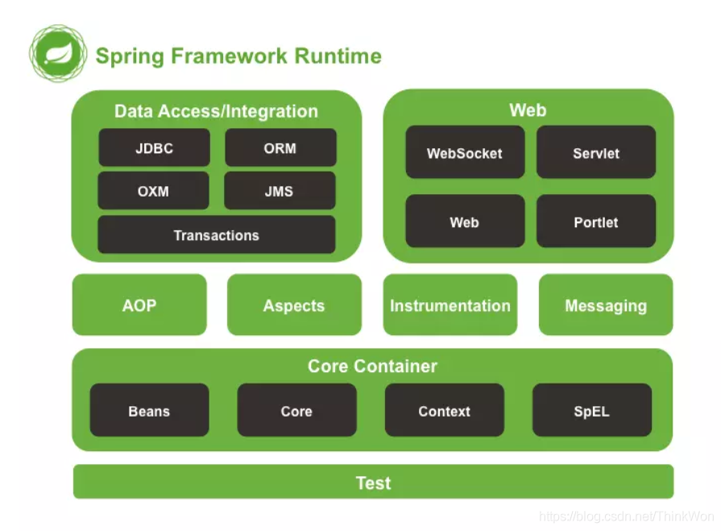
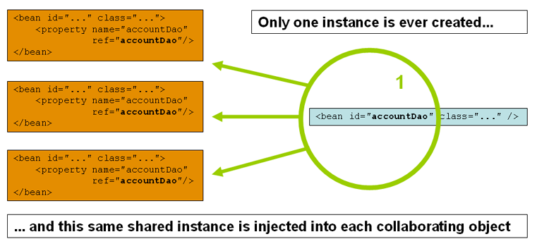
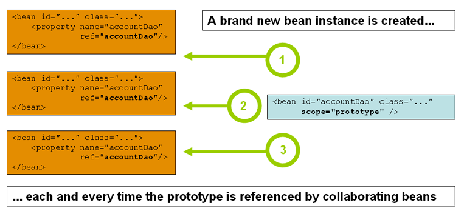
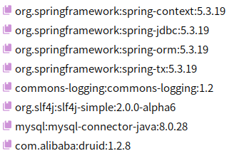
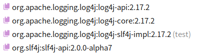

# 第 20 章 Spring

## 20.1 Spring 概述

### 20.1.1 何为 Spring

Spring 框架是一个开放源代码的 J2EE 应用程序框架，由 Rod Johnson 发起，是针对 bean 的生命周期进行管理的轻量级容器（lightweight container）。

Spring 的两个核心部分是 IOC 和 AOP，IOC 即控制反转，把对象创建交给 Spring 进行管理；Aop 即面向切面，在不修改源代码的情况下进行功能增强。

**Spring 是一个轻量级的控制反转（IOC）和面向切面编程（AOP）框架。**

### 20.1.2 Spring 的特点

1. 方便解耦，简化开发

   Spring 是一个轻量级框架，其理念是使现有技术更加容易使用。

2. 控制反转

   通过 Spring 提供的 IoC 容器，我们可以将对象之间的依赖关系交由 Spring 进行控制，避免硬编码所造成的过度程序耦合。有了 Spring，用户不必再为单实例模式类、属性文件解析等这些很底层的需求编写代码，可以更专注于上层的应用。

3. AOP 编程的支持

   通过 Spring 提供的 AOP 功能，方便进行面向切面的编程，许多不容易用传统 OOP 实现的功能可以通过 AOP 轻松应付。

4. 声明式事务的支持

   在 Spring 中，我们可以从单调烦闷的事务管理代码中解脱出来，通过声明式方式灵活地进行事务的管理，提高开发效率和质量。

5. 方便集成各种优秀框架

   Spring 不排斥各种优秀的开源框架，相反，Spring 可以降低各种框架的使用难度，Spring 提供了对各种优秀框架（如 Struts,Hibernate、Hessian、Quartz）等的直接支持。

6. 降低 Java EE API 的使用难度

   Spring 对很多难用的 Java EE API（如 JDBC，JavaMail，远程调用等）提供了一个薄薄的封装层，通过 Spring 的简易封装，这些 Java EE API 的使用难度大为降低。

7. Java 源码是经典学习范例

   Spring 的源码设计精妙、结构清晰、匠心独运，处处体现着大师对 Java 设计模式灵活运用以及对 Java 技术的高深造诣。Spring 框架源码无疑是 Java 技术的最佳实践范例。如果想在短时间内迅速提高自己的 Java 技术水平和应用开发水平，学习和研究 Spring 源码将会使你收到意想不到的效果。

### 20.1.3 Spring 组成



## 20.2 IOC 容器

IOC 即控制反转，降低代码耦合度，把对象的创建、管理和装配，交给 Spring 进行管理。


控制反转(Inversion of Control)是一种设计思想，依赖注入是实现 IOC 的一种方法。

控制反转是一种通过描述（XML 或注解）并通过第三方去生产或获取特定对象的方式，在 Spring 中实现控制反转是的 IOC 容器，实现方法是依赖注入。

### 20.2.1 IOC 底层原理

IOC 底层采用 xml 文件解析、工厂设计模式及反射技术实现。

IOC 思想甚于 IOC 容器完成，IOC 容器底层就是对象工厂，Spring 提供 IOC 容器的两种实现：

- BeanFactory

  IOC 容器的基本实现，是 Spring 内部使用的接口；

  加载配置文件时不会创建对象，在获取对象时才创建。

- ApplicationContext

  BeanFactory 接口的子接口，提供了更多更强大的功能，面向开发人员。

  加载配置文件时即创建对象。

### 20.2.2 xml 方式 Bean 管理

Bean 管理一般有两个操作：创建对象和注入属性。

1.  创建对象：

    ```xml
    <bean id="hello" class="HelloSpring"></bean>
    ```

    - id 对象标识
    - class 类路径

    **创建对象时默认使用类的无参构造器。**

2.  注入属性：

    DI(dependency injection)：依赖注入就是注入属性，bean 对象的创建依赖于容器，bean 对象中的所有属性由容器来注入，可以使用 set 方法注入或有参构造方法注入。

    - set 方法注入

      ```xml
      <bean id="" class="">
          <property name="" value=""></property>
      </bean>
      ```

    - 有参构造方法注入

      ```xml
      <bean id="" class="">
          <constructor-arg name="" value=""></constructor-arg>
      </bean>
      ```

    - 外部 Bean

      ```xml
      <bean id="userDAOImpl" class="UserDAOImpl"></bean>
      <bean id="userService" class="UserService">
          <property name="userDAO" value="userDAOImpl"></property>
      </bean>
      ```

    - 集合属性

      ```xml
      <bean id="student" class="Student">
          <!--数组类型属性注入-->
          <property name="courses">
              <array>
                  <value>Java</value>
                  <value>JavaScript</value>
                  <value>Python</value>
                  <value>数据库</value>
              </array>
          </property>
          <property name="books">
              <list>
                  <value>Core Java</value>
                  <value>ProfessionalJavaScriptforWebDevelopers</value>
                  <value>PythonCrashCourse</value>
              </list>
          </property>
          <property name="scores">
              <map>
                  <entry key="Programming" value="98"></entry>
                  <entry key="OperatingSystem" value="86"></entry>
              </map>
          </property>
      </bean>
      ```

    - p 命名空间

      ```xml
      <beans xmlns="http://www.springframework.org/schema/beans"
          xmlns:xsi="http://www.w3.org/2001/XMLSchema-instance"
          xmlns:p="http://www.springframework.org/schema/p"
          xsi:schemaLocation="http://www.springframework.org/schema/beans
              https://www.springframework.org/schema/beans/spring-beans.xsd">

          <bean name="john-classic" class="com.example.Person">
              <property name="name" value="John Doe"/>
              <property name="spouse" ref="jane"/>
          </bean>

          <bean name="john-modern"
              class="com.example.Person"
              p:name="John Doe"
              p:spouse-ref="jane"/>

          <bean name="jane" class="com.example.Person">
              <property name="name" value="Jane Doe"/>
          </bean>
      </beans>
      ```

      **使用前需要导入 xml 约束。**

    - c 命名空间

      ```xml
      <beans xmlns="http://www.springframework.org/schema/beans"
          xmlns:xsi="http://www.w3.org/2001/XMLSchema-instance"
          xmlns:c="http://www.springframework.org/schema/c"
          xsi:schemaLocation="http://www.springframework.org/schema/beans
              https://www.springframework.org/schema/beans/spring-beans.xsd">

          <bean id="beanTwo" class="x.y.ThingTwo"/>
          <bean id="beanThree" class="x.y.ThingThree"/>

          <!-- traditional declaration with optional argument names -->
          <bean id="beanOne" class="x.y.ThingOne">
              <constructor-arg name="thingTwo" ref="beanTwo"/>
              <constructor-arg name="thingThree" ref="beanThree"/>
              <constructor-arg name="email" value="something@somewhere.com"/>
          </bean>

          <!-- c-namespace declaration with argument names -->
          <bean id="beanOne" class="x.y.ThingOne" c:thingTwo-ref="beanTwo"
              c:thingThree-ref="beanThree" c:email="something@somewhere.com"/>
      </beans>
      ```

      **使用前需要导入 xml 约束。**

3.  Bean 自动装配

    Spring 根据指定的装配规则（属性名或属性类型）自动注入匹配的属性值。

    通过 bean 标签中的 autowire 属性进行配置。

    - byName

      根据属性名注入。

    - byType

      根据属性类型注入（必须保证全局类型唯一）。

    ```xml
    <?xml version="1.0" encoding="UTF-8"?>
    <beans xmlns="http://www.springframework.org/schema/beans"
        xmlns:xsi="http://www.w3.org/2001/XMLSchema-instance"
        xmlns:context="http://www.springframework.org/schema/context"
        xsi:schemaLocation="http://www.springframework.org/schema/beans
            https://www.springframework.org/schema/beans/spring-beans.xsd
            http://www.springframework.org/schema/context
            https://www.springframework.org/schema/context/spring-context.xsd">

        <context:annotation-config/>
        <bean id="employee" class="pojo.Employee"/>
    </beans>
    ```

4.  外部属性文件

    创建外部`.properties`属性文件;
    将外部属性文件引入到 Spring 配置文件中；

    - 引入 context 名称空间
    - 在 Spring 配置文件使用标签引入外部属性文件

### 20.2.3 注解方式 Bean 管理

注解是代码中特殊的标记，可以简化 xml 文件配置。

**使用注解生效，必须开启注解的支持。**

1.  创建对象

    常用注解：

    - @Component

      组件注解 ，配置在类上，表明该类已被 Spring 管理。

    - @Service

      应用在 Service 层的类。

    - @Controller

      应用在 Controller 层的类。

    - @Repository

      应用在 DAO 层的类。

    方法步骤：

    - 引入依赖 spring-aop
    - 开启组件扫描
    - 创建类，在类上添加创建对象注解

2.  注入属性

    常用注解：

    - @AutoWired，根据属性类型自动注入
    - @Qualifier，根据属性名称注入
    - @Resource，可根据属性名称，也可根据属性类型（非 Spring 原生，不建议使用）
    - @Value，向普通属性注入值

3.  xml 与注解最佳实践

    - xml 用来管理 bean
    - 注解只负责完成属性的注入

4.  完全注解开发

    添加配置类，使用`@Configuration`注解标注，表明该类是一个配置类。

    配置类：

    ```java
    @Configuration
    public class AppConfig {
        @Bean
        public User user() {
            return new User();
        }
    }
    ```

    测试类：

    ```java
    public class AppConfigTest {
        @Test
        public void testAppConfig() {
            ApplicationContext context = new AnnotationConfigApplicationContext(AppConfig.class);
            User user = context.getBean("user", User.class);
            System.out.println(user);
        }
    }
    ```

### 20.2.4 Bean 作用域

Spring 有两种类型的 Bean，一种是普通 Bean，另一种是工厂 Bean（即 FactoryBean)。

1.  普通 Bean

    在配置文件中定义的 bean 类型就是返回类型。

2.  工厂 Bean

    配置文件定义的 Bean 类型可以和返回值类型不一致。

    - 步骤 1:创建类，实现 FactoryBean 接口；
    - 步骤 2:实现接口的方法，在实现中定义返回的 bean 类型。

3.  Bean 作用域

    在 Spring 中，设置创建 Bean 实例是单实例还是多实例，可以通过 scope 属性进行设置。

    - singleton 为单实例（默认）

      加载 Spring 配置文件时就会创建单实例对象。

      

    - prototype 为多实例

      在调用 getBean 方法时创建多实例对象。

      

4.  Bean 生命周期

    - 通过构造器创建 Bean 实例（无参数构造器）；
    - 为 Bean 的属性设置值和对其他 Bean 引用（调用 set 方法）；
    - 调用 Bean 的初始化方法；
    - Bean 可以使用（对象获取）；
    - 关闭容器时，调用 Bean 的销毁方法（需要进行配置销毁方法）。

    ```java
    public class Orders {
        private String oname;

        public Orders() {
            System.out.println("步骤1：执行无参构造器创建Bean实例");
        }

        public void setOname(String oname) {
            this.oname = oname;
            System.out.println("步骤2：调用属性set方法设置对应值");
        }

        //创建执行的初始化方法
        public void init() {
            System.out.println("步骤3：执行初始化方法");
        }

        //创建执行的销毁方法
        public void destroy() {
            System.out.println("步骤5：执行销毁方法");
        }
    }
    ```

    ```xml
    <bean id="orders" class="Orders" init-method="init"
        destroy-method="destroy">
        <property name="oname" value="Cellphone"></property>
    </bean>
    ```

    ```java
    public class OrdersTest {
        @Test
        public void testOrders() {
            // 1. 加载配置文件
            ApplicationContext context =
                    new ClassPathXmlApplicationContext("beans.xml");

            // 2. 获取配置创建的对象
            Orders orders = context.getBean("orders", Orders.class);

            System.out.println("步骤4：获取创建的Bean实例对象");
            System.out.println(orders);

            ((ClassPathXmlApplicationContext)context).close();
        }
    }
    ```

## 20.3 AOP

### 20.3.1 AOP 概述

AOP 即 Aspect Oriented Programming，面向切面编程，是通过预编译方式和运行期间动态代理实现程序功能的统一维护的一种技术。

AOP 是 OOP 的延续，是软件开发中的一个热点，也是 Spring 框架中的一个重要内容，是函数式编程的一种衍生范型。

利用 AOP 可以对业务逻辑的各个部分进行隔离，从而使得业务逻辑各部分之间的耦合度降低，提高程序的可重用性，同时提高了开发的效率。

### 20.3.2 AOP 原理

1. 代理模式

   - 角色分析：

     - 抽象角色：一般使用接口或抽象类来解决
     - 真实角色：被代理的角色
     - 代理角色：代理真实角色，代理后一般会做一些附属操作
     - 客户：访问代理对象

   - 静态代理
   - 动态代理

     动态代理分为两大类：甚于接口的动态代理和甚于类的动态代理。

     - 甚于接口：JDK 动态代理
     - 甚于类：cglib

2. AOP 底层原理

   AOP 底层采用动态代理，区分两种情况

   - 有接口时，使用 JDK 动态代理，创建接口实现类的代理对象，增强类的方法。

   - 没有接口时，使用 CGLIB 动态代理，创建子类的代理对象，增强类的方法。

3. AOP 术语

   - 横切关注点

     跨越应用程序多个模块的方法或功能，即与业务逻辑无关但需要关注的部分，如日志、安全、缓存、事务等。

   - 连接点

     类中可以被增强的方法。

   - 切入点

     实际被增强的方法称为切入点。

   - 通知（增强）

     实际增强的逻辑部分即为通知。通知有多种类型，前置通知、后置通知、环绕通知、异常通知、最终通知。

   - 切面

     把通知应用到切入点的过程即为切面。

### 20.3.3 AOP 基于 xml 配置文件实现

Spring 框架中一般甚于 AspectJ 实现 AOP 操作，甚于 AspectJ 实现 AOP 操作有基于 xml 配置文件和注解两种方式。

1. 实现接口

   ```java
   public interface UserService {
       void add();
       void update();
       void query();
       void remove();
   }
   ```

   接口实现：

   ```java
   public class UserServiceImpl implements UserService{
       @Override
       public void add() {
           System.out.println("add user");
       }

       @Override
       public void update() {
           System.out.println("update user");
       }

       @Override
       public void query() {
           System.out.println("query user");
       }

       @Override
       public void remove() {
           System.out.println("remove user");
       }
   }
   ```

2. 实现 AOP 接口

   ```java
   public class BeforeLog implements MethodBeforeAdvice {
       @Override
       public void before(Method method, Object[] args, Object target) throws Throwable {
           System.out.println(target.getClass().getName() + " -> " + method.getName() + " is running");
       }
   }
   ```

   ```java
   public class AfterLog implements AfterReturningAdvice {
       @Override
       public void afterReturning(Object returnValue, Method method, Object[] args, Object target) throws Throwable {
           System.out.println(method.getName() + " finished, result is " + returnValue);
       }
   }
   ```

3. applicationContext 中配置

   ```xml
   <bean id="userService" class="service.UserServiceImpl"/>
   <bean id="beforeLog" class="log.BeforeLog"/>
   <bean id="afterLog" class="log.AfterLog"/>

   <!-- 使用Spring API接口 -->
   <aop:config>
       <!-- 配置切入点 -->
       <aop:pointcut id="pointcut" expression="execution(* service.UserServiceImpl.*(..))"/>
       <!-- 配置环绕增强 -->
       <aop:advisor advice-ref="beforeLog" pointcut-ref="pointcut"/>
       <aop:advisor advice-ref="afterLog" pointcut-ref="pointcut"/>
   </aop:config>
   ```

4. 测试

   ```java
   @TestInstance(TestInstance.Lifecycle.PER_CLASS)
   public class LogTest {
       private ApplicationContext context;
       @BeforeAll
       public void getApplicationContext() {
           context = new ClassPathXmlApplicationContext("applicationContext.xml");
       }

       @Test
       public void testLogPointCut() {
           UserService userService = (UserService) context.getBean("userService");
           System.out.println(userService);
           userService.add();
           userService.update();
       }
   }
   ```

### 20.3.4 AOP 基于注解实现

- 切入点表达式

```java
execution([权限修饰符][返回类型][类路径][方法名称][参数列表])

// 对org.example.Class类中的method方法时行增强
execution(* org.example.Class.method(..))

// 对org.example.Class类中的所有方法进行增强
execution(* org.example.Class.*(..))

// 对rog.example包下的所有类中的所有方法进行增强
execution(* rog.example.*.*(..))
```

- AspectJ 注解

  - 创建类，在类中定义方法
  - 创建增强类，编写增强逻辑

    在增强类中创建方法，不同方法代表不同的通知类型

  - 进行通知配置

    - 在 Spring 配置文件中，开启注解扫描
    - 使用注解创建对象
    - 在增强类中添加@Aspect 注解
    - 在 Spring 配置文件中开启生成代理对象

  - 配置不同类型通知

    在增强类的通知方法上添加通知类型注解，使用切入点表达式配置。

  ***

  - 抽取相同的切入点
  - 有多个增强类对同一个方法进行增强，设置增强类的优先级，使用@Order 注解，数字类型值越小优先级越高
  - 完全注解开发，创建配置类

## 20.4 JdbcTemplate

### 20.4.1 JdbcTemplate 概述

Spring 对 JDBC 进行了封装

### 20.4.2 操作步骤

1. 配置准备

- 添加 Spring 和数据库连接依赖

  

- Spring 配置文件中配置数据库连接池
- 配置 JdbcTemplate 对象，注入 DataSource
- 创建 Service 类、DAO 类，在 DAO 类中注入 jdbcTemplate 对象

2. 操作数据库

- 增加
- 修改
- 删除
- 查询

  - 返回某个值

    queryForObject(sql, requiredType.class)

  - 返回某个对象

    queryForObject(sql, new BeanPropertyRowMapper<>(requiredType.class), args)

  - 返回集合
    query(sql, new BeanPropertyRowMapper<>(requiredType.class))

- 批量操作
  - 批量添加
  - 批量修改
  - 批量删除

## 20.5 事务管理

### 20.5.1 事务概述

事务是数据库操作的最基本单元，是逻辑上的一组操作，要么都成功，如果有一个失败所有操作都失败。

事物的特性（ACID）：

- 原子性
- 一致性
- 隔离性
- 持久性

### 20.5.2 Spring 事务管理

事务一般添加到 Service 层（业务逻辑层），进行事务管理一般有两种方式：编程式事务管理和声明式事务管理。

声明式事务管理方式有甚于注解方式和甚于 xml 配置文件方式进行具体操作。

### 20.5.3 Spring 事务操作 API

1. API

2. 注解声明式事务管理操作

   - 在 Spring 配置文件中配置事务管理器
   - 在 Spring 配置文件中开启事务注解

     引入名称空间，开启事务注解

   - 在 service 类上添加事务注解

     @Transactional 注解可以添加到类上（表示类中所有方法都添加事务），也可以添加到方法上（该方法添加事务）

     @Transactional 注解属性配置：

     - propagation 事务传播行为

       多事务间的事务传播行为。

     - ioslation 事务隔离级别

       事务有隔离性，多事务操作之间不会产生影响，不考虑隔离可能产生脏读、不可重复读、虚读等问题。

     - timeout 超时时间

       事务需要在一定时间内进行提交，若未提交则进行回滚。

     - readOnly 是否只读
     - rollbackFor 回滚

       设置出现哪些异常进行事务回滚。

     - noRollbackFor 不回滚

       设置出现哪些异常不进行事务回滚。

3. xml 声明式事务管理

   - 在 Spring 配置文件中进行配置

     - 配置事务管理器
     - 配置通知
     - 配置切入点和切面

   ```xml
   <!--创建事务管理器-->
   <bean id="transactionManager"
         class="org.springframework.jdbc.datasource.DataSourceTransactionManager">
       <!--注入数据源-->
       <property name="dataSource" ref="dataSource"/>
   </bean>
   <!--开启事务注解-->
   <tx:annotation-driven transaction-manager="transactionManager"/>
   ```

4. 完全注解开发

## 20.6 Spring5 新特性

### 20.6.1 Spring5 概述

代码基于 Java8

### 20.6.2 Spring5 整合 Log4j2 框架

- 引入依赖 jar 包

  

- 创建`log4j2.xml`配置文件

### 20.6.3 Spring5 核心容器支持@Nullable 注解

1. @Nullable 注解

   - 使用在方法上，表示方法返回值可以为空
   - 使用在方法参数上，表示方法参数可以为空
   - 使用在属性上，表示属性值可以为空

### 20.6.4 Spring5 支持 lambda 表达式

### 20.6.5 Spring5 整合 JUnit5 框架

- 引入 JUnit5 依赖 jar 包
- 创建测试类，使用注解完成
- 使用复合注解@SpringJUnitConfig(locations = "")

### 20.6.6 SpringWebflux

1. SpringWebflux 概述

   用于 Web 开发，与 SpringMVC 类似，使用响应式编程。

   Webflux 是异步非阻塞框架，核心甚于 Reactor 的相关 API 实现。

2. 响应式编程

   响应式编程是一种面向数据流和变化传播的编程范式。

   - 实现类

     Webflux 中通过 Reactor 实现，Reactor 是满足 Reactive 规范的框架，包含两个核心类，Mono 和 Flux。

     Mono 和 Flux 都实现了 Publisher 接口，其中 Mono 对象实现了发布者，可以返回 0 或者 1 个元素；Flux 对象实现发布者，返回 N 个元素。

   - 信号特点

     - 错误信号和完成信号都是终止信息，但不能共存；
     - 如果没有发送任何元素值，而是直接发送错误或者完成信号，表示是空数据流；
     - 如果没有错误信号，没有完成信号，表示是无限数据流。

   - 操作符

     - map 元素映射为新元素
     - flatMap 元素映射为流

3. SpringWebflux 执行流程和核心 API

   基于 Reactor 实现，默认容器是 Netty(高性能，NIO 异步非阻塞框架)。

   核心控制器使用 DispatchHandler，该控制器实现 WebHandler 接口，负责请求处理。

4. SpringWebflux 甚于注解编程模型

   - 创建 Spring 工程，引入 Webflux 依赖
   -

5. SpringWebflux 甚于函数式编程模型

## 20.7 Spring 注解驱动开发

1. Spring 容器在启动时，先保存所有注册的 Bean 的定义信息

   - xml 注册 bean `<bean>`
   - 注解注册 bean `@Bean`, `@Service`, `@Component`

2. Spring 容器会在适合的时机创建 Bean

   - 使用 bean 时
   - 统一创建剩下的 bean 时

3. 后置处理器

   - 每个 bean 创建完成后，都会使用各种后置处理器增强 bean 的功能

4. 事件驱动模型

   ApplicationListener:事件监听
   ApplicationEventMulticaster: 事件派发
