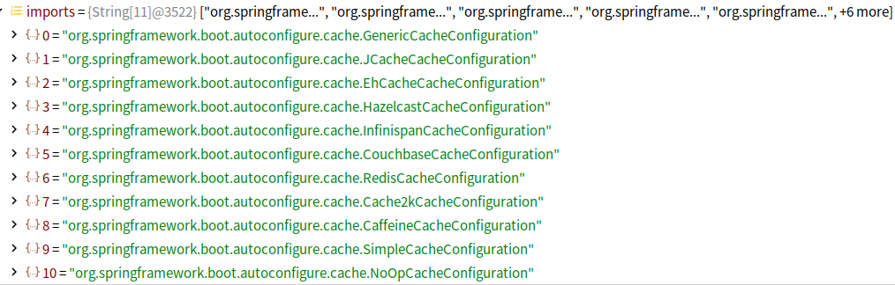
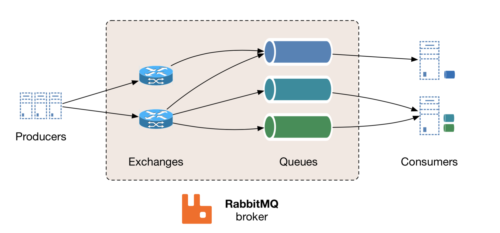
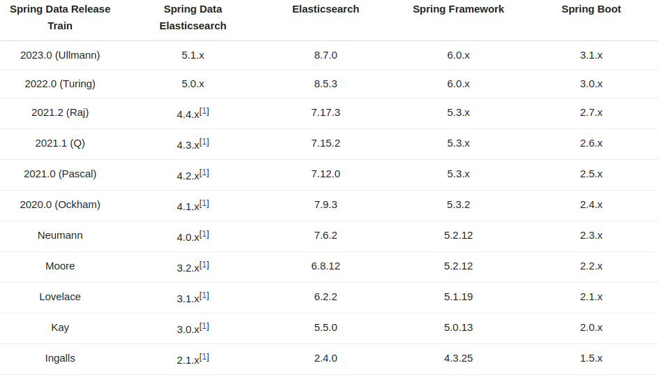

# 第 24 章 Spring Boot

## 24.1 SpringBoot 概述

### 24.1.1 SpringBoot 简介

SpringBoot 简化 Spring 应用开发框架，是对整个 Spring 技术栈的大整合，J2EE 开发的一站式解决方案。

1. 优点

   - 快速创建独立运行的 Spring 项目以及与主流框架集成
   - 使用嵌入式的 Servlet 容器，应用无需打成 war 包
   - starters 自动依赖与版本控制
   - 大量的自动配置，简化开发，也可以修改默认值
   - 无需配置 XML，无代码生成，开箱即用
   - 准生产环境的运行时应用监控
   - 与云计算的天然集成

### 24.1.2 微服务

- 微服务是一种软件架构风格
- 一个应用拆分为一组小型服务
- 每个服务运行在自己的进程内，可以独立部署和升级
- 可以通过 HTTP 方式进行互通
- 服务围绕业务功能拆分
- 可以由全自动部署机制独立部署
- 去中心化，服务自治

### 24.1.3 分布式

### 24.1.4 云原生

## 24.2 Hello SpringBoot

### 24.2.1 开发环境搭建

1. JDK

   | JDK 版本 | SpringBoot 版本  |
   | -------- | ---------------- |
   | jdk-8    | SpringBoot 2.x.x |
   | jdk-17   | SpringBoot 3.x.x |

2. Maven/Gradle

   | 构建工具 | 版本 | SpringBoot 版本 |
   | -------- | ---- | --------------- |
   | Maven    | 3.5+ | 3.x.x           |
   | Gradle   | 7.x  |                 |

3. SpringBoot

   SpringBoot 3+

### 24.2.2 Hello SpringBoot

1. 创建 maven 工程
2. 引入依赖

   ```xml
   <parent>
       <groupId>org.springframework.boot</groupId>
       <artifactId>spring-boot-starter-parent</artifactId>
       <version>2.7.3</version>
   </parent>

   <dependencies>
       <dependency>
           <groupId>org.springframework.boot</groupId>
           <artifactId>spring-boot-starter-web</artifactId>
           <version>2.7.3</version>
       </dependency>
   </dependencies>
   ```

3. 创建主程序

   ```java
   // @SpringBootApplication标注主程序类
   @SpringBootApplication
   public class HelloSpringBootApplication {
       public static void main(String[] args) {
           SpringApplication.run(HelloSpringBootApplication.class, args);
       }
   }
   ```

4. 编写业务
5. 测试
6. 简化配置

   SpringBoot 约定项目 resources 文件夹下`application.properties`或`application.yml`为默认配置文件

   ```properties
   server.port=8082
   ```

7. 简化部署

   ```xml
   <build>
       <finalName>hellospringboot</finalName>
       <plugins>
           <plugin>
               <groupId>org.springframework.boot</groupId>
               <artifactId>spring-boot-maven-plugin</artifactId>
           </plugin>
       </plugins>
   </build>
   ```

   将项目打成 jar 包，直接在目标服务器执行即可。

### 24.2.3 HelloSpringBoot 探究

1. 依赖管理

   - 父依赖

     ```xml
     <parent>
         <groupId>org.springframework.boot</groupId>
         <artifactId>spring-boot-starter-parent</artifactId>
         <version>2.7.3</version>
     </parent>

     <!-- 其父项目是spring-boot-dependencies -->
     <!-- 真正管理SpringBoot应用里的所有依赖版本 -->

     <parent>
         <groupId>org.springframework.boot</groupId>
         <artifactId>spring-boot-dependencies</artifactId>
         <version>2.7.3</version>
     </parent>
     ```

     SpringBoot 自动进行版本仲裁，无需关注版本号。

   - 启动器

     ```xml
     <dependency>
         <groupId>org.springframework.boot</groupId>
         <artifactId>spring-boot-starter-web</artifactId>
         <version>2.7.3</version>
     </dependency>
     ```

   `spring-boot-starter-web`是 SpringBoot 的 Web 开发场景启动器，导入了 web 模块正常运行所依赖的组件。

   SpringBoot 将所有功能场景抽取出来，形成如`spring-boot-starter-*`的场景启动器，只需要在项目里引入 starter 相关场景的依赖都会导入，需要什么功能就导入什么启动器。

   SpringBoot 支持自定义场景启动器，命名格式为`*-spring-boot-starter`，底层最核心的依赖是

   ```xml
   <dependency>
       <groupId>org.springframework.boot</groupId>
       <artifactId>spring-boot-starter</artifactId>
       <version>2.7.3</version>
       <scope>compile</scope>
   </dependency>
   ```

2. 主程序类

`@SpringBootApplication`标注在某个类上说明它是 SpringBoot 的主配置类，SpringBoot 运行这个类的 main 方法启动 SpringBoot 应用。

```java
@Target(ElementType.TYPE)
@Retention(RetentionPolicy.RUNTIME)
@Documented
@Inherited
@SpringBootConfiguration
@EnableAutoConfiguration
@ComponentScan(excludeFilters = { @Filter(type = FilterType.CUSTOM, classes = TypeExcludeFilter.class),
		@Filter(type = FilterType.CUSTOM, classes = AutoConfigurationExcludeFilter.class) })
public @interface SpringBootApplication {
    ...
}
```

- `@SpringBootConfiguration` 标注在某个类上，表示该类是 SpringBoot 的配置类，配置类也是容器中的一个组件
- `@EnableAutoConfiguration` 开启自动配置功能

  ```java
  @Target(ElementType.TYPE)

  @Retention(RetentionPolicy.RUNTIME)
  @Documented
  @Inherited
  @AutoConfigurationPackage
  @Import(AutoConfigurationImportSelector.class)
  public @interface EnableAutoConfiguration {
      ...
  }
  ```

  `@AutoConfigurationPackage` 自动配置包，将主配置类（@SpringBootApplication 标注的类）所在包及其子包里的所有组件扫描到 Spring 容器。

  `@Import` Spring 底层注解，向容器导入哪些组件

  会给容器中导入自动配置类（xxxAutoConfiguration），就是导入并配置场景所需的组件

  SpringBoot 在启动时从类路径下的`META-INF/spring.factories`中获取 EnableAutoConfiguration 指定的值，将这些值作为自动配置类导入到容器中，自动配置类生效完成自动配置。

3. 自动配置

   - 默认的包结构

     主程序所在包及其子包里的组件都会被默认扫描，无需包扫描配置

   - SpringBoot 启动时加载主配置类，开启自动配置功能@EnableAutoConfiguration
   - @EnableAutoConfiguration 作用：

     - 利用 EnableAutoConfigurationImportSelector 给容器中导入组件，将类路径下 META-INF/spring.factories 里配置的所有 EnableAutoConfiguration 的值加入到容器中

   - 所有在配置文件中能配置的属性都封装在 xxxProperties 类中，配置文件可配置的功能参照某个功能对应的属性类
   - 每个自动配置类进行自动配置功能

     引入对应的场景，自动配置都会开启，所有的自动配置功能都在`spring-boot-autoconfigure`包里

## 24.3 SpringBoot 自动配置

### 24.3.1 SpringBoot 配置文件

SpringBoot 使用一个全局配置文件，配置文件名固定为：`application.properties`或`application.yml`，配置文件可以修改 SpringBoot 自动配置的默认值。

1.  YAML 语法

    - 基本语法

      k:(空格)v 表示一对键值对（空格必须有）

      以空格的缩进来控制层级关系，左对齐的一列数据，都是同一层级；属性和值大小写敏感。

      ```yaml
      server:
        port: 8081
        path: /index
      ```

    - 值的写法

      - 字面量（数字、字符串、布尔值）

        `k: v` 字面直接写。

        字符串默认不加单引号或双引号。双引号不会转义字符中的特殊字符，此时特殊字符作为其本身的意义；单引号会转义特殊字符，此时特殊字符最终作为一个普通字符串数据。

      - 对象、Map（键值对）

        `k: v` 对象仍以`k:v`形式写

        ```yaml
        person:
            name: tom
            age: 20

        // 行内写法
        person: {name: tom, age: 20}
        ```

      - 数组

        用- 值表示数组中的一个元素

        ```yaml
        pets:
         - cat
         - dog

        // 行内写法
        pets: [cat, dog]
        ```

2.  @Value 获取值和@ConfigurationProperties 获取值

    |                 | @ConfigurationProperties | @Value   |
    | --------------- | ------------------------ | -------- |
    | 功能            | 批量注入配置文件中的属性 | 逐个指定 |
    | 松散语法        | 支持                     | 不支持   |
    | SpEL            | 不支持                   | 支持     |
    | JSR303 数据校验 | 支持                     | 不支持   |
    | 复杂类型封装    | 支持                     | 不支持   |

    如果是在某个业务逻辑中获取配置文件中的某项值，使用@Value；如果编写了一个 JavaBean 来和配置文件进行映射，使用@ConfigurationProperties。

3.  @PropertySource 和@ImportResource

    - @PropertySource 加载指定的配置文件

      person.properties

      ```properties
      person.lastName=springboot-config
      person.age=3
      person.email=springboot-config@gmail.com
      person.birth=2022/12/9
      person.map.k1=v1
      person.map.k2: v2
      person.list=java, python
      person.dog.name=狗子
      person.dog.age=2
      ```

      Person.java

      ```java
      @PropertySource("classpath:person.properties")
      @ConfigurationProperties(prefix = "person")
      @Component
      // JSR303数据校验
      @Validated
      public class Person {
          private String lastName;
          private Integer age;
          @Email
          private String email;
          private Date birth;

          private Map<String, Object> map;
          private List<Object> list;
          private Dog dog;

          // 省略构造方法及getter、setter方法
          ...
      }
      ```

    - @ImportResource 导入 Spring 的配置文件，使配置文件生效

    SpringBoot 推荐全注解的方式给容器中添组件：

    - 配置类（Spring 配置文件）
    - 使用@Bean 向容器添加组件

      ```java
      @Configuration
      public class AppConfig {
          // 将方法的返回值添加到容器中，容器中组件的默认id就是方法名
          @Bean
          public HelloService helloService() {
              System.out.println("Adding component to container");
              return new HelloService();
          }
      }
      ```

4.  配置文件占位符

    - 随机数

      ```java
      ${random.value}
      ${random.int}
      ${random.long}
      ${random.int[1024, 65536]}
      ```

    - 占位符

      占位符获取之前配置的值，如果没有可使用`:`指定默认值

      ```properties
      person.info=${person.name:hello} is learning
      ```

5.  Profile

    - 指定环境配置文件

      在编写主配置文件时，可以是`application-{profile}.properties/yml`，如`application-dev.properties` `application-test.properties`或`application-prod.properties`。

    - 激活指定环境

      - 配置文件激活

        默认使用`application.properties`(永远被加载)，可使用`spring.profiles.active=dev/prod/test`来激活其他配置文件。

      - 命令行激活

        ```
        java -jar xxx.jar --spring.profiles.active=dev/prod/test --person.name=hello
        ```

6.  外部化配置

    springboot 启动时会扫描加载`application.properties`或`application.yml`作为默认配置文件，文件位置：

    - file:./config/
    - file:./
    - classpath:/config/
    - classpath:/
    - jar 包当前目录

    按照估优先级从高到低的顺序加载，高优先级配置覆盖低优先级配置内容，文件内容不同时配置文件进行**互补配置**。

### 24.3.2 容器功能

1. 组件添加

   - `@Configuration`

     - 基本使用
     - Full 模式与 Lite 模式

       - `proxyBeanMethods = true/false`属性
       - 配置类组件之间无依赖关系用 Lite 模式加速容器启动过程，减少判断
       - 配置类组件之间有依赖关系，方法会被调用得到之前单实例组件，使用 Full 模式

   - `@Bean`, `@Component`, `@Controller`, `@Repository`

     向容器中导入组件，使用方法不变。

   - `@Import()`

     给容器中导入组件，组件名默认为全类名。

   - `@Conditional`

2. 原生配置文件引入

   - `@ImportResource`

3. 配置绑定

   - `@ConfigurationProperties`

### 24.3.3 自动配置原理

1. 引导加载自动配置类

   ```java
   @SpringBootConfiguration
   @EnableAutoConfiguration
   @ComponentScan(excludeFilters = { @Filter(type = FilterType.CUSTOM, classes = TypeExcludeFilter.class),
           @Filter(type = FilterType.CUSTOM, classes = AutoConfigurationExcludeFilter.class) })
   public @interface SpringBootApplication {
       ...
   }
   ```

   - `@SpringBootConfiguration`

     `@Configuration`标注当前类是一个配置类

   - `@ComponentScan`

     指定扫描组件

   - `@EnableAutoConfiguration`

     ```java
     @AutoConfigurationPackage
     @Import(AutoConfigurationImportSelector.class)
     public @interface EnableAutoConfiguration {
         ...
     }
     ```

     - `@AutoConfigurationPackage`

       ```java
       // 给容器中导入一个组件
       @Import(AutoConfigurationPackages.Registrar.class)
       public @interface AutoConfigurationPackage {}
       ```

       利用 Registrar 给容器中导入一系列组件，将主程序类所在包下的所有组件导入。

     - `@Import(AutoConfigurationImportSelector.class)`

       - 调用`AutoConfigurationImportSelector`的 getAutoConfigurationEntry()方法批量导入一些组件
       - 调用`List<String> configurations = getCandidateConfigurations(annotationMetadata, attributes);`获取到所有需要导入到容器中的组件
       - 从`META-INF/spring.factories`来加载一个文件

2. 按需开启自动配置项

   虽然启动时会加载所有自动配置，但会按照条件装配规则按需配置。

3. 定制化修改自动配置

   SpringBoot 默认在底层配置好所有组件，如果用户配置了则以用户配置优先。

总结：

- SpringBoot 首先加载所有的自动配置类（形如 xxxAutoConfiguration）
- 每个自动配置类按照条件生效，默认都会绑定配置文件指定的值，该值从 xxxProperties 中获取，xxxProperties 则和配置文件绑定
- 生效的配置类给容器中装配对应的组件
- 容器中有相关的组件，则具备了对应的功能
- 定制化配置
  - 用户定义自己的@Bean 替换底层组件
  - 用户修改对应的配置文件中的值

### 24.3.4 最佳实践

- 引入场景依赖
- 查看自动配置了什么（选做）

  - 自己分析
  - 配置文件中添加`debug=true`开启自动配置报告

- 是否需要修改配置项

  - 参照文档修改配置项
  - 自定义加入或者替换组件

## 24.4 SpringBoot 与 Web 开发

### 24.4.1 SpringBoot 开发 Web 应用

### 24.4.2 SpringBoot 静态资源映射

1. 静态资源目录

   - 静态资源目录

     只要静态资源放在类路径下的文件夹

     ```
     classpath:/META-INF/resources/
     classpath:/resources/
     classpath:/static/
     classpath:/public/
     / -- 当前项目根路径
     ```

     可通过`项目根路径/静态资源名`访问。

     原理：静态映射`/**`

     请求先寻找对应的 Controller，如果 Controller 能够处理则进行处理，如果 Controller 不能处理，则交给静态资源处理器，访问当前项目的静态资源，静态资源找不到时报 404 错误。

     ```java
     private static final String[] CLASSPATH_RESOURCE_LOCATIONS = { "classpath:/META-INF/resources/",
                     "classpath:/resources/", "classpath:/static/", "classpath:/public/" };
     ```

   - 静态资源访问前缀

     ```yml
     spring:
       mvc:
         static-path-pattern: /res/**
     ```

   - webjars

     所有`/webjars/**`都在`classpath:/META-INF/resources/webjars/`目录下寻找资源

     ```java
     @Override
     public void addResourceHandlers(ResourceHandlerRegistry registry) {
         if (!this.resourceProperties.isAddMappings()) {
             logger.debug("Default resource handling disabled");
             return;
         }
         addResourceHandler(registry, "/webjars/**", "classpath:/META-INF/resources/webjars/");
         addResourceHandler(registry, this.mvcProperties.getStaticPathPattern(), (registration) -> {
             registration.addResourceLocations(this.resourceProperties.getStaticLocations());
             if (this.servletContext != null) {
                 ServletContextResource resource = new ServletContextResource(this.servletContext, SERVLET_LOCATION);
                 registration.addResourceLocations(resource);
             }
         });
     }
     ```

2. 欢迎页映射

   ```java
   // HandlerMapping，即处理器映射，保存了每个Handler能处理哪些请求

   @Bean
   public WelcomePageHandlerMapping welcomePageHandlerMapping(ApplicationContext applicationContext,
           FormattingConversionService mvcConversionService, ResourceUrlProvider mvcResourceUrlProvider) {
       WelcomePageHandlerMapping welcomePageHandlerMapping = new WelcomePageHandlerMapping(
               new TemplateAvailabilityProviders(applicationContext), applicationContext, getWelcomePage(),
               this.mvcProperties.getStaticPathPattern());
       welcomePageHandlerMapping.setInterceptors(getInterceptors(mvcConversionService, mvcResourceUrlProvider));
       welcomePageHandlerMapping.setCorsConfigurations(getCorsConfigurations());
       return welcomePageHandlerMapping;
   }

   WelcomePageHandlerMapping(TemplateAvailabilityProviders templateAvailabilityProviders,
   		ApplicationContext applicationContext, Resource welcomePage, String staticPathPattern) {
   	if (welcomePage != null && "/**".equals(staticPathPattern)) {
   		logger.info("Adding welcome page: " + welcomePage);
   		setRootViewName("forward:index.html");
   	}
       // 调用Controller /index
   	else if (welcomeTemplateExists(templateAvailabilityProviders, applicationContext)) {
   		logger.info("Adding welcome page template: index");
   		setRootViewName("index");
   	}
   }
   ```

3. favicon.ico

   在静态资源目录下命名文件`favicon.ico`，即可自动加载。

4. 静态资源配置原理

   - SpringBoot 启动默认加载 xxxAutoConfiguration 类（自动配置类）
   - SpringMVC 功能的自动配置类 WebMvcAutoConfiguration，检查是否生效

     ```java
     @AutoConfiguration(after = { DispatcherServletAutoConfiguration.class, TaskExecutionAutoConfiguration.class,
     ValidationAutoConfiguration.class })
     @ConditionalOnWebApplication(type = Type.SERVLET)
     @ConditionalOnClass({ Servlet.class, DispatcherServlet.class, WebMvcConfigurer.class })
     @ConditionalOnMissingBean(WebMvcConfigurationSupport.class)
     @AutoConfigureOrder(Ordered.HIGHEST_PRECEDENCE + 10)
     public class WebMvcAutoConfiguration {
         ...
     }
     ```

   - 给容器中配置的组件

     ```java
     @SuppressWarnings("deprecation")
     @Configuration(proxyBeanMethods = false)
     @Import(EnableWebMvcConfiguration.class)
     @EnableConfigurationProperties({ WebMvcProperties.class, WebProperties.class })
     @Order(0)
     public static class WebMvcAutoConfigurationAdapter implements WebMvcConfigurer, ServletContextAware {
         ...
     }
     ```

     配置文件的相关属性和 xxx 进行了绑定：WebMvcProperties == spring.mvc， WebProperties == spring.web

     `WebMvcAutoConfigurationAdapter`类只有一个有参构造器，构造器所有参数的值都会从容器中确定。

     ```java
     // WebProperties webProperties  获取和spring.web绑定的所有值的对象
     // WebMvcProperties mvcProperties  获取和spring.mvc绑定的所有值的对象
     // ListableBeanFactory beanFactory  Spring的beanFactory
     // ObjectProvider<HttpMessageConverters> messageConvertersProvider  找到所有的HttpMessageConverters
     // ObjectProvider<ResourceHandlerRegistrationCustomizer> resourceHandlerRegistrationCustomizerProvider 找到资源处理器的自定义器
     // ObjectProvider<DispatcherServletPath> dispatcherServletPath
     // ObjectProvider<ServletRegistrationBean<?>> servletRegistrations 给应用注册Servlet, Filter
     public WebMvcAutoConfigurationAdapter(WebProperties webProperties, WebMvcProperties mvcProperties,
     		ListableBeanFactory beanFactory, ObjectProvider<HttpMessageConverters> messageConvertersProvider,
     		ObjectProvider<ResourceHandlerRegistrationCustomizer> resourceHandlerRegistrationCustomizerProvider,
     		ObjectProvider<DispatcherServletPath> dispatcherServletPath,
     		ObjectProvider<ServletRegistrationBean<?>> servletRegistrations) {
     	this.resourceProperties = webProperties.getResources();
     	this.mvcProperties = mvcProperties;
     	this.beanFactory = beanFactory;
     	this.messageConvertersProvider = messageConvertersProvider;
     	this.resourceHandlerRegistrationCustomizer = resourceHandlerRegistrationCustomizerProvider.getIfAvailable();
     	this.dispatcherServletPath = dispatcherServletPath;
     	this.servletRegistrations = servletRegistrations;
     	this.mvcProperties.checkConfiguration();
     }
     ```

     资源处理默认规则：

     ```java
     @Override
     public void addResourceHandlers(ResourceHandlerRegistry registry) {
     	if (!this.resourceProperties.isAddMappings()) {
     		logger.debug("Default resource handling disabled");
     		return;
     	}
         // webjars规则
     	addResourceHandler(registry, "/webjars/**", "classpath:/META-INF/resources/webjars/");
     	addResourceHandler(registry, this.mvcProperties.getStaticPathPattern(), (registration) -> {
     		registration.addResourceLocations(this.resourceProperties.getStaticLocations());
     		if (this.servletContext != null) {
     			ServletContextResource resource = new ServletContextResource(this.servletContext, SERVLET_LOCATION);
     			registration.addResourceLocations(resource);
     		}
     	});
     }
     ```

     ```properties
     # 禁用所有静态资源规则
     spring.web.addMappings=false
     ```

### 24.4.3 请求参数处理

1.  Restful 风格

    使用 HTTP 请求方式动词来表示对资源的操作。

    - 普通 CRUD 与 RestfulCRUD 对比：

      | 操作 | 普通 CRUD                | RestfulCRUD                        |
      | ---- | ------------------------ | ---------------------------------- |
      |      | 通过 uri 来区分操作      | 通过 http 请求方式区分对资源的操作 |
      | 查询 | getEmp                   | emp --> GET                        |
      | 添加 | addEmp?xxx               | emp --> POST                       |
      | 修改 | updateEmp?id=xxx&xxx=xxx | emp/{id} --> PUT                   |
      | 删除 | deleteEmp?id=xxx         | emp/{id} --> DELETE                |

    - RestfulCRUD 架构：

      | 操作         | 请求 URI | 请求方式 |
      | ------------ | -------- | -------- |
      | 查询所有员工 | emps     | GET      |
      | 查询某个员工 | emp/{id} | GET      |
      | 添加页面     | emp      | GET      |
      | 添加操作     | emp      | POST     |
      | 修改页面     | emp/{id} | GET      |
      | 修改操作     | emp      | PUT      |
      | 删除操作     | emp/{id} | DELETE   |

2.  Restful 使用与原理

    - SpringBoot 开启 Restful 请求映射

      核心 Filter 是 HiddenHttpMethodFilter。

      使用时表单 method=POST，添加隐藏域\_method=PUT/DELETE，并在 SpringBoot 中手动开启。

      ```java
      @Bean
      @ConditionalOnMissingBean(HiddenHttpMethodFilter.class)
      @ConditionalOnProperty(prefix = "spring.mvc.hiddenmethod.filter", name = "enabled")
      public OrderedHiddenHttpMethodFilter hiddenHttpMethodFilter() {
      return new OrderedHiddenHttpMethodFilter();
      }
      ```

      ```html
      <!-- 删除实现方式1 -->
      <form th:action="@{/user/}+${user.id}" method="post">
        <input type="hidden" name="_method" value="delete" />
        <button type="submit" class="btn btn-sm btn-danger">删除</button>
      </form>
      ```

      开启页面表单的 Restful 风格：

      ```properties
      spring.mvc.hiddenmethod.filter.enabled=true
      ```

      ```yml
      spring:
        mvc:
          hiddenmethod:
            filter:
              enabled: true
      ```

    - Restful 原理

      - 表单提交时携带\_method=PUT/DELETE 属性
      - 请求被 HiddenHttpMethodFilter 拦截

        - 判断请求是否正常，并且是 POST 请求
          - 获取到\_method 属性值（兼容 PUT, DELETE, PATCH）
          - 原生 request(post)，包装模式 requestWrapper 重写了 getMethod()，返回传入值
          - 过滤器链放行时使用 wapper，以后所调用的 getMethod()是调用 requestWrapper 的

3.  请求映射原理

    

    SpringMVC 功能分析都从`org.springframework.web.servlet.DispatcherServlet`类的`doDispatch()`方法开始，所有请求都会调用该方法。

    ```java
    @SuppressWarnings("deprecation")
    protected void doDispatch(HttpServletRequest request, HttpServletResponse response) throws Exception {
    	...
    }
    ```

4.  普通参数与基本注解

    - 注解

      - `@PathVariable`
      - `@RequestHeader`
      - `@ModelAttribute`
      - `@RequestParam`
      - `@MatrixVariable`
      - `@CookieValue`
      - `@RequestBody`

    - Servlet API
    - 复杂参数

      **Map**, **Model**, Errors/BindingResult, **RedirectAttributes**, **ServletResponse**, SessionStatus, UrlComponentBuilder, ServletUriComponentsBuilder

      `Map<String, Object> map`, `Model model`, `HttpServletRequest request`都可以给 request 域中存放数据，使用`request.getAttribute()`获取。

    - 自定义对象参数

5.  POJO 封装过程

6.  参数处理原理

    - HandlerMapping 中找到能处理请求的 Handler(Controller.method())
    - 为当前 Handler 找一个适配器 HandlerAdapter

      - HandlerAdapter

        

        0 - 支持方法上标注`@RequestMapping`
        1 - 支持函数式编程

      - 执行目标方法

        ```java
        // DispatcherServlet -- doDispatch
        mv = ha.handle(processedRequest, response, mappedHandler.getHandler());
        ```

        ```java
        // RequestMappingHandlerAdapter.java
        mav = invokeHandlerMethod(request, response, handlerMethod);

        // ServletInvocableHandlerMethod.java
        Object returnValue = invokeForRequest(webRequest, mavContainer, providedArgs);

        // 获取方法参数值
        Object[] args = getMethodArgumentValues(request, mavContainer, providedArgs);
        ```

      - 参数解析器

        确定将要执行的目标方法的每一个参数的值。

        

      - 返回值处理器

        

      - 如何确定目标方法的每个参数值

        - 逐个判断所有参数解析器
        - 解析该参数的值

        ```java
        // InvocableHandlerMethod.java
        protected Object[] getMethodArgumentValues(NativeWebRequest request,
            @Nullable ModelAndViewContainer mavContainer, Object... providedArgs) throws Exception {

            MethodParameter[] parameters = getMethodParameters();
            if (ObjectUtils.isEmpty(parameters)) {
                return EMPTY_ARGS;
            }

            Object[] args = new Object[parameters.length];
            for (int i = 0; i < parameters.length; i++) {
                MethodParameter parameter = parameters[i];
                parameter.initParameterNameDiscovery(this.parameterNameDiscoverer);
                args[i] = findProvidedArgument(parameter, providedArgs);
                if (args[i] != null) {
                    continue;
                }
                if (!this.resolvers.supportsParameter(parameter)) {
                    throw new IllegalStateException(formatArgumentError(parameter, "No suitable resolver"));
                }
                try {
                    args[i] = this.resolvers.resolveArgument(parameter, mavContainer, request, this.dataBinderFactory);
                }
                catch (Exception ex) {
                    // Leave stack trace for later, exception may actually be resolved and handled...
                    if (logger.isDebugEnabled()) {
                        String exMsg = ex.getMessage();
                        if (exMsg != null && !exMsg.contains(parameter.getExecutable().toGenericString())) {
                            logger.debug(formatArgumentError(parameter, exMsg));
                        }
                    }
                    throw ex;
                }
            }
            return args;
        }
        ```

      - 目标方法执行完成

        将所有数据放在 ModelAndViewContainer 中，包含要去的页面地址 View.

      - 处理派发结果

### 24.4.4 数据响应与内容协商

1.  响应 JSON

    - jackson.jar + @ResponseBody

      SpringBoot 自动配置了 JSON 处理模块，只需在响应体上标注`@ResponseBody`注解，即可自动给前端返回 JSON 数据。

      原理：

      - 返回值解析器

        

        ```java
        // HandlerMethodReturnValueHandlerComposite.java
        @Override
        public void handleReturnValue(@Nullable Object returnValue, MethodParameter returnType,
                ModelAndViewContainer mavContainer, NativeWebRequest webRequest) throws Exception {

            HandlerMethodReturnValueHandler handler = selectHandler(returnValue, returnType);
            if (handler == null) {
                throw new IllegalArgumentException("Unknown return value type: " + returnType.getParameterType().getName());
            }
            handler.handleReturnValue(returnValue, returnType, mavContainer, webRequest);
        }
        ```

        - 返回值解析器判断是否支持返回值类型 supprotReturnType
        - 返回值处理器调用 handleReturnValue 进行处理
        - `RequestResponseBodyMethodProcessor` 可以处理标注了`@ResponseBody`注解的返回值

          ```java
          @Override
          public void handleReturnValue(@Nullable Object returnValue, MethodParameter returnType,
                  ModelAndViewContainer mavContainer, NativeWebRequest webRequest)
                  throws IOException, HttpMediaTypeNotAcceptableException, HttpMessageNotWritableException {

              mavContainer.setRequestHandled(true);
              ServletServerHttpRequest inputMessage = createInputMessage(webRequest);
              ServletServerHttpResponse outputMessage = createOutputMessage(webRequest);

              // Try even with null return value. ResponseBodyAdvice could get involved.
              // 使用消息转换器进行写出操作
              writeWithMessageConverters(returnValue, returnType, inputMessage, outputMessage);
          }
          ```

    - HTTPMessageConverter 原理

      - 利用 MessageConverters 进行处理，将数据写为 JSON

        - 内容协商（浏览器默认以请求头的方式告诉服务器能接受什么样的内容类型）

          

        - 服务器最终根据自身能力，决定服务器能生产什么内容类型的数据

          

        - 遍历所有容器底层的 HttpMessageConverter，查找能处理的转换器

          - 得到 MappingJackson2HttpMessageConverter 可以将对象写为 JSON
          - 利用 MappingJackson2HttpMessageConverter 将对象转为 JSON 再写出去

2.  内容协商

    根据客户端接收能力不同，返回不同媒体类型的数据。

    - 引入 xml 依赖

      ```xml
      <dependency>
      	<groupId>com.fasterxml.jackson.dataformat</groupId>
      	<artifactId>jackson-dataformat-xml</artifactId>
      </dependency>
      ```

    - postman 分别测试返回 json 和 xml

      只要改变请求头中 Accept 字段，HTTP 协议中的规定，告诉服务器客户端可以接收的数据类型。

    - 开启浏览器参数方式内容协商功能

      为了方便内容协商，开启甚于请求参数的内容协商功能。

      ```properties
      spring.mvc.contentnegotiation.favorParameter=true
      ```

      发送请求：`http://localhost:8080/user-data?format=xml`和`http://localhost:8080/user-data?format=json`

    - 内容协商原理

      - 判断当前响应头中是否已经有确定的媒体类型(MediaType)
      - 获取客户端支持接收的内容类型(请求头 Accept 字段)
      - 遍历循环当前系统所有的 MessageConverter，找到支持操作 Person 的 Converter
      - 统计 Converter 支持的媒体类型
      - 客户端需要`application/xml`，服务端能力（10 种，JSON，XML）
      - 进行内容协商最佳匹配媒体类型
      - 用支持将对象转为最佳匹配媒体类型的 Converter，并调用进行转化

    - 自定义 MessageConverter

      实现多协议数据兼容。

      - `@ResponseBody`响应数据出去调用 RequestResponseBodyMethodProcessor 处理
      - Processor 处理方法返回值
      - 所有 MessageConverter 合起来可以支持各种媒体类型数据的操作（读、写）
      - 内容协商找到最终的 messageConverter

      **有可能添加的自定义功能会覆盖默认的很多功能，导致一些默认的功能失效。**

### 24.4.5 模板引擎


1.  引入 thymeleaf 模板引擎

    ```xml
    <dependency>
        <groupId>org.springframework.boot</groupId>
        <artifactId>spring-boot-starter-thymeleaf</artifactId>
    </dependency>
    ```

2.  thymeleaf 使用

    - 导入 thymeleaf 名称空间

      ```xml
      <html xmlns:th="http://www.thymeleaf.org">
      ```

3.  thymeleaf 语法规则

    - `th:attribute` 改变任意 html 属性内容

      

    - 表达式

    | 类别                     | 表达式语法                                         | 含义           | 备注                                                             |
    | ------------------------ | -------------------------------------------------- | -------------- | ---------------------------------------------------------------- |
    | Simple expressions       | Variable Expressions: ${...}                       | 获取变量值     | 获取对象的属性、调用方法；使用内置的基本对象；使用内置的工具对象 |
    |                          | Selection Variable Expressions: \*{...}            | 选择表达式     | 功能上和`${..}`相同；配合`th:object="${session.user}"`使用       |
    |                          | Message Expressions: #{...}                        | 获取国际化内容 |
    |                          | Link URL Expressions: @{...}                       | 定义 URL       |
    |                          | Fragment Expressions: ~{...}                       | 片段引用       |
    | Literals                 | Text literals: 'one text' , 'Another one!' ,…      |
    |                          | Number literals: 0 , 34 , 3.0 , 12.3 ,…            |
    |                          | Boolean literals: true , false                     |
    |                          | Null literal: null                                 |
    |                          | Literal tokens: one , sometext , main ,…           |
    | Text operations          | String concatenation: +                            |
    |                          | Literal substitutions: The name is ${name}         |
    | Arithmetic operations    | Binary operators: + , - , \* , / , %               |
    |                          | Minus sign (unary operator): -                     |
    | Boolean operations       | Binary operators: and , or                         |
    |                          | Boolean negation (unary operator): ! , not         |
    | Comparisons and equality | Comparators: > , < , >= , <= ( gt , lt , ge , le ) |
    |                          | Equality operators: == , != ( eq , ne )            |
    | Conditional operators    | If-then: (if) ? (then)                             |
    |                          | If-then-else: (if) ? (then) : (else)               |
    |                          | Default: (value) ?: (defaultvalue)                 |
    | Special tokens           | No-Operation: \_                                   |

4.  视图解析原理流程

    - 目标方法处理过程中，所有数据都会放在**ModelAndViewContainer**中，包括数据和视图地址
    - 任何目标方法执行完成后都会返回 ModelAndView(数据和视图地址)
    - **processDispatchResult**处理派发结果（页面如何响应）
      - **render(mv, request, response)** 进行页面渲染逻辑

### 24.4.6 拦截器

1. 添加拦截器

   - 编写一个拦截器实现`HandlerInterceptor`接口
   - 注册拦截器到容器中(实现`WebMvcConfigurer`接口的`addIntercetpors()`)
   - 指定拦截规则(如果是拦截所有请求，静态资源也会被拦截)

2. 拦截器原理

   - 根据当前请求，找到**HandlerExecutionChain**(可以处理请求的 handler 以及 handler 的所有拦截器)
   - 顺序执行所有拦截器的 `preHandle()` 方法

     - 如果当前拦截器的`preHandle()`返回`true`，则执行下一个拦截器的`preHandle()`
     - 如果当前拦截器的`preHandle()`返回`false`，则倒序执行已执行拦截器的`afterCompletion()`

   - 任何一个拦截器返回`false`，直接跳出，不执行目标方法；所有拦截器返回`true`，执行目标方法
   - 倒序执行所有拦截器的`postHandle()`
   - 前面步骤出现异常都会直接触发`afterCompletion()`，或页面成功渲染后也会倒序触发`afterCompletion()`

   

### 24.4.7 文件上传

1.  文件上传配置

    - 页面表单

      ```html
      <!-- 文件上传表单 -->
      <form role="form" th:action="@{/upload_photos}" method="POST" enctype="multipart/form-data">
        <!-- 单文件上传 -->
        <div class="form-group">
          <label for="headerImage">头像</label>
          <input type="file" name="headerImage" />
        </div>
        <!-- 多文件上传 -->
        <div class="form-group">
          <label for="photos">生活照</label>
          <input type="file" name="photos" multiple />
        </div>
        <button type="submit" class="btn btn-primary">Submit</button>
      </form>
      ```

    - 属性配置

      ```properties
      # 配置文件上传相关属性
      spring.servlet.multipart.max-file-size=100MB
      spring.servlet.multipart.max-request-size=500MB
      ```

2.  自动配置原理

    文件上传自动配置类`MultipartAutoConfiguration`中封装了属性`multipartProperties`完成自动配置，可以在配置文件中修改`spring.servlet.multipart.xxx`相关属性。

    - 请求进来使用文件上传解析器判断并封装文件上传请求
    - 参数解析器解析请求中的文件内容封装成 MultipartFile
    - 将 request 中文件信息封装为一个 Map
    - 通过 FileCopyUtils 实现文件流的拷贝

### 24.4.8 错误处理机制

1.  SpringBoot 默认的错误处理机制

    - 默认情况下，SpringBoot 提供/error 处理所有错误映射
    - 对于机器客户端，生成 JSON 响应，其中包含错误、HTTP 状态和异常消息等；浏览器客户端响应一个`whitelabel`错误视图，以 HTML 格式呈现相同数据
    - 要对其进行自定义，添加 View 解析为 error

2.  定制错误响应页面

    - 有模板引擎的情况下

      将错误页面命名为错误状态码.html 放在模板引擎文件夹的 error 文件夹下，发生此状态码的错误会自动匹配到对应页面，也可以使用 4xx 和 5xx 作为错误页面的文件名来匹配所有对应类型的错误。

    - 没有模板引擎情况下

      可以将处理页面放在静态资源文件夹下。

    - 定制错误处理逻辑

      - `@ControllerAdvice`和`@ExceptionHandler`处理异常
      - **ErrorViewResolver**实现自定义处理异常
      - 实现`HandlerExceptionResolver`处理异常

3.  异常处理自动配置原理

    `ErrorMvcAutoConfiguration`自动配置异常处理规则

    - `DefaultErrorAttributes`类型的 `errorAttributes`
    - `BasicErrorController`类型的 `basicErrorController`

      - 处理默认`/error`路径请求，页面响应 `new ModelAndView("error", model)`
      - 容器中添加组件 `View` 类型的 `error`，响应默认错误页
      - `BeanNameViewResolver`(视图解析器)，按照返回的视图名作为组件的 id 去容器中找 View 对象

    - `DefaultErrorViewResolverConfiguration`类型的`conventionErrorViewResolver`

      如果发生错误，会以 HTTP 状态码作为视图页地址(viewName)

### 24.4.9 Web 原生组件注入

1. 使用 Servlet API

   - `@ServletComponentScan(basePackages = "")` 指定原生 Servlet 组件位置
   - `@WebServlet(urlPatterns = "")` 标注 Servlet 组件
   - `@WebFilter(urlPatterns = "")` 标注 Filter 组件
   - `@WebListener` 标注 Listener 组件

2. 使用 RegistrationBean

   使用`ServletRegistrationBean`注册 Servlet 组件，使用`FilterRegistrationBean`注册 Filter 组件，使用`ServletListenerRegistrationBean`注册 Listener 组件。

### 24.4.10 配置嵌入式 Servlet 容器

SpringBoot 默认使用 tomcat 作为嵌入式的 Servlet 容器。

1. 修改与 server 有关的配置

   - 修改配置文件

   ```properties
   server.port=8081

   server.tomcat.uri-encoding=UTF-8
   ```

   - 编写 EmbeddedServletContainerCustomizer(嵌入式 Servlet 容器定制器)来修改容器配置

2. 使用其他 Servlet 容器

   - 切换使用 jetty

   适用于长连接应用。

   ```xml
   <dependency>
       <groupId>org.springframework.boot</groupId>
       <artifactId>spring-boot-starter-web</artifactId>
       <exclusions>
           <exclusion>
               <groupId>org.springframework.boot</groupId>
               <artifactId>spring-boot-starter-tomcat</artifactId>
           </exclusion>
       </exclusions>
   </dependency>

   <dependency>
       <groupId>org.springframework.boot</groupId>
       <artifactId>spring-boot-starter-jetty</artifactId>
   </dependency>
   ```

   - 切换使用 undertow

   不支持 JSP。

   ```xml
   <dependency>
       <groupId>org.springframework.boot</groupId>
       <artifactId>spring-boot-starter-web</artifactId>
       <exclusions>
           <exclusion>
               <groupId>org.springframework.boot</groupId>
               <artifactId>spring-boot-starter-tomcat</artifactId>
           </exclusion>
       </exclusions>
   </dependency>

   <dependency>
       <groupId>org.springframework.boot</groupId>
       <artifactId>spring-boot-starter-undertow</artifactId>
   </dependency>
   ```

3. 嵌入式 Servlet 容器自动配置原理

4. 嵌入式 Servlet 容器启动原理

### 24.4.10 定制化原理

1. 定制化常见方式

   - 编写自定义配置类 xxxCOnfiguration，@Bean 替换、增加容器中默认组件；视图解析器
   - 修改配置文件
   - xxxCustomizer 定制化器，可改变 xxx 默认规则
   - web 应用编写配置类实现 WebMvcConfigurer 接口定制化 web 功能，添加@Bean 给容器中拓展组件
   - `@EnableWebMvc`和`WebMvcConfigurer `全面接管 SpringMVC，实现定制和功能拓展

2. 原理分析

   场景 starter -> xxxAutoConfiguration -> 导入 xxx 组件 -> 绑定 xxxProperties -> 绑定配置文件项

## 24.5 SpringBoot 数据访问

SpringBoot 默认彩整合 SpringData 的方式统一处理关系型数据库和非关系型数据库，添加了大量自动配置。

### 24.5.1 数据源自动配置

1. JDBC 数据源

   SpringBoot 默认使用 `com.zaxxer.hikari.HikariDataSource` 作为数据源，数据源相关配置在`DataSourceProperties`中。

   SpringBoot 默认可支持`org.apache.tomcat.jdbc.pool.DataSource` `HikariDataSource` `BasicDataSource`等数据源。

   ```xml
   <dependency>
       <groupId>org.springframework.boot</groupId>
       <artifactId>spring-boot-starter-jdbc</artifactId>
   </dependency>
   <dependency>
       <groupId>mysql</groupId>
       <artifactId>mysql-connector-java</artifactId>
       <version>8.0.28</version>
   </dependency>
   ```

2. 自动配置

   - `DataSourceAutoConfiguration` 数据源自动配置
   - `DataSourceTransactionManagerAutoConfiguration` 事务管理器自动配置
   - `JdbcTemplateAutoConfiguration` JdbcTemplate 自动配置，对数据库进行 crud 操作

3. 修改配置项

   ```properties
   #数据库连接信息
   spring.datasource.driverClassName=com.mysql.cj.jdbc.Driver
   spring.datasource.url=jdbc:mysql://localhost:3306/database-name
   spring.datasource.username=root
   spring.datasource.password=password
   #配置数据源类型(默认HikariDataSource)
   spring.datasource.type=com.zaxxer.hikari.HikariDataSource
   ```

### 24.5.2 配置 Druid 数据源

1. 自定义方式整合

```xml
<dependency>
    <groupId>com.alibaba</groupId>
    <artifactId>druid</artifactId>
    <version>1.2.8</version>
</dependency>
```

```yml
spring:
  datasource:
    driver-class-name: com.mysql.cj.jdbc.Driver
    url: jdbc:mysql://localhost:3306/springdb
    username: root
    password: mysql

    type: com.alibaba.druid.pool.DruidDataSource

    # 数据源其他配置
    initialSize: 5
    minIdle: 5
    maxActive: 20
    maxWait: 60000
    timeBetweenEvictionRunsMillis: 60000
    minEvictableIdleTimeMillis: 300000
    validationQuery: SELECT 1 FROM DUAL
    testWhileIdle: true
    testOnBorrow: false
    testOnReturn: false
    poolPreparedStatements: true
    # 配置监控统计拦截的filters，去掉后监控界面sql无法统计，'wall'用于防火墙
    filters: stat,wall
    maxPoolPreparedStatementPerConnectionSize: 20
    useGlobalDataSourceStat: true
    connectionProperties: druid.stat.mergeSql=true;druid.stat.slowSqlMillis=500
```

```java

@Configuration
public class DruidConfig {
    @Bean
    @ConfigurationProperties(prefix = "spring.datasource")
    public DataSource dataSource() {
        return new DruidDataSource();
    }

    /**
     * 配置Druid监控
     * 1. 配置一个管理后台Servlet
     * 2. 配置一个监控filter
     */
    @Bean
    public ServletRegistrationBean statViewServlet() {
        ServletRegistrationBean servletBean = new ServletRegistrationBean(new StatViewServlet(), "/druid/*");

        Map<String, String> initParams = new HashMap<>();
        initParams.put("loginUsername", "root");
        initParams.put("loginPassword", "12345");
        initParams.put("allow", "");    // 默认为所有
        servletBean.setInitParameters(initParams);

        return servletBean;
    }

    @Bean
    public FilterRegistrationBean webStatFilter() {
        FilterRegistrationBean filterBean = new FilterRegistrationBean();
        filterBean.setFilter(new WebStatFilter());

        Map<String, String> initParams = new HashMap<>();
        initParams.put("exclusions", "*.html, *.css, /druid/*");
        filterBean.setInitParameters(initParams);
        filterBean.setUrlPatterns(Arrays.asList("/*"));

        return filterBean;
    }
}
```

2. 引入`druid-spring-boot-starter`

   - 引入 druid-starter

     maven:

     ```xml
     <dependency>
         <groupId>com.alibaba</groupId>
         <artifactId>druid-spring-boot-starter</artifactId>
         <version>1.2.14</version>
     </dependency>
     ```

   gradle:

   ```
   implementation group: 'com.alibaba', name: 'druid-spring-boot-starter', version: '1.2.15'
   ```

   - 自动配置

     - 扩展配置项**spring.datasource.druid**
     - DruidSpringAopConfiguration 监控 SpringBean，配置项是 spring.datasource.druid.aop-patterns
     - DruidStatViewServletConfiguration 监控页配置，默认开启，配置项是 spring.datasource.druid.stat-view-servlet
     - DruidWebStatFilterConfiguration web 监控配置，默认开启，配置项是 spring.datasource.druid.web-stat-filter
     - DruidFilterConfiguration 所有 Druid 配置的 Filter

### 24.5.2 SpringBoot 整合 MyBatis

1. 引入 mybatis 场景启动器

   ```xml
   <dependency>
       <groupId>org.mybatis.spring.boot</groupId>
       <artifactId>mybatis-spring-boot-starter</artifactId>
       <version>2.2.2</version>
   </dependency>
   ```

   ```gradle
   implementation group: 'org.mybatis.spring.boot', name: 'mybatis-spring-boot-starter', version: '3.0.1'
   ```

2. 配置

   - 配置模式

     - `SqlSessionFactory` 自动配置
     - `SqlSession` 自动配置了 `SqlSessionTemplate` 组合了 `SqlSession`
     - Mapper 只要接口标注了 `@Mapper`，就会被自动扫描
     - 可以使用`@MapperScan=()`配置进行指扫描

     ```java
     @ConfigurationProperties(prefix = MybatisProperties.MYBATIS_PREFIX)
     public class MybatisProperties {

         public static final String MYBATIS_PREFIX = "mybatis";
         ...
     }
     ```

     ```xml
     # 指定全局配置文件位置
     mybatis.configLocation=classpath:mybatis-config.xml
     # 指定sql映射文件位置
     mybatis.mapperLocations=classpath:mapper/*.xml
     # 开启驼峰命名规则
     mybatis.configuration.mapUnderscoreToCamelCase=true
     ```

   - 注解模式

     ```java
     @Mapper
     public interface DepartmentMapper {
         @Select("SELECT * FROM department WHERE department_id=#{departmentId}")
         Department getDepartmentById(Integer departmentId);

         @Insert("INSERT INTO department(department_name) VALUES (#{departmentName})")
         @Options(useGeneratedKeys = true, keyProperty = "departmentId")
         Integer insertDepartment(Department department);

         @Update("UPDATE department SET department_name=#{departmentName} WHERE department_id=#{departmentId}")
         Integer updateDepartment(Department department);

         @Delete("DELETE FROM department WHERE department_id=#{departmentId}")
         Integer deleteDepartmentById(Integer departmentId);
     }
     ```

3. 最佳实战

   - 引入`mybatis-spring-boot-starter`
   - 配置`application.properties`指定 mapperLocations
   - 编写 Mapper 接口并标注`@Mapper`注解
   - 简单方法直接注解方式
   - 复杂方法编写`mapper.xml`进行绑定映射

### 24.5.3 整合 MyBatis-Plus

1. 引入 mybatis-plus 场景启动器

// TODO: 项目待修改，视频 66-67 集

    ```xml
    <dependency>
        <groupId>com.baomidou</groupId>
        <artifactId>mybatis-plus</artifactId>
        <version>3.5.2</version>
    </dependency>
    ```

### 24.5.4 整合 redis

// TODO: 69-70 集

### 24.5.5 SpringBoot JPA

1. SpringData 简介

2. 整合 SpringData JPA

   - 编写一个实体类与数据表进行映射，配置映射关系

   - 编写一个 DAO 接口来操作实体类对应的表

   - 进行基本配置

     ```properties
     spring.jpa.hibernate.ddlAuto=update
     #控制台显示SQL
     spring.jpa.showSql=true
     ```

## 24.6 SpringBoot 原理解析

### 24.6.1 自定义 starter

1. starter 启动原理

### 24.6.2 启动原理

- 创建 SpringApplication 对象

  ```java
  public SpringApplication(ResourceLoader resourceLoader, Class<?>... primarySources) {
  	this.resourceLoader = resourceLoader;
  	Assert.notNull(primarySources, "PrimarySources must not be null");
      // 保存主配置类
  	this.primarySources = new LinkedHashSet<>(Arrays.asList(primarySources));
      // 判断当前应用是否为web应用
  	this.webApplicationType = WebApplicationType.deduceFromClasspath();
  	this.bootstrapRegistryInitializers = new ArrayList<>(
  			getSpringFactoriesInstances(BootstrapRegistryInitializer.class));
      // 从类路径下找到META-INF/spring.factories配置的所有ApplicationContextInitializer，保存起来
  	setInitializers((Collection) getSpringFactoriesInstances(ApplicationContextInitializer.class));
      // 从类路径下找到META-INF/spring.factories配置的所有ApplicationListener，保存起来
  	setListeners((Collection) getSpringFactoriesInstances(ApplicationListener.class));
      // 从多个配置类中找到有main()的主配置类
  	this.mainApplicationClass = deduceMainApplicationClass();
  }
  ```

  - 保存主配置类信息
  - 判断当前应用类型，使用`ClassUtils`
  - `bootstrapRegistryInitializers` 初始启动引导器，从类路径下找到 META-INF/spring.factories 配置的所有 BootstrapRegistryInitializer
  - `ApplicationContextInitializer` 从类路径下找到 META-INF/spring.factories 配置的所有 ApplicationContextInitializer
  - `ApplicationListener` 应用监听器，从类路径下找到 META-INF/spring.factories 配置的所有 ApplicationListener

- 运行 run 方法

  ```java
  public ConfigurableApplicationContext run(String... args) {
  	long startTime = System.nanoTime();
  	DefaultBootstrapContext bootstrapContext = createBootstrapContext();
      // 获取SpringApplicationRunListeners，从META-INF/spring.factories路径
  	SpringApplicationRunListeners listeners = getRunListeners(args);
      // 回调所有SpringApplicationRunListener的starting()
  	listeners.starting(bootstrapContext, this.mainApplicationClass);
  	try {
          // 封装命令行参数
  		ApplicationArguments applicationArguments = new DefaultApplicationArguments(args);
          // 装备环境
  		ConfigurableEnvironment environment = prepareEnvironment(listeners, bootstrapContext, applicationArguments);
              // 创建环境完成后回调SpringApplicationRunListener.environmentPrepared()表示环境准备完成
  		configureIgnoreBeanInfo(environment);
  		Banner printedBanner = printBanner(environment);
          // 创建ApplicationContext()，决定创建web容器还是普通容器
  		context = createApplicationContext();
  		context.setApplicationStartup(this.applicationStartup);
          // 准备上下文环境
          // 将environment保存到ioc中
          // applyInitializers():回调之前保存的所有ApplicationContextInitializer的initialize()
          // 回调所有SpringApplicationRunListener的contextPrepared()
  		prepareContext(bootstrapContext, context, environment, listeners, applicationArguments, printedBanner);
          // prepareContext运行完成后回调所有SpringApplicationRunListener的contextLoaded()

          // 刷新容器，ioc容器初始化（如果是web应用，则创建嵌入式的Tomcat）
          // 扫描、创建、加载所有组件
  		refreshContext(context);
  		afterRefresh(context, applicationArguments);
  		Duration timeTakenToStartup = Duration.ofNanos(System.nanoTime() - startTime);
  		if (this.logStartupInfo) {
  			new StartupInfoLogger(this.mainApplicationClass).logStarted(getApplicationLog(), timeTakenToStartup);
  		}
          // SpringApplicationRunListener回调started()
  		listeners.started(context, timeTakenToStartup);
          // 从ioc容器中获取所有的ApplicationRunner和CommandLineRunner进行回调
  		callRunners(context, applicationArguments);
  	}
  	catch (Throwable ex) {
  		handleRunFailure(context, ex, listeners);
  		throw new IllegalStateException(ex);
  	}
  	try {
  		Duration timeTakenToReady = Duration.ofNanos(System.nanoTime() - startTime);
  		listeners.ready(context, timeTakenToReady);
  	}
  	catch (Throwable ex) {
  		handleRunFailure(context, ex, null);
  		throw new IllegalStateException(ex);
  	}
  	return context;
  }
  ```

  - 记录应用启动时间
  - 创建引导上下文
  - 获取所有 RunListener(运行监听器)
  - 遍历`SpringApplicationRunListener`并调用`starting()`
  - 保存命令行参数`ApplicationArguments`
  - 准备环境 prepareEnvironment()

    - 返回或创建基础环境信息对象
    - 配置环境信息对象
    - 绑定环境信息
    - 监听器调用`listener.environmentPrepared()`，通知所有监听器当前环境准备完成

  - 创建 IOC 容器

    - 根据项目类型(Servlet)创建容器
    - 当前创建 AnnotationConfigServletWebServerApplicationContext

  - 准备 ApplicationContext IOC 容器基本信息

    - 保存环境信息
    - IOC 容器后置处理流程
    - 应用初始化器 applyInitializers

  - 刷新 IOC 容器
  - SpringApplicationRunListener 回调 started()
  - ApplicationRunner 和 CommandLineRunner 进行回调

## 24.7 SpringBoot 日志

### 24.7.1 日志框架简介

### 24.7.2 SLF4j 日志框架

1. 使用 SLF4j

   SpringBoot 选择 slf4j 日志框架 和 logback 实现。

   

   配置文件做成日志实现框架自己本身的配置文件。

2. 统一日志记录

   - 将系统中其他日志框架排除
   - 用中间包替换原有日志框架
   - 导入 self4j 其他的实现

### 24.7.3 SpringBoot 日志使用

1. SpringBoot 日志关系

   SpringBoot 能自动适配所有日志，底层使用 slf4j+logback 的方式记录日志，引入其它框架时，只需将该框架依赖的日志框架排除。

2. 日志使用

   - 默认配置
   - 指定配置

     在类路径下配置每个日志框架的配置文件，SpringBoot 就不使用默认配置。

     | Logging System | Customization                                                          |
     | -------------- | ---------------------------------------------------------------------- |
     | Logback        | logback-spring.xml, logback.xml, logback-spring.groovy, logback.groovy |
     | Log4j2         | log4j2-spring.xml, log4j2.xml                                          |

     `logback.xml`直接被日志框架识别，`logback-spring.xml`日志框架不直接加载，由 SpringBoot 解析日志配置，可以使用 SpringBoot 的高级 Profile 功能。

## 24.8 单元测试

### 24.8.1 JUnit5

### 24.8.2 JUnit5 常用注解

- `@Test` 表示方法是测试方法
- `@ParameterizedTest` 表示方法是参数化测试
- `@RepeatedTest` 表示方法可重复执行
- `@DisplayName` 为测试类或测试方法设置展示名称
- `@BeforeEach` 表示在每个单元测试之前执行
- `@AfterEach` 表示在每个单元测试之后执行
- `@BeforeAll` 表示在所有单元测试之前执行
- `@AfterAll` 表示在所有单元测试之后执行
- `@Tag` 表示单元测试类别
- `@Disabled` 表示测试类或测试方法不执行
- `@Timeout` 表示测试方法运行如果超过了指定时间将会返回错误
- `@ExtendWith` 为测试类或测试方法提供扩展类引用

### 24.8.3 断言

断言是测试方法中的核心部分，用来验证测试需要满足的条件。

1. 简单断言
2.

### 24.8.4 前置条件

### 24.8.5 嵌套测试

### 24.8.6 参数化测试

## 24.9 指标监控

未来每个微服务在云上部署后，都需要对其进行监控、追踪、审计、控制等，SpringBoot 抽取了 Actuator 场景，使得每个微服务快速引用即可获得生产级别的应用监控、审计等功能。

### 24.9.1 SpringBoot Actuator

1.  引入 actuator 场景启动器

    ```xml
    <dependency>
        <groupId>org.springframework.boot</groupId>
        <artifactId>spring-boot-starter-actuator</artifactId>
    </dependency>
    ```

    配置：

    ```properties
    management.endpoints.enabled-by-default=true
    management.endpoints.web.exposure.include=\*
    ```

### 24.9.2 Actuator Endpoint

1. Health Endpoint

   健康检查端点，一般用于在云平台，平台会定时检查应用的健康状况，可以使用 Health Endpoint 为平台返回当前应用的一系列组件健康状况。

   health endpoint 返回的结果应该是一系列健康检查后的汇总报告，

2. Metrics Endpoint

   提供详细的、层级的、空间指标信息，这些信息可以被 pull(主动推送)或 push(被动获取)方式得到。

3. Loggers Endpoint
4. 管理 Endpoint

   默认开启所有的 endpoint(shutdown 除外)。

   可以禁用所有的 endpoint，再手动开启指定的 endpoint。

### 24.9.3 定制 Endpoint

1. 定制 health 信息

   ```java
   @Component
   public class ComponentHealthIndicator extends AbstractHealthIndicator {
       @Override
       protected void doHealthCheck(Health.Builder builder) throws Exception {

       }
   }
   ```

2. 定制 info 信息
3. 定制 metrics

### 24.9.4 可视化

// TODO: spring-boot-admin，视频 80 集

## 24.10 SpringBoot 缓存

### 24.10.1 JSR-107 规范

1. Java Caching 核心接口

   | 接口            | 功能                                                                                                    |
   | --------------- | ------------------------------------------------------------------------------------------------------- |
   | CachingProvider | 定义创建、配置、获取、管理和控制多个 CacheManager，一个应用可以在运行期访问多个                         |
   | CacheManager    | 定义了创建、配置、获取、管理和控制多个唯一命名的 Cache，一个 CacheManager 仅被一个 CacheProvider 所拥有 |
   | Cache           | 类似 Map 的数据结构并临时存储 Key 为索引的值，一个 Cache 仅被一个 CacheManage 拥有                      |
   | Entry           | 一个存储在 Cache 中的 key-value 对                                                                      |
   | Expiry          | 每个存储在 Cache 中的条目有一个定义的有效期，超过该时间，条目为过期状态                                 |

### 24.10.2 Spring 缓存抽象

Spring 定义了`org.springframework.cache.Cache`和`org.springframework.cache.CacheManager`接口统一不同的缓存技术，并支持使用 JCache 注解简化开发。

1. 缓存注解

   | 注解           | 含义                                                   |
   | -------------- | ------------------------------------------------------ |
   | Cache          | 缓存接口，定义缓存操作                                 |
   | CacheManager   | 缓存管理器，管理各种缓存组件                           |
   | @EnableCaching | 开启甚于注解的缓存                                     |
   | @Cacheable     | 主要针对方法配置，能够根据方法的请求参数对结果进行缓存 |
   | @CacheEvict    | 清空缓存                                               |
   | @CachePut      | 保证方法被调用，并且结果被缓存                         |

### 24.10.3 使用默认缓存

1. 开启甚于注解的缓存

   ```java
   @EnableCaching
   @SpringBootApplication
   public class SpringBootCacheApplication {
       public static void main(String[] args) {
           SpringApplication.run(SpringBootCacheApplication.class, args);
       }
   }
   ```

2. 标注缓存注解

   ```java
   @Cacheable(cacheNames = {"employeeCache"})
   @Override
   public Employee getEmployeeById(Integer employeeId) {
       System.out.println("Notes: Getting employee by id=" + employeeId);
       return employeeMapper.getEmployeeById(employeeId);
   }
   ```

   | 注解         | 属性             | 说明                                                                     |
   | ------------ | ---------------- | ------------------------------------------------------------------------ |
   | @Cacheable   |                  | 将方法的运行结果进行缓存，后续使用相同数据时直接从缓存中获取，不调用方法 |
   |              | cacheNames/value | 指定缓存组件名                                                           |
   |              | key              | 缓存数据使用的 key，默认使用方法参数值,可编写 SpEL                       |
   |              | keyGenerator     | key 的生成器，可以指定 key 生成器的组件 id，key 和 keyGenerator 选一使用 |
   |              | cacheManager     | 指定缓存管理器，或 cacheResolver 指定获取解析器                          |
   |              | condition        | 指定符合条件时缓存                                                       |
   |              | unless           | 否定缓存，当条件为 true 时不会被缓存                                     |
   |              | sync             | 是否使用异步模式                                                         |
   | @CachePut    |                  | 先调用目标方法，并将目标方法的结果缓存起来                               |
   | @CacheEvict  |                  | 清除缓存                                                                 |
   |              | key              | 要清除的缓存数据                                                         |
   |              | allEntries       | 指定清除缓存中的所有数据                                                 |
   |              | beforeInvocation | 清除缓存是否在方法之前指行，默认为在方法执行之后                         |
   | @CacheConfig |                  | 抽取缓存的公共配置                                                       |

3. 原理

   - 自动配置

     - 自动配置类 `CacheAutoConfiguration`
     - 缓存配置类

       

     - 默认配置类`SimpleCaceConfiguration`生效

   - 运行流程

     - 方法运行前，先查询 Cache 缓存组件，按照@Cacheable 指定的 cacheNames 获取，第一次获取如果不存在，则自动创建
     - 去 Cache 中查找缓存的内容，使用一个 key，默认为方法参数，key 默认使用 keyGenerator 生成
     - 没有查到缓存就调用目标方法
     - 将目标方法返回结果放入缓存中

   @Cacheable 标注的方法执行之前先检查缓存中有没有该数据，默认按照参数的值八为 key 查询缓存，如果没有就运行方法并将结果放入缓存，后续调用可以直接使用缓存中的数据。

### 24.10.4 整合 redis 缓存

1. 引入 redis 场景启动器

   ```xml
   <dependency>
       <groupId>org.springframework.boot</groupId>
       <artifactId>spring-boot-starter-data-redis</artifactId>
   </dependency>
   ```

   ```gradle
    implementation group: 'org.springframework.boot', name: 'spring-boot-starter-data-redis', version: '2.7.7'
   ```

2. 配置 redis

   ```properties
   spring.redis.host=localhost
   ```

3. 原理

   - 引入 redis 场景启动器后，容器中保存了 `RedisCacheManager`
   - `RedisCacheManager`创建 `RedisCache` 作为缓存组件，操作 redis 缓存数据
   - 默认保存数据 `k-v`都是 Object 类型，利用序列化保存
   - 自定义 CacheManager

4. 操作

## 24.11 SpringBoot 消息

在应用中可以通过消息服务中间件来提升系统异步通信能力、扩展解耦能力。

### 24.11.1 基本概念

1. 消息代理(message broker)

   消息发送者发送消息后，由消息代理接管，消息代理保证消息传递到指定目的地。

2. 目的地(destination)

   - 队列(queue)：点对点消息通信(point-to-point)
   - 主题(topic)：发布(publish)/订阅(subscribe)消息通信

3. 消息通信机制

   - 点对点式

     消息发送者发送消息，消息代理将其放入一个队列中，消息接收者从队列中获取消息内容，消息读取后被移出队列。消息只有唯一的发送者和接受者，但并不表示只有有一个接收者。

   - 发布订阅式

     发送者（发布者）发送消息到主题，多个接收者（订阅者）监听（订阅）主题，在消息到达时同时收到消息。

4. 消息代理规范

   - JMS(Java Message Service)Java 消息服务

     甚于 JVM 消息代理的规范，ActiveMQ 和 HornetMQ 是 JMS 的实现。

   - AMQP(Advanced Message Queuing Protocol)

     高级消息队列协议，兼容 JMS，RabbitMQ 是 AMQP 的实现。

### 24.11.2 RabbitMQ

1.  RabbitMQ 核心概念

    - Message

      消息，由消息头和消息体组成。消息体是不透明的，消息头由一系列可选属性组成，包括`routing-key`(路由键)、`priority`(相对于其他消息的优先权)、`delivery-mode`(指出该消息可能需要持久性存储)等。

    - Publisher

      消息生产者，一个向交换器发布消息的客户端应用程序。

    - Consumer

      消息消费者，一个从消息队列中取得消息的客户端应用程序。

    - Exchange

      交换器，用来接收生产者发送的消息并将这些消息路由给服务器中的队列。

    - Queue

      消息队列，用来保存消息直到发送给消费者，即是消息的容器，也是消息的终点。

    - Binding

      用于消息队列和交换器之间的关联。一个绑定就是甚于路由键将交换器和消息队列连接起来的路由规则。

    - Connection

      网络连接。

    - Channel

      信道，多路复用连接中的一条独立的双向数据流通道。信道是建立在真实的 TCP 连接内的虚拟连接，AMQP 命令都是通过信道发出去的，发布消息、订阅队列或接收消息等动作都是通过信道完成。

    - Virtual Host

      虚拟主机，表示一批交换器、消息队列和相关对象。

    - Broker

      消息队列服务器实体。

    

2.  运行机制

    AMQP 中增加了 Exchange 和 Binding 角色，生产者把消息发布到 Exchange 上，消息最终到达队列并被消费者接收，Bingding 决定交换器的消息应该发送到哪个队列。

### 24.11.3 整合 RabbitMQ

1. 安装 RabbitMQ

   ```
    // docker 安装rabbitmq
    docker pull rabbitmq:3.12-rc-management

    // 运行
    docker run --name rabbitmq -d -p 5672:5672 -p 15672:15672 rabbitmq:3.12-rc-management
   ```

   docker 容器运行后，访问 localhost:15672，以 guest 身份登录，可查看 rabbitmq 相关管理界面。

2. 引入 amqp 依赖

   ```xml
    <!-- https://mvnrepository.com/artifact/org.springframework.boot/spring-boot-starter-amqp -->
    <dependency>
        <groupId>org.springframework.boot</groupId>
        <artifactId>spring-boot-starter-amqp</artifactId>
        <version>2.7.7</version>
    </dependency>
   ```

   ```gradle
    implementation group: 'org.springframework.boot', name: 'spring-boot-starter-amqp', version: '2.7.7'
   ```

3. 配置 rabbitmq

   ```properties
    # 配置rabbitmq
    #spring.rabbitmq.host=127.0.0.1
    spring.rabbitmq.username=guest
    spring.rabbitmq.password=guest
   ```

4. 发送消息

   ```java

   @SpringBootTest
   public class SpringBootAmqpApplicationTest {
       @Autowired
       RabbitTemplate rabbitTemplate;

       @Test
       public void testExchangeSend() {
           // 需要自定义消息体内容和消息头
           // rabbitTemplate.send(exchange, routeKey, message);

           Map<String, Object> message = new HashMap<>();
           message.put("msg", "这是第一个消息");
           message.put("data", Arrays.asList("helloworld", 123));
           // rabbitTemplate.convertAndSend("exchange.direct", "yaoguang.news", message);
           rabbitTemplate.convertAndSend("exchange.direct", "yaoguang.news", new Book("长安的荔枝", "马伯庸"));
       }

       @Test
       public void testExchangeReceive() {
           Object obj = rabbitTemplate.receiveAndConvert("yaoguang.news");
           System.out.println(obj.getClass());
           System.out.println(obj);
       }

       @Test
       public void testFanoutSend() {
           rabbitTemplate.convertAndSend("exchange.fanout","", new Book("一日三秋", "刘震云"));
       }
   }
   ```

5. 接收消息

   ```java
    @EnableRabbit           // 开启基于注解的RabbitMQ
    @SpringBootApplication
    public class SpringBootAmqpApplication {
        public static void main(String[] args) {
            SpringApplication.run(SpringBootAmqpApplication.class);
        }
    }
   ```

   ```java
    @Service
    public class BookService {

        @RabbitListener(queues = "yaoguang.news")
        public void receive(Book book) {
            System.out.println("Get message: " + book);
        }

        @RabbitListener(queues = "kunlun")
        public void receiveMessage(Message message) {
            System.out.println(message.getBody());
            System.out.println(message.getMessageProperties());
        }
    }
   ```

6. 创建消息队列

## 24.12 SpringBoot 检索

应用经常需要添加检索功能，ElasticSearch 是当前全文搜索引擎的首选，它是一个分页式搜索服务，提供 Restful API，采用 shard(分片)方式保证数据安全，并提供自动 resharding 功能，可以快速存储、搜索和分析海量数据。

SpringBoot 通过整合 Spring Data ElasticSearch 为我们提供便捷的检索功能支持。

### 24.12.1 docker 安装配置 ElasticSearch

## 24.12.2 SpringBoot 整合 ElasticSearch

1.  引入 ElasticSearch 依赖

    ```xml
    <!-- https://mvnrepository.com/artifact/org.springframework.boot/spring-boot-starter-data-elasticsearch -->
    <dependency>
        <groupId>org.springframework.boot</groupId>
        <artifactId>spring-boot-starter-data-elasticsearch</artifactId>
        <version>2.7.7</version>
    </dependency>

    ```

    ```gradle
    // https://mvnrepository.com/artifact/org.springframework.boot/spring-boot-starter-data-elasticsearch
    implementation group: 'org.springframework.boot', name: 'spring-boot-starter-data-elasticsearch', version: '2.7.7'

    ```

2.  spring data elastaticsearch

    版本适配说明：

    

    - Client 节点信息 clusterNodes
    - ElasticsearchTemplate 操作 elasticsearch
    - 编写 ElasticsearchRepository 子接口来操作 elasticsearch

## 24.13 SpringBoot 任务

1. 异步任务

2. 定时任务

   Spring 提供了异步执行任务调度方法，提供 TaskExecutor、TaskScheduler 接口。

3. 邮件任务

## 24.14 SpringBoot 安全

Spring Security 最主要的目标是“认证”和“授权”。

- 认证：建立一个声明的主体的过程
- 授权：确定一个主体是否允许在应用程序执行一个动作的过程

## 24.15 SpringBoot 分布式

### 24.15.1 分布式概念

### 24.15.2 Zookeeper 和 Dubbo

1. Zookeeper

分布式应用程序协调服务，它是一个为分布式应用提供一致性服务的软件，提供的功能包括：配置维护、域名服务、分布式同步、组服务等。

2. Dubbo
