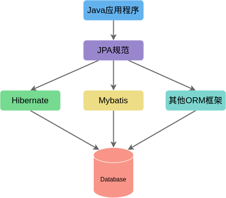

# 第 22 章 JPA

## 22.1 JPA 概述

### 22.1.1 JPA

JPA 即 Java Persistence API，用于对象持久化的 API，它是 JavaEE 5.0 平台标准的 ORM 规范，使应用程序以统一的方式访问持久层。

### 22.1.2 JPA 特点

1. 标准化
2. 易用性
3. 查询能力强大
4. 支持面向对象的高级特性

### 22.1.3 JPA 技术

1. ORM 映射元数据
2. JPA 的 API
3. 查询语言（JPQL）

## 22.2 JPA 核心技术

### 22.2.1 JPA HelloWorld

使用 JPA 持久化对象的步骤

-   创建 persistence.xml，在文件中配置持久化单元
-   创建实体类，使用注解描述实体类与数据库表之间的映射关系
-   使用 JPA API 完成数据增删改查
-

### 22.2.2 JPA 基本注解

-   @Entity

    标识实体类

-   @Table

    映射数据表表名（使用 name 属性）

-   @Id

    映射主键

-   @GeneratedValue

    标主键的生成策略，通过 strategy 属性指定，可选策略有 IDENTITY(Id 自增方式，Oracle 不支持)、AUTO(JPA 自动选择，默认选项)、SEQUENCE(通过序列产生主键，MySQL 不支持)、TABLE(通过表产生主键)

-   @Basic

    表示一个简单属性到数据库表的字段映射，对没有任何标的属性默认即为@Basic

-   @Column

    当实体属性与其映射的数据库表的列不同名时需要使用，还可以标其他属性，如 length

-   @Transient

    表示该属性并非一个到数据库表的字段的映射，ORM 框架将忽略该属性。

-   @Temporal

    可以使用该注解高速 Date 类型的 DATE、TIME、TIMESTAMP 三种不同的精度。

### 22.2.3 JPA API

1. Persistence

2. EntityManagerFactory

    该接口主要用于创建 EntityManager 实例

3. EntityManager

    - find

4. EntityTransaction

### 22.2.4 映射关联关系

1. 单向多对一的关联关系

    - 配置关联关系
    - 增
    - 查
    - 删
    - 改

2. 单向一对多的关联关系

3. 双向多对一的关联关系

4. 双向一对一的关联关系

5. 双向多对多的关联关系

## 22.3 JPQL

### 22.3.1 JPQL Hello World

### 22.3.2 JPQL 技术

1. 查询缓存
2. ORDER BY 和 GROUP BY
3. 关联查询
